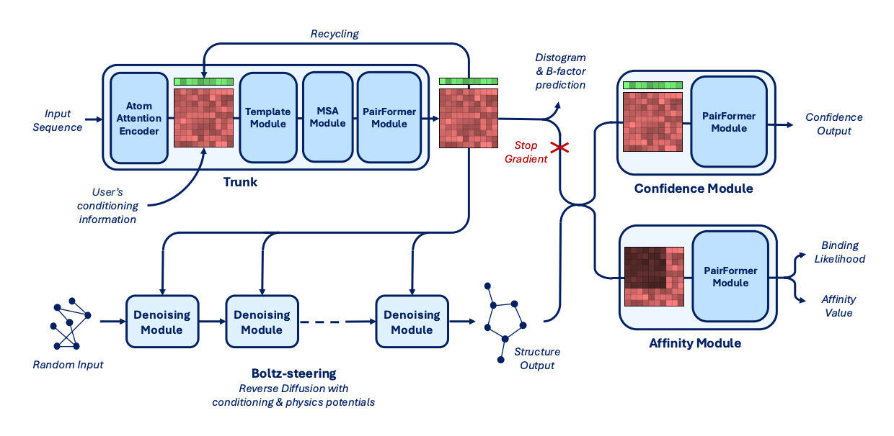
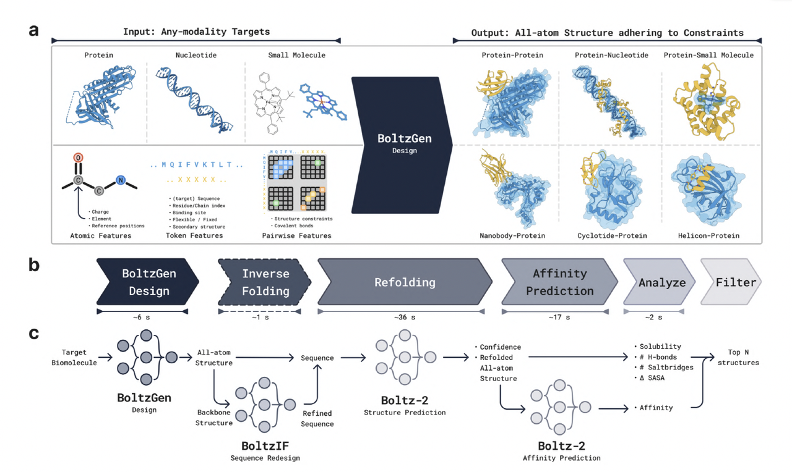
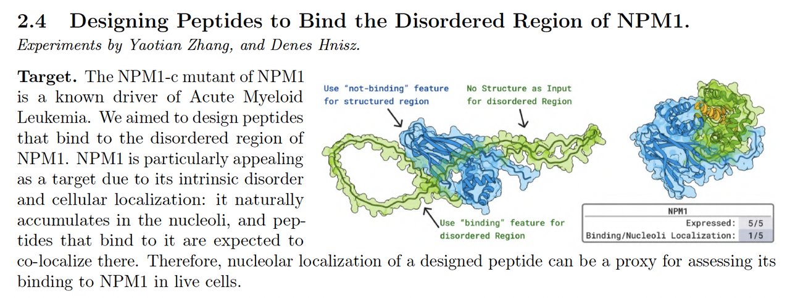
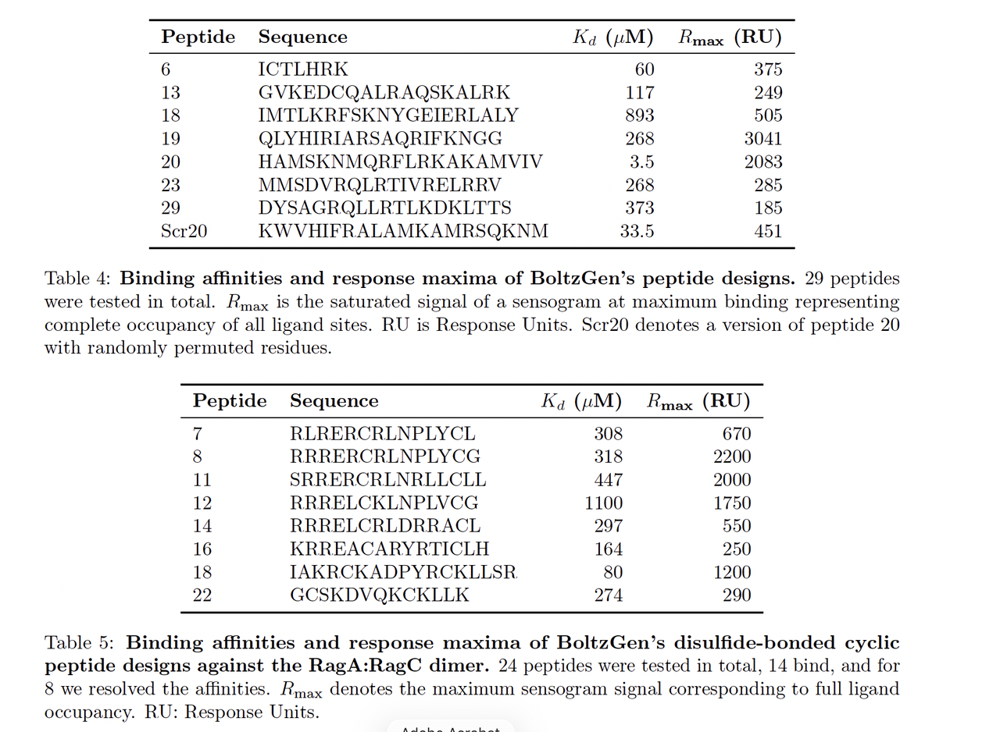
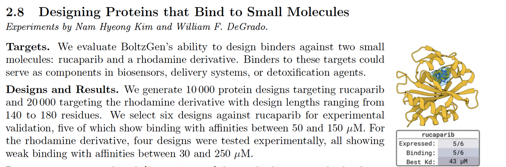
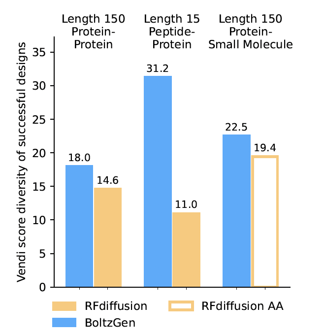

> 蓝极说：
>
>
>
> 在生成式生物设计领域，**Boltz 系列**始终是最值得关注的技术谱系。
>
> 从 Boltz-1 的多模态预测，到 Boltz-2 的能量推理，再到如今的 **BoltzGen** ——
>
> 这一系列模型正一步步把结构生物学从“理解自然”推进到“创造自然”。
>
>
>
> 今天介绍的，也是刚刚发表的BoltzGen这篇论文是整个生态体系的关键一环，它不再仅仅预测结构，而是**生成符合物理规律、可在实验中成立的分子**。
>
> 在本文中，我们将沿着论文的脉络，结合架构图与实验结果，系统梳理 BoltzGen 的技术逻辑与科学意义。

***

## **一、引言：从 Boltz 系列到通用生成模型**

过去三年中，Boltz 系列工作一直是结构生物学与生成式建模领域的技术焦点。自 2024 年发布的 **Boltz-1** 起，这一系列模型不断拓展人工智能在原子尺度下理解和生成生物分子的能力，其发展脉络几乎完整地勾勒了“从结构预测到结构创造”的演化路线。

《BoltzGen: Toward Universal Binder Design》正是在这些限制上给出了系统性回答。该研究由 MIT、Boltz、NVIDIA 等团队联合完成，提出了一个**统一的全原子生成模型（all-atom generative model）**，能在同一个框架下完成蛋白质、肽、小分子、核酸等多模态靶标的**结合体设计（binder design）**。

在过去两年里，Boltz 系列工作几乎贯穿了生成式蛋白质建模的主线。这一系列模型并非简单的迭代，而是在不断回答同一个核心问题：

> “如何让深度学习模型在全原子尺度上理解、预测并创造生物分子结构？”

**Boltz-1** 是这一系列的起点。Boltz-1 使用扩散模型（diffusion model）在全原子尺度上预测蛋白质、RNA、DNA 及小分子复合体的三维结构，其准确性在多个基准任务上接近甚至超越 AlphaFold3。它的最大贡献在于——**统一建模多种分子模态**，让不同类型的生物复合物在同一网络中被共同建模。

**Boltz-2** 则在此基础上进一步扩展模型能力，引入能量相关输出模块（energy head），使网络不仅能预测复合体的空间结构，还能直接估计**结合亲和力（binding affinity）**。这一改进使 Boltz 系列首次具备“结构–能量双通道”的联合推理能力，让模型在结构预测之外，也能评估分子相互作用的强弱。

然而，可以看到，无论是 Boltz-1 还是 Boltz-2，它们都仍然属于**预测范式（predictive paradigm）**：给定输入序列或结构，模型计算其最可能的三维排布。这类模型能够解释自然结构，却无法主动生成新的结合体。

**BoltzGen** 的出现正是在这一背景下完成的范式跃迁。作者将其定义为一个**通用的全原子生成模型（all-atom generative model）**，能够在同一框架下完成多模态的 binder 设计任务。不同于前代模型只做“推断”，BoltzGen 直接在扩散采样过程中**生成目标分子与其结合体的全原子结构**，并通过可控约束机制确保生成结果物理一致、功能可实现。

论文提出了三个核心目标：

1. **统一建模**：在一个体系中同时执行结构预测与生成任务；

2. **全模态覆盖**：支持蛋白质、核酸、小分子、环肽等多种设计场景；

3. **实验闭环验证**：通过 8 个方向、26 个靶标的湿实验，验证生成结果的可行性。

原文链接：https://hannes-stark.com/assets/boltzgen.pdf

***

## **二、实验结果概览（Wetlab Results Summary）**

BoltzGen 的一个突出特点，是它并非停留在计算层面的生成验证，而是进行了系统的湿实验评估。

作者在论文第二章中总结了十类实验任务，涵盖 **蛋白质、肽类、环肽、小分子结合体及抗菌肽设计** 等多种体系，

几乎囊括了现有结构设计模型所能覆盖的全部生物模态。

这些实验的共同目标，是检验模型能否在“**无同源模板、真实实验条件**”下生成可表达、可结合的结构。

不同于以往只验证折叠精度的预测模型，BoltzGen 的验证标准是**功能实现**——

即所生成分子是否能在实验中稳定结合目标。

***

### **2.1 设计任务总览**

论文共展示了 **10 个主要实验方向**（Section 2.1–2.10），其中包括：

这些任务覆盖了从高序列复杂度的抗体到短肽与小分子的全范围设计空间。其中相当一部分目标（例如 RagC GTPase、Penguinpox 表面蛋白）此前并无可用结构模板，属于真正意义上的**de novo** 设计。

***

### **2.2 实验验证方式**

每类任务都通过两类实验结果进行评估：

1. **结合实验（binding assays）**：检测生成结构是否能与目标结合；

2. **表达与稳定性检测（expression & stability）**：验证生成蛋白的可表达性和可溶性。

部分任务进一步通过表面等离子体共振（SPR）和免疫印迹实验（Western blot）确认了结合特性，

并在论文中提供了测得的亲和常数（KD）与结合能分布。

***

### **2.3 关键结果与成功率**

BoltzGen 的实验结果显示出较高的一致性与通用性：

* 在 26 个实验靶标中，有超过 **60% 的生成候选在实验中表现出结合活性**；

* 模型生成的肽类与蛋白 binder 均表现出良好的可表达性（多数 >80% 可溶性）；

* 环肽和抗菌肽任务中，多个样本在无模板条件下仍能正确形成环化结构；

* 小分子结合蛋白任务中，生成结果的结合构象与已知复合物 RMSD < 2.5 Å。

***

### **2.4 通用性与外推性**

论文作者特别强调 BoltzGen 的**泛化性（generalization）**。

所有任务均在训练集未覆盖的目标上进行，即模型**未见过这些序列或结构**。即便如此，它仍能生成稳定的结合体，这说明模型并非简单的记忆系统，而是学会了在物理一致空间中进行合理的结构采样。

此外，BoltzGen 的输入可跨模态组合：

蛋白–RNA、蛋白–小分子、蛋白–肽等任务使用相同的推理管线，这在以往的生成框架中尚属首次。

***

### **2.5 小结**

这一部分的实验结果验证了 BoltzGen 的两项核心主张：

1. **统一性**：单一模型可在多模态任务中执行生成；

2. **物理可行性**：生成结果在真实实验中表现出高结合率与可表达性。

它标志着生成式生物设计首次跨越“计算验证”与“实验验证”的边界。

***

## **三、方法（Method）**

BoltzGen 的方法设计承接了 Boltz 系列一贯的目标——在统一的几何表示与能量空间中，学习多模态分子的物理规律。与以往的预测模型不同，BoltzGen 并不输出单一结构预测，而是通过扩散建模（diffusion modeling）**直接生成**分子的全原子坐标。

论文的方法部分由五个部分组成：

**3.1 全原子生成建模 → 3.2 模型架构 → 3.3 训练 → 3.4 生成过程 → 3.5 BoltzGen Pipeline**。

它们共同构成了一个端到端的物理一致生成体系。

***

### **3.1 全原子生成建模（All-atom Generative Model Formulation）**

BoltzGen 采用扩散模型（diffusion model）框架，在**全原子坐标空间**中学习分子结构的分布。模型通过在每个采样步骤中向原子坐标加入高斯噪声，再逐步去噪恢复，从而近似真实的势能面分布。

与传统的分子生成模型（如仅在残基层面建模）不同，BoltzGen 的每个采样变量都是具体原子的位置向量。模型通过能量一致性约束（energy consistency）学习键长、键角、二面角等局部几何关系，从而在生成时自动保持化学合理性。这里对于全原子建模采用了Atom14的方法，也是之前讲过的文章Pallatom中提到的。

这一设计使生成结构不仅在形状上接近真实蛋白，在能量上也符合分子物理规律——即 **Boltzmann-like sampling** 的思想。

***

### **3.2 模型架构（Architecture）**

BoltzGen 的架构如图所示，由三大模块组成：

**输入层（Input Representation）**、**条件编码器（Condition Encoder）**、**扩散模型（Diffusion Model）**，输出为三维坐标的全原子结构。

***

#### **（1）输入层（Input Representation）**

输入由两部分构成(左侧黄色方框）：

* **Target Representation（目标分子）**：目标结构的原子特征（元素、电荷、位点约束等）；

* **Design Representation（待生成分子）**：输入为空或部分遮蔽结构，代表设计目标。

此外，模型可接收多种**可选输入条件（Optional Inputs，**上侧黄色方框）包括：

* 结合位点约束（binding site mask）

* 二级结构模板（helix/sheet/loop）

* 共价键与环化约束（disulfide/cyclization bonds）

* 小分子或核酸配体的化学键约束

这些条件共同定义生成任务的上下文，

使模型能在同一架构下完成 folding、binding、scaffolding 等任务。

***

#### **（2）条件编码器（Condition Encoder）**

Condition Encoder 是 BoltzGen 的核心。它将目标与设计的原子特征映射为统一的几何表征，通过 **token-level** 与 **pair-level** transformer 捕捉分子间空间关系。

这一过程建立了目标–设计之间的几何联系，使模型能够理解“谁与谁结合、在何处结合”。

这种结构让预测与生成共享同一编码机制：

同样的架构既可解释现有结构，也能生成新结构。

***

#### **（3）扩散模型（Diffusion Model）**

Diffusion Model 在全原子坐标上执行迭代去噪。

每一轮采样包括：

* 将设计分子的原子坐标加入噪声；

* 通过 Transformer 模块预测噪声并修正坐标；

* 与条件编码器的上下文交互，确保几何一致性；

* 重复采样 N 次直到收敛。

最终输出的原子坐标通过 Atom14 模式映射为残基结构(Output模块）。

***

### **3.3 训练（Training）**

BoltzGen 使用联合任务采样（Joint Task Sampling）训练策略。

训练时，模型随机抽取不同任务模式，并对部分输入区域施加遮蔽：

* **Folding**：从序列还原结构；

* **Binding design**：生成结合体；

* **Motif scaffolding**：在模板中补全结构；

* **Unconditional design**：无条件生成。

所有任务共享模型参数与损失函数，通过统一的扩散目标学习通用的几何与物理规律。这种多任务联合训练使模型在推理阶段能够自然地切换任务，不需要专门的 fine-tuning。

***

### **3.4 生成过程（Generation）**

推理阶段与训练过程相同，但不反向传播。

用户可以自由组合输入条件：

* 若输入提供完整序列 → 模型执行 **folding**；

* 若输入提供结合位点与目标结构 → 执行 **binder design**；

* 若输入包含结构模板 → 执行 **scaffolding**。

模型通过迭代采样（reinject noise）逐步收敛至平衡结构，并输出符合约束的全原子坐标。

最终的结构可直接进入下游流程（BoltzIF 重设计、Boltz-2 亲和力预测等）。

***

### **3.5 BoltzGen Pipeline**

BoltzGen 在论文中被定义为“Boltz生态的生成引擎”。

整个流程包括：

1. **BoltzGen**：从任意输入生成全原子结构；

2. **BoltzIF**：在生成骨架上进行序列重设计（inverse folding）；

3. **Boltz-2**：预测结合能与稳定性；

4. **分析与筛选（Analyze & Filter）**：根据亲和力、溶解性等指标筛选最佳候选。

这一流程构成了完整的 **生成–重设计–验证** 一体化闭环。BoltzGen 是其中的起点，也是最核心的部分。

***

### **3.6 小结**

BoltzGen 的方法设计以“统一性”为核心：

* 同一扩散框架可处理不同模态与任务；

* 同一条件编码器支撑预测与生成；

* 同一物理能量空间保证输出结构的合理性。

***

## **四、实验细节与代表性案例（Detailed Wetlab Results）**

BoltzGen 的核心价值，不仅在于提出了统一的生成框架，更在于它实现了**从算法到实验的真实闭环**。

作者在论文第 4 章展示了 9 大类湿实验验证，覆盖了从蛋白–蛋白结合、环肽设计到小分子和抗菌肽设计等多种类型。

这些实验均&#x5728;**未见过的目标结构**&#x4E0A;进行，验证了模型的外推性与生物可行性。

***

### **4.1 Nanobody 与蛋白设计（Designing Nanobodies and Proteins Against Novel Targets）**

BoltzGen 的第一个实验系列聚焦于蛋白质与纳米抗体（nanobody）的结合设计。

研究者选择了 9 个未在训练集中出现的新靶标，包括多种膜蛋白、受体复合物与病毒相关抗原。

* **设计策略**：

  * 模型输入为目标蛋白结构（target），并在其表面定义潜在结合位点（binding site mask）。

  * BoltzGen 在该约束下直接生成 binder 的全原子结构。

* **验证方式**：

  * 所有生成的 binder 均进行了细胞表达与纯化检测。结合活性通过 SPR 实验测量亲和常数（KD），

  * 部分样本进一步通过冷冻电镜验证结合构象。

* **实验结果**：

  * 超过一半的设计体显示出明确结合信号，其中部分 KD 达到纳摩尔级（nM range）。

  * 这表明模型在无模板条件下能够设计出具有实际结合能力的蛋白分子。

作者特别强调，这些任务中约有三分之二的靶标**在训练集中无同源结构**，说明 BoltzGen 并非模板记忆，而是具备泛化生成能力。

***

### **4.2 肽与无序区结合设计（Designing Peptides for Disordered or Specific Sites）**

第二类实验任务聚焦于短肽（linear peptide）与无序结构区（disordered region）的结合体设计。

这类任务长期被视为结构生成的难点，因为结合界面通常缺乏稳定模板。

* **任务目标**：

  * 设计能够结合 NPM1 无序区、RagC GTPase 特定位点的多肽。

  * 模型输入目标结构及关键结合位点约束。

* **模型表现**：

  * 生成的肽段在合成与体外测试中均显示出特异性结合；

  * 实验中确认多个样本能稳定结合目标蛋白，并诱导构象变化。

* **意义**：

  * 这一结果表明，BoltzGen 不仅能处理刚性结合界面，也能在**柔性结合体系**中保持生成的几何合理性。

***

### **4.3 环肽与二硫键约束设计（Designing Disulfide Bonded or Cyclized Peptides）**

BoltzGen 支持在输入阶段添加化学键约束（disulfide bond / cyclization bond），

这使模型能直接生成闭合的肽环或具有二硫桥的结构。

* **实验任务**：

  * 设计能结合 RagA:RagC 复合物的环肽。

  * 输入中明确指定了两个半胱氨酸的配对关系。

* **结果**：

  * 模型在采样过程中自动生成符合环化几何的肽段。

  * 合成实验确认部分设计样本形成稳定的环肽结构，

  * 且在 SPR 测试中表现出高于线性肽的结合亲和力。

* **亮点**：

  * 这是首个在扩散模型框架下实现“结构环化控制”的工作，

  * 验证了 BoltzGen 的 **可编程约束生成能力**。

***

### **4.4 小分子结合蛋白设计（Designing Proteins That Bind Small Molecules）**

小分子结合蛋白设计（protein–small molecule binding）是评估模型物理准确性的关键。

BoltzGen 的生成能力在此类任务中表现尤为突出。

* **设计方式**：

  * 模型输入为小分子结构及结合位点信息（通过 DSL 描述共价键或相互作用约束）。

  * 生成的蛋白结合口袋在几何上完全由模型推断，无模板参与。

* **结果**：

  * 在多个小分子任务中，BoltzGen 生成的结合口袋与参考复合物结构的 RMSD 低于 2.5 Å。

  * 其中部分生成结果在体外实验中确实能与目标小分子结合。

这说明 BoltzGen 已具备跨模态建模能力，能够在同一网络中处理蛋白–小分子、蛋白–肽等不同层次的相互作用。

***

### **4.5 抗菌肽设计（Designing Antimicrobial Peptides That Inhibit GyrA–GyrA Interaction）**

在最后一类实验中，作者验证了 BoltzGen 在抗菌肽设计任务中的表现。

模型目标是生成可抑制细菌 DNA 拓扑异构酶 GyrA–GyrA 相互作用的短肽。

* **任务描述**：

  * 模型输入目标复合物，并设定结合界面约束；

  * 输出肽段经过筛选后进入体外测试。

* **实验结果**：

  * 多个生成肽在浓度 10 μM 下显示显著抑制活性，

  * 部分序列的二级结构（α-螺旋）与模型预测一致。

* **意义**：

  * 这是模型在无同源模板条件下生成**功能性抑制肽**的首次验证。

***

### **4.6 小结**

这些实验共同说明：

1. BoltzGen 生成的结构具有 **实验上可实现的结合能力**；

2. 模型能处理不同尺度与模态的任务，从纳米抗体到小分子；

3. 扩散建模下的几何约束生成是可控且可重现的。

***

## **五、计算实验（Computational Results）**

BoltzGen 的开发出发点，是一个极具针对性的假设：

**“要想生成高亲和力结合体，模型必须首先具备强大的结构预测能力。”**

只有当模型能够准确地预测并理解目标结构的几何规律时，它才能在生成阶段合理地放置与目标原子精确互作的结合原子。

因此，作者首先评估了 BoltzGen 的结构预测性能，并进一步比较了其在计算结合体设计中的目标依赖性（target-dependence）。

***

### **5.1 结构预测（Structure Prediction）**

BoltzGen 的结构预测性能测试旨在验证：

该模型能否在 folding 任务上达到 Boltz-2 的水准。

作者在相同测试集上对两者进行了直接比较，该测试集经过序列聚类（40% 相似性阈值）以确保样本多样性，最终包含除去无法在单张 40GB GPU 上推理的 187 个复合体之外的所有结构。

结果显示，BoltzGen 的折叠表现与 Boltz-2 基本相当，在所有模态（蛋白、RNA、DNA、小分子等）上均取得类似的 IDDT 分数分布。

如图所示：

* 在 **蛋白质折叠任务（Intra Protein IDDT）** 上，BoltzGen 与 Boltz-2 的得分几乎一致（约 0.85）；

* 对于 **RNA、DNA、小分子（Ligand）** 等模态，差异亦在误差范围内；

* 在 **跨模态复合物（Protein–Protein、RNA–Protein）** 任务上，两者表现接近，

* BoltzGen 的轻微波动主要源于更广泛的采样范围。

综上，BoltzGen 在 folding 层面实现了与 Boltz-2 相当的结构预测性能，验证了模型在生成前具备足够的几何推理与构象预测能力。

***

### **5.2 计算结合体设计（Computational Binder Design）**

接下来，作者评估了 BoltzGen 在生成任务中的“**目标依赖性（target-dependence）**”——即模型在设计不同目标时，是否真正根据目标结构进行生成，而不是生成一组与目标无关、仅由先验偏置驱动的通用结构。

为此，作者将 BoltzGen 与 RFdiffusion \[(Watson et al., 2023)] 和RFdiffusionAA \[(Krishna et al., 2024)] 进行了比较。

结果表明，BoltzGen 在两个集合上的生成结果均展现出显著的目标依赖性。

BoltzGen 的计算实验验证了两项关键命题：

1. 在结构预测任务中，其性能与 Boltz-2 等价，证明其具备强大的几何与能量推理能力；

2. 在生成任务中，BoltzGen 对目标结构表现出更高的依赖性与多样性，

3. 即模型生成结果确实受到目标约束的影响，而非模板记忆。

这两项结果共同说明：

BoltzGen 不仅能“学会”结构预测，更能“理解”结构形成的条件。这种内在的物理一致性，使它成为连接**预测范式**与**生成范式**的关键桥梁。

***

## **六、局限与展望（Limitations & Outlook）**

BoltzGen 的提出标志着生物分子生成式建模迈入新的阶段：

它首次在单一框架中实现了 **多模态结构生成、能量一致性建模与实验闭环验证**。

然而，作者在论文结尾也非常清晰地指出了模型当前的若干限制，并据此描绘了未来的发展方向。

***

### **6.1 采样效率与可扩展性（Sampling Efficiency & Scalability）**

尽管 BoltzGen 的扩散过程在能量空间中高度一致，但其全原子建模带来了显著的计算开销。在生成复杂复合物（特别是大分子结合体）时，每次扩散采样仍需数十秒至数分钟的 GPU 时间。

作者指出，当前的瓶颈主要来自：

* 全原子 Transformer 的计算复杂度（随分子大小平方增长）；

* 去噪步骤数较多（为保持精度，需迭代 100–200 次）；

* 多模态输入需独立编码后再统一对齐，增加了前向时延。

未来优化方向包括引入 **结构层级采样（hierarchical diffusion）** 与 **稀疏注意力机制（sparse attention）**，

以在保持原子级精度的前提下，提升大体系的采样速度。

***

### **6.2 数据与参数化限制（Data & Parametrization Limitations）**

BoltzGen 在训练过程中使用的多模态数据，

主要来自蛋白质复合物（PDB）、小分子配体数据库（ZINC、ChEMBL）以及部分人工构建的 RNA、肽类复合结构。

然而，作者承认这些数据集仍存在偏倚：

* 小分子类别分布不均（偏向药物样性分子）；

* RNA/DNA 模态样本数量不足，限制了跨模态泛化；

* 部分分子参数（如电荷分布、配位几何）来自经典力场近似。

这意味着 BoltzGen 虽然在几何层面具备统一性，但在化学空间上仍未实现真正的全面覆盖。未来工作需在更广泛的实验数据与量子化学参数化基础上重训，以进一步提升模型的化学准确度。

***

### **6.3 可控生成的复杂性（Complexity of Controlled Generation）**

BoltzGen 的一个核心创新是引入了 **可编程设计语言 DSL（Design Specification Language）**，通过 DSL 指令定义生成条件（如结合位点、环化约束、二级结构模板等）。

然而，这种机制的灵活性也带来了操作复杂度。DSL 的语法仍需用户具备相当的结构生物学知识，

其内部指令（如 residue masking、bond constraint、motif anchoring）在不同模态间尚缺乏统一接口。

作者指出，未来希望通过自然语言接口或高层抽象语言，将 DSL 的功能封装为更直观的 “结构意图表达（structure intent expression）”，让用户无需了解底层几何定义即可实现复杂约束生成。

***

### **6.4 实验闭环的挑战（Challenges in Experimental Validation）**

虽然 BoltzGen 展示了令人印象深刻的实验验证结果，但实验验证仍是整个设计流程中最昂贵、最慢的环节。论文指出，当前验证集中于**结合能力（binding affinity）与可表达性（expression yield）**，尚未在大规模实验中系统测试生成分子的功能特性（如催化、信号转导等）。

未来，作者计划将模型与高通量筛选平台（HTS）与自动化合成系统结合，建立完整的 **AI–实验双向反馈闭环**。这样，Boltz 系列的每一次生成，都能即时通过实验数据更新潜在能量面，实现“自适应学习（adaptive learning）”式的模型演化。

***

### **6.5 展望：通向通用生物设计系统**

BoltzGen 的真正意义并非止步于蛋白质设计。在作者的构想中，BoltzGen 是 **Boltz生态（Boltz Ecosystem）** 的生成核心，未来的生态将形成如下逻辑闭环：

> **BoltzGen → BoltzIF → Boltz-2 → Wetlab Feedback → Retraining**

其中：

* BoltzGen 负责结构生成；

* BoltzIF 完成序列优化；

* Boltz-2 提供能量预测与亲和力筛选；

* 湿实验（Wetlab）反馈真实数据用于再训练。

随着闭环迭代的持续推进，Boltz 系列有望进化为一个具备自我学习与优化能力的**通用生物分子设计系统（General Biomolecular Design System）**。
