在现代生物分子设计中，一个根本性的问题是：**我们是否能够突破天然氨基酸构成蛋白质的限制，设计出更强大、更具有功能性的分子？**

随着蛋白质工程和肽类药物的快速发展，越来越多的研究者意识到，仅依赖20种天然氨基酸所构建的“化学空间”存在天然瓶颈。相比之下，**非天然氨基酸（non-canonical amino acids, ncAAs）** 提供了前所未有的构象灵活性与化学多样性，使得我们可以在更高维度上进行功能探索：包括增强稳定性、优化靶点亲和力、引入非天然催化机制，甚至构建全新的蛋白结构拓扑。

然而，真正将非天然氨基酸引入多肽或蛋白结构中并实现**结构层面的功能设计**，依旧是一个悬而未解的挑战。大多数主流蛋白结构预测与设计工具，如 AlphaFold、RosettaFold 或 Score-based generative models，均建立在“标准氨基酸”的封闭体系之上，对 ncAA 缺乏表达能力、训练样本与计算支持。

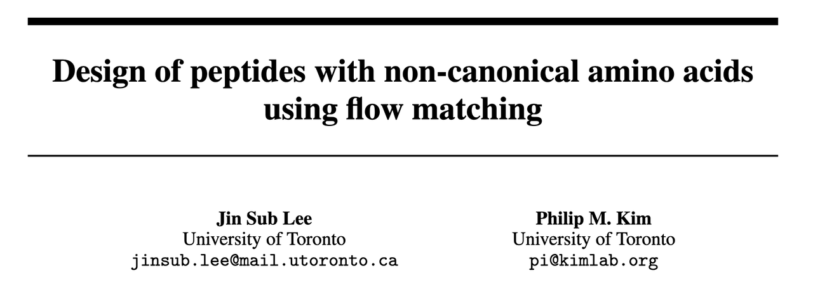

在这一背景下，Lee 和 Kim 等人在其论文《Design of peptides with non-canonical amino acids using flow matching》中提出了一项具有代表性的工作。他们构建了一个以 flow matching 为核心的结构生成模型 **NCFlow**，结合分子建模、深度学习打分与物理能量验证，搭建了一个系统性的 ncAA 多肽设计平台。本文将对该工作进行逐步解读，阐明其方法框架、结构精度、应用流程与案例分析，帮助读者理解其在蛋白质工程与药物设计领域的重要意义。

***

## 1.&#x20;**&#x20;为什么研究非天然氨基酸？扩展蛋白质设计的化学空间**

蛋白质由20种标准的天然氨基酸（canonical amino acids）组成，这一套“遗传编码字母表”在自然进化中已被充分利用，赋予了生命体极为多样的结构与功能。然而，在药物设计、酶工程及蛋白材料等方向，天然氨基酸所提供的结构与化学多样性已经逐渐显现出其局限性。

**非天然氨基酸（non-canonical amino acids, ncAAs）**——即不编码于标准遗传密码表中的氨基酸——为这一困境提供了解决思路。ncAAs 可通过多种方式引入蛋白质中，包括合成生物学途径（例如遗传密码扩展、转译系统重编程）或化学修饰（如后翻译修饰、半合成策略）。它们具备以下潜力：

* 引入**非天然官能团**以催化自然界未出现的反应；

* 提高蛋白质的**热稳定性、酶活性或溶解性**；

* 优化**结合亲和力与选择性**，尤其在多肽类药物开发中发挥关键作用；

* 赋予蛋白质**新的结构构象能力**，如构建不规则主链、宏环结构等。

当前，非天然氨基酸已在多个方向展现出极高应用价值，尤其是**大环肽（macrocyclic peptides）**&#x4F5C;为介于小分子与抗体之间的药物形式，因其良好的稳定性与结合特异性而备受关注。ncAA 的引入为其提供了更高的结合自由度和药代优化空间。

***

## 2. **现有计算设计方法的局限性**

尽管深度学习在蛋白质结构预测领域取得了突破（例如 AlphaFold2/3、RoseTTAFold、RFDiffusion 等），但在处理非天然氨基酸方面仍存在严重局限。现有主流模型对标准残基高度依赖，无法有效泛化至化学组成发生变化的结构。

以下是当前主要的挑战：

### **1️⃣ 表达能力限制：模型结构依赖于标准氨基酸嵌入**

如 AlphaFold 系列模型采用了基于序列的残基 token 化，其输入嵌入空间仅涵盖20种天然氨基酸（外加部分 mask token）。当输入中包含未经训练的 ncAA 或者具有不同原子数、键型的残基时，这些模型往往无法正常工作。此外，AlphaFold3 虽然引入了配体建模能力，但其构象输入要求包括**RDKit conformers、结构 token**等预定义信息，而这些在 ncAA 设计任务中往往是未知的设计目标本身。

### **2️⃣ 数据瓶颈：PDB 中 ncAA 数据稀缺且偏倚**

目前 PDB 中非天然氨基酸残基占比仅约 **0.02%**，且多数为技术性引入（如硒代蛋氨酸用于晶体解析），缺乏代表性的自然构象或功能性上下文。如此严重的数据稀疏性直接限制了使用深度学习方法学习高质量的结构映射函数。

### **3️⃣ 打分工具不支持 ncAA 残基**

在蛋白设计中，结构预测仅是第一步，后续需要可靠的打分函数来评估突变体的稳定性或功能。例如，Rosetta 及 AlphaFold 衍生工具（如 ipTM 或 pLDDT）均默认输入为标准氨基酸，无法支持任意结构组分的多肽设计。

此外，当前几乎所有基于机器学习的结合亲和力预测器（如 ProteinMPNN、EquiBind、DiffDock）也都依赖预定义 residue embedding 或限定配体描述符，对于原子层级自定义的 ncAA 无法兼容。

***

以上挑战表明，要在设计中系统性地引入非天然氨基酸，仅仅依赖现有工具是不够的。我们亟需一种：

* **能直接处理原子图结构**；

* **可泛化至任意分子结构的生成模型**；

* 并能**结合蛋白结构上下文，预测嵌入后的合理构象**。

这正是 NCFlow 所提出的技术路径的出发点。

***

## 3.  **NCFlow 是什么？一个通用的非天然氨基酸三维结构生成模型**

在面对非天然氨基酸（ncAA）设计时，我们的目标不仅是“换一个侧链”，而是在空间中**合理地嵌入一个新的化学实体**，使其与蛋白质环境协调匹配，并有潜力增强功能（例如结合力）。这比普通蛋白突变复杂得多——你不能依赖“rotamer 库”或 canonical residue 模板，而必须**从原子层面推断构象**。

这正是本文提出的 **NCFlow** 所要解决的问题：

> **给定一个蛋白 pocket 和一个任意的非天然氨基酸结构，预测它在该位点的三维构象。**

***

### 3.1 **Flow matching：一种轻量、连续的生成方法**

NCFlow 的技术核心是使用了一种近年兴起的**flow matching**生成模型。这类方法与扩散模型类似，都是从一个随机初始状态出发，通过“模拟粒子轨迹”逐步逼近真实分布。

但相比标准 diffusion models（如 score-based models），**flow matching 模型不需要训练一个噪声预测器再逆推，而是直接学习一个连续向量场&#x20;**$$u_t(x)$$**&#x20;来定义轨迹微分方程**：

$$\frac{dX_t}{dt} = u_t(X_t)$$

直觉上，这就像是在学习**一个物理力场**，告诉粒子在每一个时刻应该如何移动，从一个初始分布 p 变成目标分布 q。

这种方式有几个优点非常适合 ncAA 构象生成：

* **结构连续性强**，非常适合处理 3D 原子坐标；

* **可处理任意输入结构**（不依赖 token，直接用原子类型、键图、空间信息）；

* **模型轻量（≈8M 参数）**，训练推理效率高。

***

### 3.2 **模型输入输出（结合 Figure 1）**

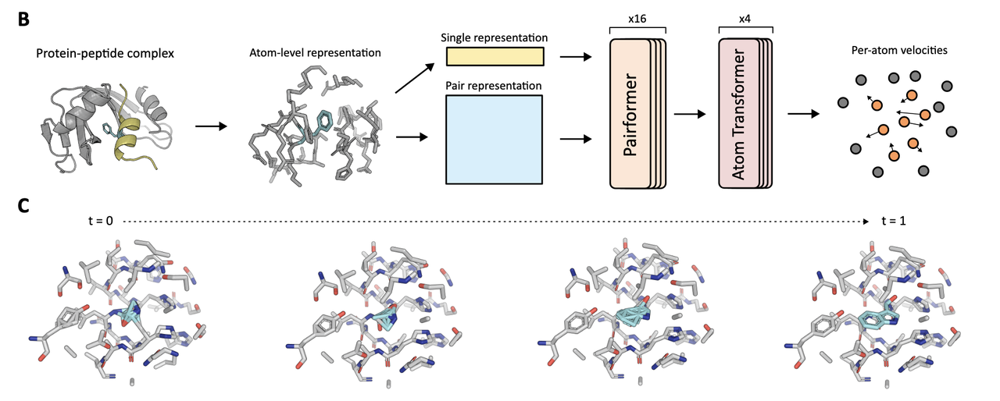

我们来看 Figure 1B–C，解释 NCFlow 的输入输出形式与轨迹过程：

* **输入：**

  * **蛋白 pocket 原子环境**（距离目标位点一定 cutoff 范围内的原子，最多 256 个）；

  * **目标 ncAA 的结构信息**，以 SMILES 编码，再转为原子类型与键连接图；

  * **时间步 t**（用于 flow 轨迹计算）；

  * **预测目标原子的掩码**（指示哪些原子要预测）。

* **输出：**

  * 给定该 pocket 和 ncAA，在 residue 替换位点上的**全原子三维构象**。

Figure 1C 中还展示了一个 sampling trajectory，从 t=0 到 t=1 的粒子轨迹——展示如何从初始噪声中逐步逼近最终目标构象。

***

### 3.3 **模型结构简述**

模型借鉴了 AlphaFold3 的架构，采用：

* **Pairformer layers**：处理原子对之间的关系；

* **Atom Transformer**：处理原子级别的信息聚合；

* 去除了 tokenization，直接使用**原子图表示**。

模型训练分为三个阶段（详见 Figure 1A）：

1. **小分子预训练（PubChem3D）**：学习构象生成的化学规则；

2. **蛋白-小分子微调（Plinder）**：学习蛋白 pocket 与配体之间的相互作用；

3. **ncAA 微调（PDB 中提取）**：学习在真实蛋白环境中，ncAA 如何构象嵌入。

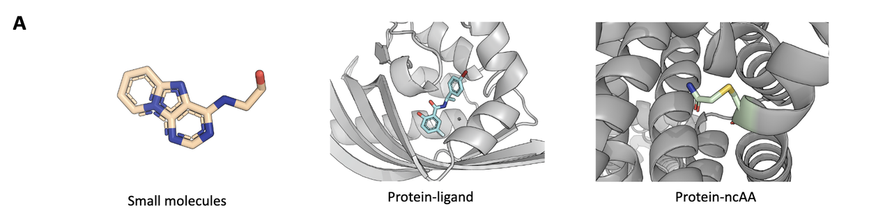

训练目标是最小化流场预测误差，使生成轨迹最大限度接近真实构象。

***

### 3.4 **实验结果支持（Figure 2）**

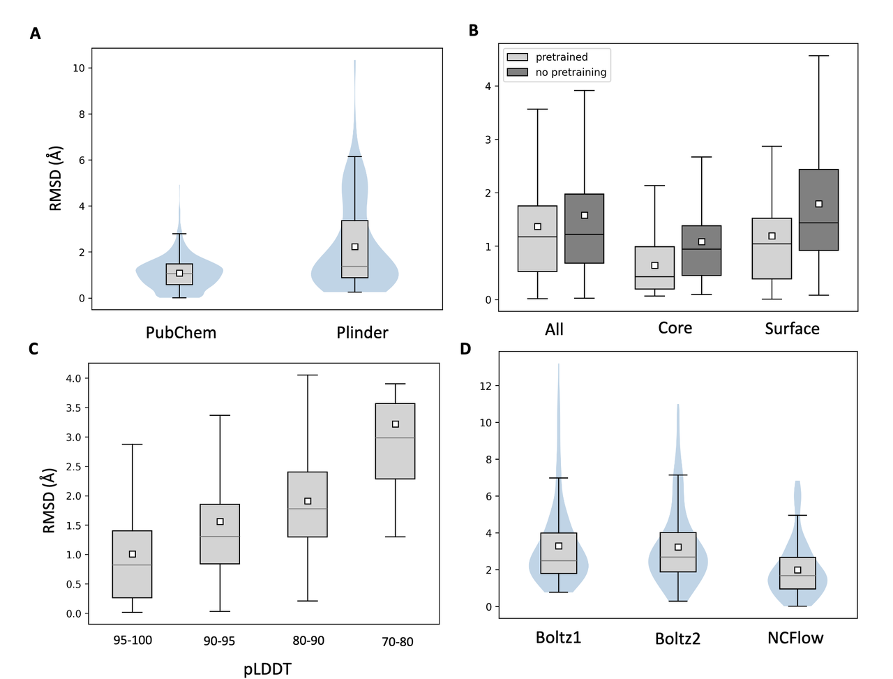

NCFlow 相比其他方法有显著优势：

* Figure 2B 显示预训练能显著降低构象 RMSD（平均降 0.2 Å）；

* Figure 2C 证实了模型预测的 **pLDDT 与 RMSD 负相关**，说明可以使用模型内置信度过滤低质量构象；

* Figure 2D 展示与 Boltz1/Boltz2 的对比，NCFlow 在单个 ncAA 构象预测上表现更精确（RMSD ≈1.4 Å vs. ≈3.3 Å）；

* Figure 2E 展示了多个实例：NCFlow 生成的 ncAA 构象（米色）与真实结构（灰色）高度重叠。

***

## 4. **NCFlow 的设计流程：系统性探索多肽–ncAA 突变体空间**

NCFlow 的能力不仅限于预测单个非天然氨基酸（ncAA）的结构。它的最终目标是：**系统地设计出具有更优结合性能的多肽变体**。为此，作者建立了一整套自动化设计流程，结合生成模型、深度学习打分和分子动力学模拟，完成“生成 + 评估”的闭环。

这套流程如下图所示：

**Figure 3A** 就是这套 pipeline 的完整图解。

***

### 4.1 **起点：一个已知的蛋白–多肽复合结构**

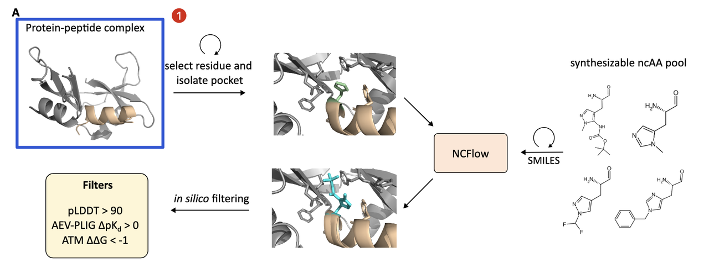

设计从一个已有的复合物结构开始，比如一个蛋白和其天然结合的线性或环形肽。目标是优化这个肽的结合能力，通过用 **非天然氨基酸替换肽中某些残基** 来达成。

***

### 4.2 **候选生成：深度“突变扫描”**

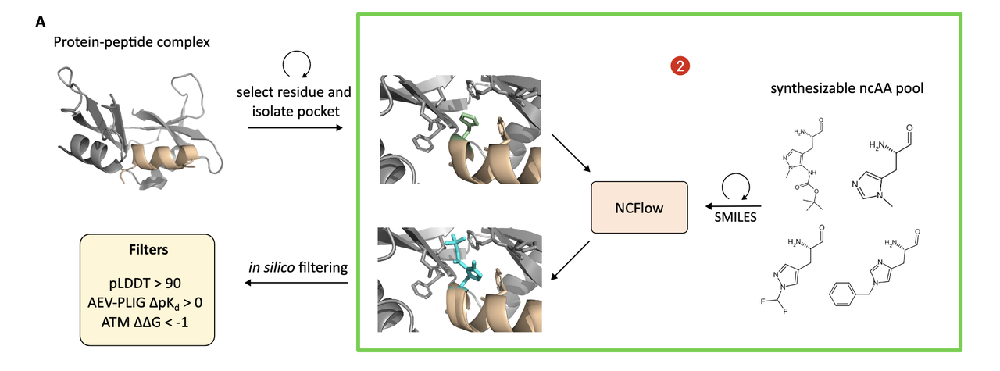

这一步类似于 **in silico deep mutational scanning**，作者对每一个多肽残基做如下操作：

* 按照该残基的“parent amino acid”查找一组合成可行的 ncAA 候选；

* 这些 ncAA 来自 WuXi AppTec 的商业库，经过 Fmoc 保护、可解析、并有已知结构；

* 每个位点的候选数量从数个到数百不等（详见 Table S1）；

* 对于每个候选，用 NCFlow 生成其嵌入 pocket 中的构象（采样 8 次，选出最优一个）。

到此为止，系统会生成 **上千个蛋白–多肽–ncAA 三元复合体变体**，每一个都具备原子级精度的结构。

***

### 4.3 **三阶段打分系统：精准筛选高亲和力变体**

由于这些突变体过多、合成成本高，作者设计了一个**三重打分系统**，用于筛选真正值得关注的变体。

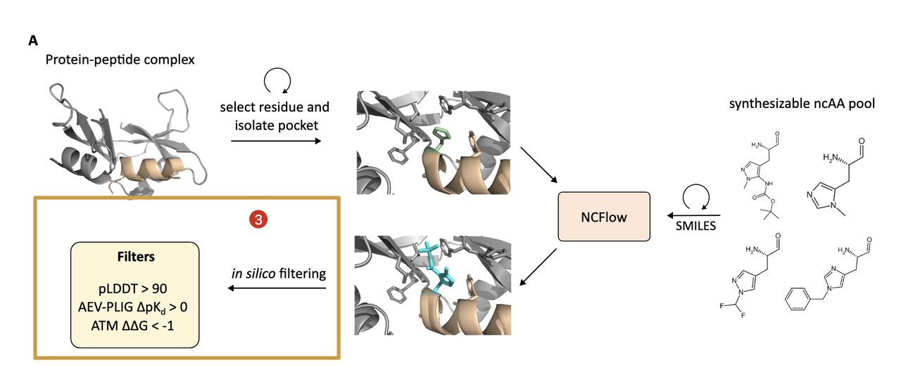

#### **A.** **结构置信度过滤（pLDDT）**

* 使用内建 confidence model 对生成结构进行打分；

* 保留 pLDDT > 90 的高置信构象；

* 有效过滤掉模型结构不确定的噪声样本。

#### **B.** **深度学习亲和力打分（AEV-PLIG）**

* 使用 AEV-PLIG 模型（训练于 PDBBind，支持非标准配体）预测 binding affinity（pKd）；

* 计算 ∆pKd = (variant – wild-type)，保留提升型（∆pKd > 0）；

* 每个蛋白-肽体系选出 **前50个变体**。

#### **C.** **物理力学验证打分（ATM）**

* 为进一步确认，使用 **Alchemical Transfer Method (ATM)** 计算 ∆∆G；

* 这是分子动力学（MD）下的相对结合自由能计算，可靠但计算量大；

* 只用于 AEV-PLIG 前50个变体，做最后确认。

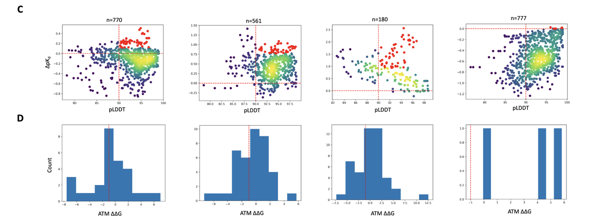

### 4.4 **适用范围广泛：线性肽、环肽、桥联肽均可处理**

Figure 3B 展示了四种蛋白–多肽 test cases：

* **1J7Z、1SSC**：标准线性肽；

* **3AV9**：N-C 头尾环化肽；

* **1SFI**：双环结构（N-C 环化 + S-S 二硫键）。

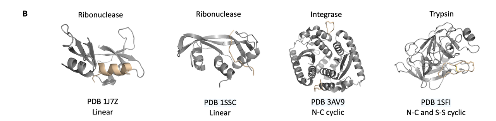

这说明 NCFlow 可应用于多种多肽构型设计场景，不局限于简单结构。

***

### 4.5 **小结：从生成到筛选，一套系统的可扩展设计方法**

通过这个设计流程，NCFlow 实现了：

* 每个位点–每个候选–每个蛋白复合体的高通量构象生成；

* 结合学习型和物理型打分的筛选标准；

* 输出结构合理、亲和力提升的非天然肽类变体。

更关键的是，该方法具有高度通用性和可扩展性，可以与已有蛋白设计工具整合使用。

***

## 5. **实例解析：非天然氨基酸如何提升结合力？——结构视角下的案例研究**

NCFlow 不只是做高通量突变和打分，它还能输出**结构上可解释的设计结果**，这对于后续的优化与实验验证极为关键。

在 **Figure 4** 中，作者展示了四个蛋白–多肽复合物中，几个最终筛选出的高亲和力变体。这些变体都满足以下条件：

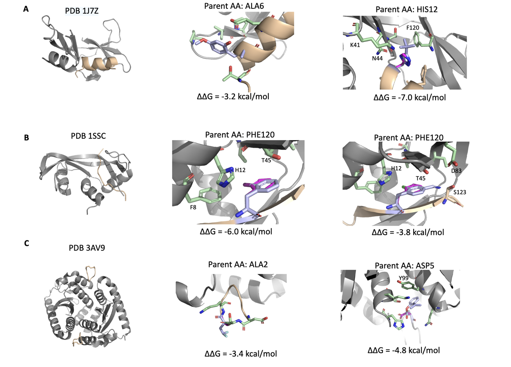

* pLDDT > 90（结构置信度高）；

* AEV-PLIG 预测 ∆pKd > 0（深度模型认为亲和力提升）；

* ATM ∆∆G < -1 kcal/mol（MD 模拟验证有物理意义上的亲和力增强）；

* 且具备良好的手性与可合成性。

让我们逐个拆解这些设计：

***

### 5.1 **Case 1：PDB 1J7Z – ALA6 位点突变，提升溶剂相互作用**

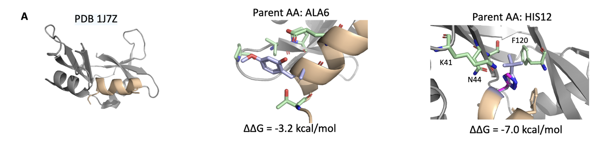

* **原始残基**：ALA（小、疏水、无侧链功能基团）；

* **设计变体**：引入一个含**2-羟基-4-甲氧基苯甲醛基团**的 ncAA；

* **结构效果**：新侧链从主链伸出，带有极性氧官能团，可与周围溶剂形成额外的氢键网络。

🧠 **功能推测**：这种“溶剂外展型”变体可能在目标 pocket 边缘形成稳定性提升，尤其在 binding site 暴露区域有效。

***

### 5.2 **Case 2：PDB 1SSC – PHE120 位点突变，形成多点 polar-polar 接触**

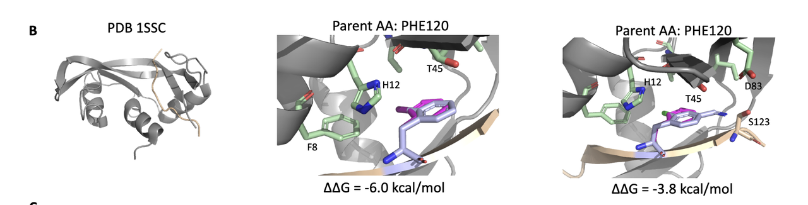

* **变体 1**：带 **碘原子**的侧链，可与附近 **H12** 残基形成极性接触；

* **变体 2**：带 **氯原子 + amidine 基团**，同时插入至 **T45, D83, S123** 所构成的极性 pocket 中；

* **原始残基**：PHE 为疏水芳香侧链，原无极性互作。

🧠 **结构启发**：通过引入带有卤素与可极化基团的 ncAA，增加与 pocket 中极性残基的定向相互作用，尤其可能形成氢键或卤键，有助于稳定结合界面。

***

### 5.3 **Case 3：PDB 3AV9 – ASP5 变体，实现 π–π stacking 增强**

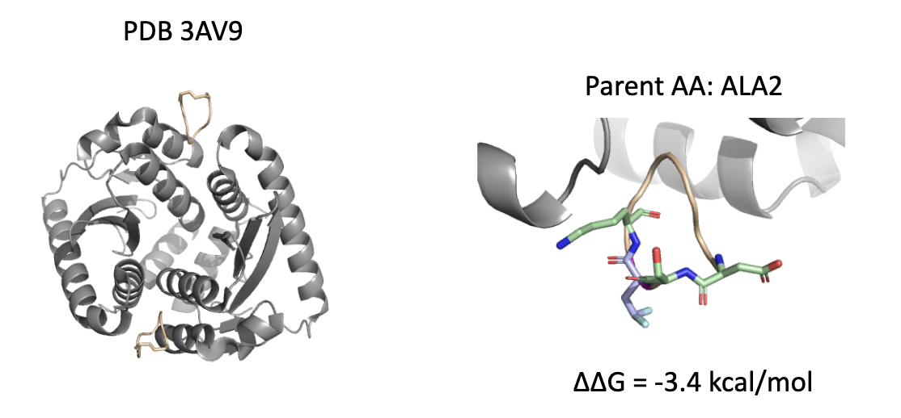

* **原始残基**：ASP（小、负电）；

* **变体**：带有一个芳香环结构，靠近 **Y99**（酪氨酸）；

* **结构效果**：可能形成 face-to-face π–π 相互作用，显著增强疏水堆积与方向性结合。

🧠 **化学直觉**：π–π stacking 在蛋白-小分子或蛋白-肽结合中是常见的能量贡献点，但 canonical ASP 无法实现，通过替换为芳香型 ncAA 即可打开这一路径。

***

### 5.4 **Case 4：PDB 3AV9 – ALA2 位点变体，提升溶剂暴露端的极性匹配**

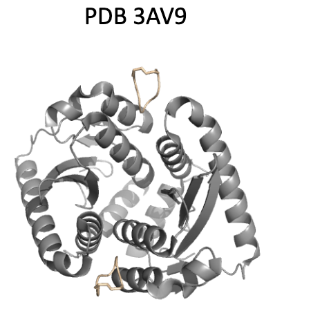

* **变体**：在侧链末端引入两个**氟原子**；

* **位置**：靠近结合面外部的溶剂暴露区域；

* **结构功能**：增强整体水溶性，同时避免 pocket 内部的排斥效应。

🧠 **设计启示**：并非所有变体都必须深入 pocket，有时优化表面电性与极性环境也能改善 binding enthalpy 与 entropy 贡献。

***

### 5.5 **总结：结构合理性是筛选“好变体”的核心**

这些示例说明，NCFlow 的设计并非盲目筛选，它结合 pocket 空间约束、化学可行性与分子互作模式，生成出：

* **可合成性强**（来源于实际 ncAA 商业库）；

* **结构可信度高**（pLDDT>90）；

* **多通道增强 binding**（溶剂互作、极性接触、堆叠作用）；

* **物理层面合理**（∆∆G 显著负值）；

Figure 4 将 wild-type、预测构象、受体 pocket 与关键接触残基清晰可视化，非常有助于理解这些突变在物理空间中如何“发挥作用”。

***

## 6.&#x20;**&#x20;总结与展望：从单点预测到通用多肽设计平台**

本文所提出的 **NCFlow** 模型与设计流程，展示了一条**系统性地将非天然氨基酸引入多肽设计**的路径。这项工作不仅弥补了现有结构预测模型在处理 ncAA 时的盲区，更提出了一个**可扩展、可解释、可验证**的端到端设计范式。

我们来回顾一下它的主要贡献：

***

### 6.1 **核心贡献**

#### **✅ 通用的构象生成能力**

* 不依赖固定的20种氨基酸；

* 接收任意原子结构（SMILES）作为输入；

* 能泛化到 PDB 中**从未见过的 ncAA**。

#### **✅ 结构质量可靠**

* 平均 RMSD 优于 Boltz1/2 约 1.8Å；

* 内置 confidence model 可提供 **pLDDT-based uncertainty**，用于过滤不可信样本。

#### **✅ 多肽设计流程成体系**

* 结合 deep mutational scanning、AEV-PLIG 深度打分、ATM MD 模拟；

* 自动生成并筛选结构合理、结合力增强的 peptide-ncAA 变体；

* 适配线性、多环等不同肽构型。

#### **✅ 可解释的结构输出**

* Figure 4 的案例展示了变体如何通过溶剂相互作用、π堆叠或极性接触实现 binding affinity 提升；

* 具有高度物理合理性，有望指导实验合成。

***

### 6.2 **当前的局限性**

尽管 NCFlow 系统表现出色，论文也诚实地指出了目前面临的一些挑战：

#### **⚠️ Scoring 方法仍具有系统依赖性**

* AEV-PLIG 和 ATM 的相关性在不同蛋白–肽体系中表现不一；

* 某些体系中模型不敏感（例如 Mdm2–p53）。

#### **⚠️ 长肽与多位点突变支持有限**

* ATM 在长肽（如 35aa PUMA）中计算容易 fail，采样不稳定；

* 当前仅处理单点突变，多点组合突变的 combinatorial explosion 尚未解决。

#### **⚠️ ncAA 池仍受限**

* 使用的 ncAA 来源于商业合成库，某些化学基团带保护性侧链，未必适用于功能增强；

* 未来可考虑结合先验知识筛选更“功能驱动”的 ncAA 子集。

***

### 6.3 **未来的可能方向**

#### **🧪 实验验证**

* 下一步关键是将 top 设计变体进行化学合成与 binding assay；

* 验证 predicted ΔΔG 与真实 KD 的一致性，为模型闭环提供支撑。

#### **🔄 多位点突变策略**

* 引入 reinforcement learning 或 beam search 策略，探索 combinatorial ncAA 变体；

* 搭配全肽级别的结构预测模型（如 AlphaFold3）做精细验证。

#### **🧠 结构–功能联合优化**

* 当前仅优化 binding affinity，未来可联合优化稳定性、免疫原性、溶解度等药物属性；

* 多目标设计框架是下一步突破方向。

***

## 7. **结语：NCFlow 是走向“智能肽药设计”的关键一步**

这篇文章不仅提供了一个强有力的结构生成模型，更重要的是构建了**一整套整合 AI 与分子模拟的工作流**，为非天然肽类药物设计打开了一条实用路径。

在 peptide therapeutics 越来越重要、合成与筛选成本居高不下的今天，NCFlow 提供的工具集，**正是将“构想中的肽”变为“结构可控、功能可预”的现实候选药物的关键一步。**

