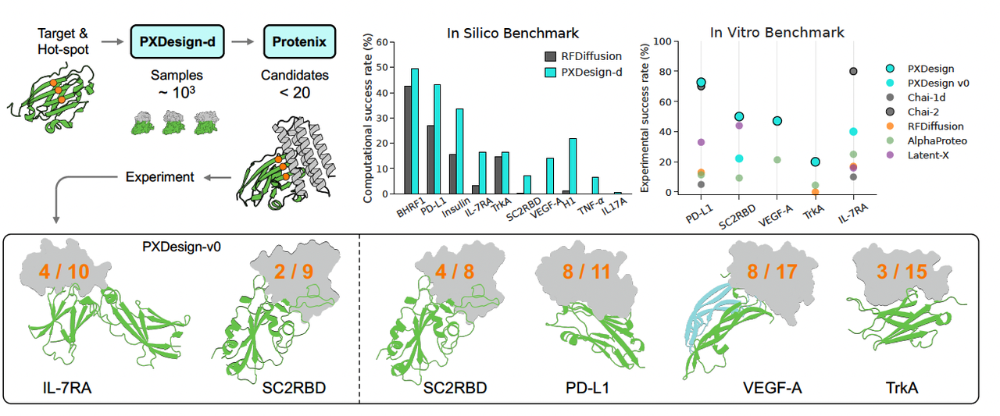
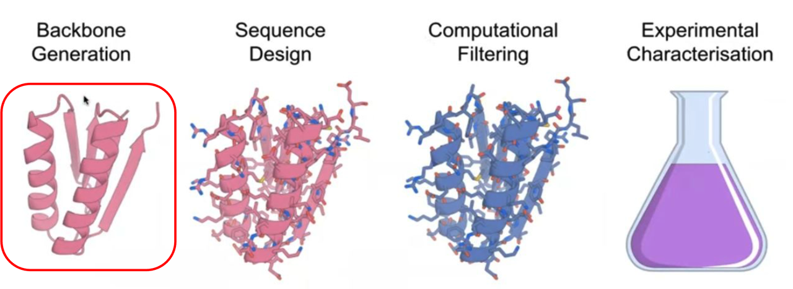
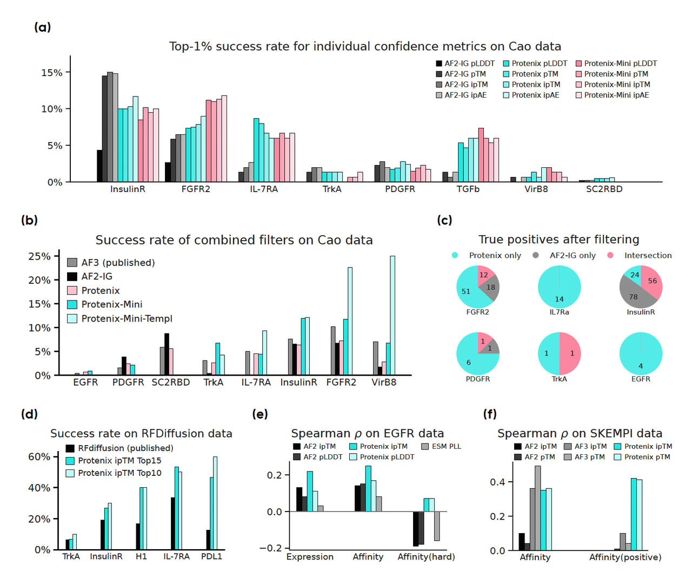
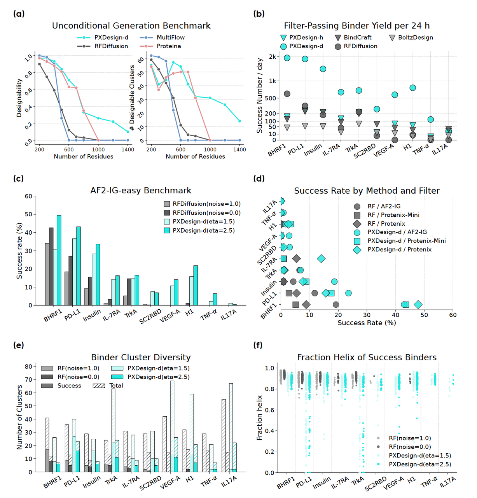
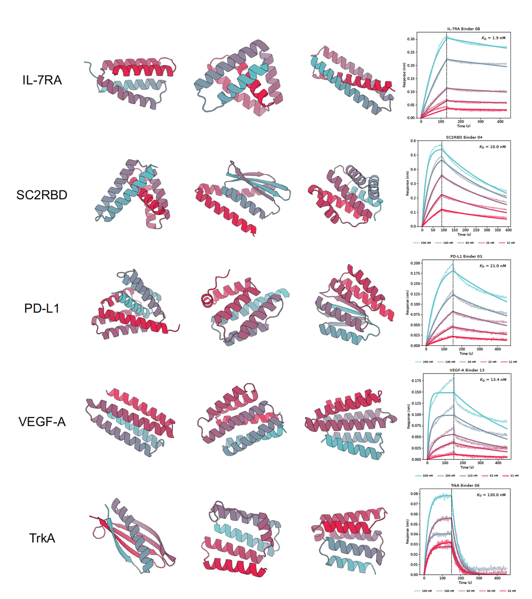

**笔者按：**

在这周五（2025.8.15),字节跳动的Seed团队发出了PXDesign的技术报告。这个团队之前是国内第一个成功复现Alphafold3的团队，他们将他们的复现模型命名为Proteinix（这个名字起的挺好：可以理解为Protein+x，符合AF3蛋白质+全原子的模型定位，也可以理解成Phenix，像凤凰一样腾飞）。他们在今年1月发出了Proteinix的技术报告，在8月就发开了对应的蛋白设计模型PXDesign，进度非常快（不愧是大公司）。不过，这应该也是他们很早就规划好的路，因为有了好的结构预测模型，大家都会很自然的想到基于这个好的结构预测模型去做一个好的设计模型。那今天就来读一读，他们新开发的PXDesign的技术报告，看看和传统方法比有哪些提升。

***

***

## 1. 背景介绍

在过去几年里，AI 在蛋白质结构预测上的突破（如 AlphaFold）震惊了整个生命科学界。但科学家们心中的“终极问题”还没有解决：

**能不能让 AI 不止预测结构，而是直接设计出能牢牢结合靶标的蛋白？**

这就是所谓的 **蛋白结合物（protein binders）设计** ——它是新型抗体、受体拮抗剂和信号通路调控工具的核心。

然而，现实往往比想象更残酷：

* 现有方法（如 AlphaProteo、RFDiffusion）在一些靶标上确实能找到 binder；

* 但**命中率低**，意味着实验室要测试大量候选，才能侥幸找到几个真正有效的。

那么问题来了：**有没有可能把命中率提升几个档次，让实验变得更“划算”？**

最近，字节跳动 Seed 团队给出了一个令人眼前一亮的答案：

他们发布了一个全新的设计框架 —— **PXDesign**。

在六个不同的蛋白靶标上，它把实验命中率提升到了 **20–61%**，而且在大多数情况下都比以往的方法高出 2–5 倍。

更重要的是，研究团队还把这个系统做成了 **开源工具和在线服务**，任何人都能尝试。

* Github仓库：https://github.com/bytedance/PXDesignBench

* 在线服务器：https://protenix-server.com/

***

📌 在这篇推文里，我们将结合论文里的图，带你逐步理解：

1. PXDesign 是如何把命中率提上去的？

2. 它为什么能比之前的方法更稳？

3. 未来它是否会成为一个“万能分子设计 AI”？

***

## 2. **为什么需要新方法？**

在蛋白结合物设计中，**生成只是第一步**。

AI 可以轻松吐出成千上万条候选序列，但问题是：

👉 **哪些才是真正可能结合的？**

这就需要 **筛选与排序 (Filtering & Ranking)**。

就像做药物筛选，关键在于从“海量噪音”里挑出真正的钻石。

***

### 2.1 **传统筛选的问题**

目前最常用的筛选方式，是基于 **AlphaFold2 改进版 (AF2-IG)** 提供的置信度指标（pLDDT、pTM、ipTM 等）。

但问题是：

* 在某些靶标上，AF2-IG 的指标确实能 enrich 出真正的 binder；

* 但在另一些靶标上，效果就会变差。

* 换句话说，**单一指标不够稳健**。

论文团队在多个数据集上做了系统对比，结果非常有意思：

* **Figure 1a**：单个置信度指标的成功率对比。

  * 👉 Protenix 系列指标（pLDDT、pTM、ipTM、ipAE）几乎全面优于 AF2-IG。

* **Figure 1c**：维恩图展示 Protenix 与 AF2-IG 筛选出的真阳性。

  * 👉 两者的重叠 surprisingly 小，说明它们关注的设计空间很不一样。

* **Figure 1d**：拿 RFDiffusion 生成的设计，分别用 AF2-IG 和 Protenix 来重新排序。

  * 👉 用 Protenix 的 ipTM 排序后，命中率 **显著提升**。

***

### 2.2 **结论**

这给我们一个很关键的启示：

* **筛选不是越单一越好，而是要多模型互补。**

* Protenix + AF2-IG 的联合使用，可以覆盖更广的设计空间，提高找到真 binder 的概率。

这也是 PXDesign 能大幅提升命中率的第一大秘诀：

👉 **不仅要会“生成”，更要会“挑选”。**

***

## 3. **PXDesign 的核心——生成 + 筛选**

在筛选之前，我们得先有“候选池”。

那么问题来了：**这些候选是怎么来的？**

***

### **⚙️ 两条路：扩散 vs 幻觉**

在蛋白设计领域，目前主流的生成方式有两种：

1. **扩散模型 (Diffusion)**

   * 类似图像生成中的 Stable Diffusion，但对象换成了蛋白结构。

   * 优点：生成速度快、样本多样性高。

   * 缺点：需要训练大模型，成本高。

2. **幻觉优化 (Hallucination)**

   * 原理是“反向优化”：让序列在结构预测模型里得高分。

   * 优点：针对性强，能做精细优化。

   * 缺点：速度慢，不适合大规模。

PXDesign 聪明地做了一个“组合拳”：

👉 扩散模型（PXDesign-d）负责 **大规模探索**，

👉 幻觉优化（PXDesign-h）负责 **小范围精细打磨**。

***

### **📊 Figure 2：谁更强？**

论文在 10 个蛋白靶标上做了大规模测试，结果很清晰：

* **Figure 2c/d**：成功率对比

  * 👉 PXDesign-d 的成功率全面超过 RFDiffusion，不论是用 AF2-IG 还是 Protenix 做筛选。

* **Figure 2e**：结构多样性

  * 👉 PXDesign-d 生成的结构簇数量更多，不再像 RFDiffusion 那样“α-螺旋偏好严重”。

  * 这意味着它探索的结构空间更广。

* **Figure 2f**：二级结构组成

  * 👉 PXDesign-d 生成的 binder 在 α-螺旋和 β-折叠之间更平衡，说明它能设计出风格多样的候选。

### **💡 结论**

这一系列对比告诉我们：

* 在“生成”阶段，PXDesign-d 能提供 **更多、更快、更丰富** 的候选；

* 搭配前面讲的 **多模型筛选 (Protenix + AF2-IG)**，PXDesign 就能从“大海捞针”变成“定向捕鱼”。

这就是它为什么能在后续实验中有 **显著命中率优势** 的根本原因。

***

## 4. **命中率的真正考验——体外实验**

在计算机上成功，并不意味着在实验室也能成功。

**真正的考验，是把设计好的蛋白拿到实验台上，看它能不能真的结合。**

***

### 4.1 **🧪 实验设计**

研究团队挑选了 6 个具有代表性的靶标：

* **IL-7RA**（免疫受体）

* **SC2RBD**（新冠病毒受体结合域）

* **PD-L1**（免疫检查点）

* **TrkA**（神经生长因子受体）

* **VEGF-A**（血管生成因子）

* **TNF-α**（炎症因子）

流程很严格：

1. 先用 **PXDesign-d** 生成候选；

2. 再用 **Protenix + AF2-IG 双重筛选**，保证质量；

3. 然后在大肠杆菌系统里表达；

4. 最后通过 **BLI（生物层干涉）实验**测定结合亲和力。

***

### 4.2 **📊 Figure 3：数据一目了然**

Figure 3 给出了多个成功 binder 的结构预测和 BLI 曲线：

* **IL-7RA**

  * 命中率从旧版 PXDesign v0 的 40% → 新版的 72.7%。

  * 图中 BLI 曲线清晰显示出纳摩尔级别的结合亲和力（KD \~1.9 nM）。

* **SC2RBD**

  * 从 22.2% → 提升到 50%。

  * 这在新冠相关研究里意义重大。

* **PD-L1**

  * 命中率高达 **72.7% (8/11)**，远超 AlphaProteo（\~11%）。

  * 图中曲线表明结合信号强且稳定。

* **VEGF-A**

  * 同样达到 47% 以上命中率，BLI 曲线 KD \~13 nM。

* **TrkA**

  * 命中率 \~20%，表现稳定。

* **TNF-α**

  * 唯一的失败靶标（0 成功），也提示了 PXDesign 仍有局限性。

***

### 4.3 **结论**

这些实验告诉我们：

* PXDesign 不只是“计算机里看起来很强”，而是能在 **真实实验** 里交出漂亮成绩单。

* 特别是像 **PD-L1、IL-7RA** 这样的免疫相关靶标，命中率远远高于以往方法。

* 即便在最难啃的 **SC2RBD** 上，也实现了 2 倍以上提升。

一句话总结：

👉 **PXDesign 把蛋白设计从“可能成功”变成了“很大概率会成功”。**

***

## 5. **从蛋白到统一分子设计平台**

如果说前面的实验已经证明 PXDesign 在 **蛋白–蛋白结合物** 上表现出色，那么团队接下来的探索更有野心：

👉 **能不能让同一套框架，跨越到其他分子类型？**

***

### 5.1 **Figure 5：跨模态设计的案例**

Figure 5 展示了一系列“零样本”的案例设计：

* RNA、DNA 的结合物

* 小分子配体的结合物

* 甚至还包括对称寡聚体的生成

这些图的核心信息是：

* PXDesign 的架构并不是为某一种分子“硬编码”的，而是基于 Protenix 预测器的通用性，可以天然适配到多种分子体系。

换句话说，**PXDesign = 一个通用分子设计引擎的雏形。**

***

### 5.2 **Figure 6：环肽（Cyclic Peptides）的验证**

研究团队选择了环肽这一“跨模态”测试场景。为什么是环肽？

* 它们结构紧凑，常常作为小分子药物的替代。

* 与蛋白 binder 设计类似，但长度更短（8–18 氨基酸）。

**结果：**

* 在 12 个目标上，PXDesign（无论是 diffusion 还是 hallucination）都超过了之前的 RFpeptides 方法。

* 特别是在困难靶标 TNF-α 上，PXDesign-h 甚至可以直接生成功能性环肽序列。

* 图 6c–d 的例子更有趣：

  * 针对 MDM2 的环肽设计，竟然复现了著名的 “F-W-L” 疏水三元组，这是天然结合界面中关键的识别信号。

***

### 5.3 **结论**

从 Figure 5 和 6 可以看出：

* PXDesign 已经从一个“蛋白设计工具”，走向了一个 **统一分子设计平台**。

* 它不仅能设计蛋白结合物，还能跨越到 **核酸、小分子、环肽**，甚至未来可能扩展到更复杂的药物分子。

一句话总结：

👉 **PXDesign 的潜力，远不止蛋白设计，它可能成为“通用分子 AI”。**

***

## 6. **局限性与挑战**

看到前面的结果，你可能会觉得 PXDesign 已经“无所不能”。

但研究团队也很坦诚：它仍然有不少限制。

***

### 6.1&#x20;**&#x20;Figure 4：靶标依赖性强**

Figure 4 展示了不同靶标在 **pTM 评分分布**和**成功率变化**上的差异。

* 有的靶标（如 FGFR2），只要把阈值调高一点，成功率就能从 5% 突然飙升到 100%。

* 但在另一些靶标（如 SC2RBD）上，同样的阈值调整却可能让成功率直接掉到 0。

👉 这说明：**没有一个通用的筛选阈值能适配所有靶标**。

PXDesign 需要针对不同靶标做定制化的参数选择。

***

### 6.2 **数据集不足**

* 目前用来做评估的公共数据集（比如 Cao dataset）阳性样本很少。

* 这导致模型的精度评估容易失真，有时候在 benchmark 上看似效果不好，但在真实实验里反而能成功（比如 SC2RBD 的情况）。

* 👉 这提醒我们：**社区迫切需要更大规模、更高质量的开放数据集。**

***

### 6.3 **流水线复杂 & 成本高**

PXDesign 的流程包括：

1. 生成

2. 预测

3. 筛选

4. 聚类

5. 再筛选

这种多步流程虽然模块化、可解释，但也意味着计算资源消耗很大，在时间敏感的场景里会有瓶颈。

***

### 6.4 **实验通量限制**

目前团队的实验主要依赖 **BLI 测试**，每个靶标大约能测 10–20 个候选。

这远远不够支撑大规模探索。

如果未来能结合 **展示技术（display-based screening）**，就能把通量提升一个数量级。

***

### 6.5 **小结**

PXDesign 已经在多数靶标上实现了前所未有的命中率，但：

* **靶标依赖性强**（Figure 4 直观展示了这一点）；

* **公共 benchmark 数据不足**；

* **实验验证通量受限**。

换句话说，PXDesign 已经把 binder 设计推上了新台阶，但距离“万能设计 AI”还有不少路要走。

***

## 7. **总结与展望**

回顾整篇论文，我们可以看到 PXDesign 的几个核心亮点：

1. **生成 + 筛选的组合拳**

   * 扩散模型负责大规模探索，幻觉优化负责小范围精细调优。

   * 多模型筛选（Protenix + AF2-IG）让命中率大幅提高。

2. **实验验证有力**

   * 在五个靶标上取得 20–61% 的命中率，远超现有方法。

   * 在 PD-L1、IL-7RA 等免疫相关靶标上表现尤其亮眼。

3. **跨模态潜力**

   * 不仅能做蛋白–蛋白结合物，还能拓展到环肽、小分子、DNA/RNA。

   * 展示出成为 **统一分子设计平台** 的可能性。

***

### 7.1 **但挑战依然存在**

* **靶标依赖性强**：不同蛋白需要不同阈值（Figure 4）。

* **数据集不足**：现有 benchmark 过于稀疏，难以全面评估方法。

* **实验瓶颈**：BLI 测试通量有限，未来需要更高通量的验证手段。

***

### 7.2 **展望未来**

PXDesign 告诉我们，AI 设计不再只是“瞎碰运气”，而是有机会变成 **高命中率、可控的科学流程**。

它或许还不能称为真正的“万能分子设计 AI”，但已经在向这个方向迈出了一大步。

未来，当更多高质量数据、更多跨模态验证和更高通量实验平台出现时，

👉 **我们离“通用分子设计引擎”的时代，可能就不远了。**

### 7.3 **点评：**

对于我们中国人来说，Proteinix和PXDesign的意义可能更重大，因为这是对现在世界上热门领域的一次国产化替代，如果效果好的话，可能能帮中国实现在蛋白质设计这个未来可能渗透进各行各业的核心技术领域，实现很好的弯道超车。

