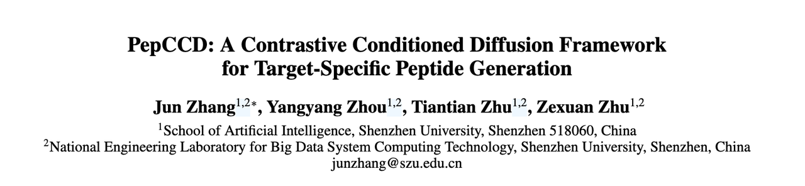
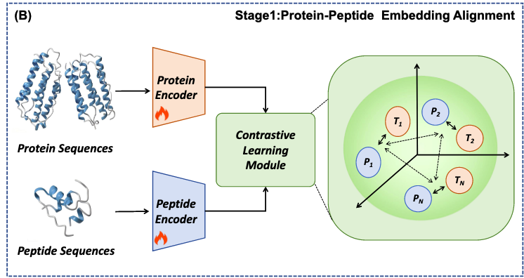
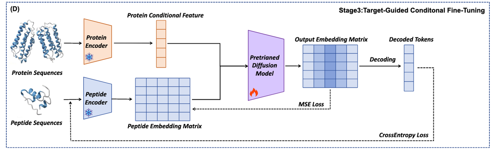
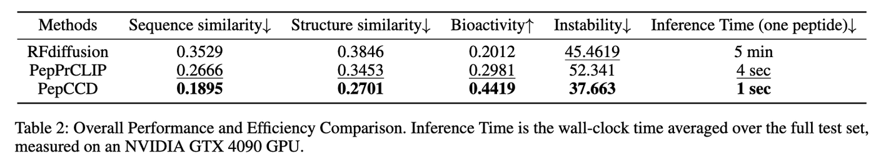
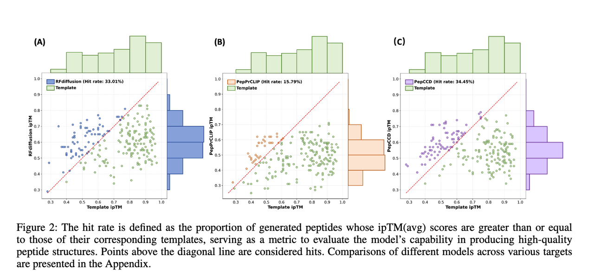

今天想和大家分享一篇最新的工作 —— **《PepCCD: A Contrastive Conditioned Diffusion Framework for Target-Specific Peptide Generation》**。

为什么要讲这篇文章呢？

* 一方面，**多肽药物**在“不可药物化”靶点上的潜力越来越受到关注，但现有的设计方法不是过度依赖高分辨率结构，就是需要昂贵低效的实验筛选。

* 另一方面，这篇文章提出的 **PepCCD 框架**，把 **对比学习** 和 **扩散模型** 融合到了一起，实现了仅基于蛋白质序列的端到端多肽生成。这种方法论上的突破，可能会成为未来肽药设计的一个新范式。

对我来说，这篇文章最大的亮点在于：它不仅解决了“**没有结构怎么办**”的难题，还在多样性、效率和生物活性预测上超越了已有的基于序列的方法。可以说，它为“**序列驱动的肽药设计**”打开了一扇新的大门。

***

## **第一部分：背景介绍**

在现代药物研发中，有一个长期存在的难题：超过 80% 的致病蛋白被认为是“小分子不可药物化”的靶点，因为它们缺乏稳定的结合口袋，难以被传统的小分子抑制剂有效调控。这类靶点，往往是疾病进程的关键角色，却常常被挡在“药物化”大门之外。

相比之下，**多肽药物**以其高特异性、良好生物相容性和低毒性，在这类靶点的治疗中展现出巨大潜力。过去二十年，已有超过百种多肽药物成功上市，用于癌症、糖尿病、感染性疾病等多种领域。但问题也随之而来：

> 如何在庞大的多肽序列空间里，高效找到真正能与特定蛋白结合的候选？

传统路径依赖于 **高通量实验筛选** 或 **基于蛋白结构的计算设计**。然而，实验筛选不仅耗时耗资，成功率也低；而结构依赖的方法，又受限于高分辨率结构数据的稀缺性和不稳定性，特别是面对动态构象蛋白时，几乎无能为力。

> 那么，**能否只依靠蛋白质的序列信息，就直接生成与之特异结合的多肽？**

这一问题，正是本文所要讲解的研究——**PepCCD 框架**——试图回答的核心。正如 Figure 1(A) 所展示的那样，研究者们设计了一个端到端的生成式模型，只需输入蛋白序列，就能输出具有靶点特异性的候选多肽，彻底绕开对结构的依赖。

***

## **第二部分：方法创新逻辑**

PepCCD 的设计框架可以从 Figure 1 来理解：从输入蛋白质序列开始，经过三个核心阶段，最终输出与目标蛋白高度匹配的多肽序列。相比于以往依赖结构的设计流程，这一方法的最大创新，在于它把 **对比学习（Contrastive Learning）** 和 **条件扩散模型（Conditional Diffusion Model）** 有机结合，完成了“仅基于序列”的端到端多肽生成。

1. **框架总览（Figure 1A）**

研究者首先构建了一个整体的Pipeline：输入是蛋白质序列，输出是目标特异性多肽序列。整个过程完全不依赖三维结构，只需要序列信息，就能走通完整的生成路径。这为“结构不可得”的靶点，提供了全新的设计可能。

***

* **Stage 1: 蛋白-多肽对比学习 (Figure 1B)**

核心问题在于：

> 怎样让模型理解“**这个蛋白应该匹配什么样的多肽**”？

PepCCD 的解决方案是引入**对比学习**。

* 使用双 ESM-2 编码器，分别对蛋白和多肽进行编码。

* 通过对比学习，把真实配对的蛋白-多肽 embedding 拉近，把非配对的推远。

* 最终在语义空间中，蛋白序列就能携带关于“潜在结合肽”的关键信息。

> 这一阶段的意义在于：让蛋白和多肽共享语义空间，为后续的条件生成提供“桥梁”。

***

* **Stage 2: 无条件的多肽扩散模型预训练 (Figure 1C)**

接下来，研究者构建了一个超大规模的模拟多肽数据集，对扩散模型进行 **无条件预训练**。

* 过程如图所示：对多肽 embedding 加入高斯噪声，再学习去噪还原。

* 本质上是让模型掌握多肽序列的整体分布和多样性。

> 这一阶段的意义在于：为模型打下“**多肽长什么样**”的统计学基础，保证后续生成不至于局限在模板或训练数据里。

***

* **Stage 3: 条件扩散微调 (Figure 1D)**

最后，PepCCD 将 **目标蛋白的语义向量**（来自 Stage 1 对比学习）输入扩散模型，作为条件信号，引导去噪过程。

* 在这一环节，生成过程不仅能保持多肽的多样性，还能精准对齐到特定蛋白靶点。

* 输出阶段，模型会解码成具体的氨基酸序列，并通过交叉熵损失优化与真实数据的接近度。

***

**总结一下**：

Figure 1 展示的三阶段流程，正是 PepCCD 的创新核心：

* Stage 1 确保蛋白-多肽的“语义桥梁”；

* Stage 2 提供多肽生成的多样性与稳健性；

* Stage 3 则把二者结合起来，实现精准且多样的靶点特异性设计。

***

## **第三部分：实验结果亮点**

模型提出后，研究者将 PepCCD 与两类最先进方法做了对比：

* **RFdiffusion**：基于结构的代表方法；

* **PepPrCLIP**：基于序列的代表方法。

对比结果直接体现在 Table 1、Table 2 和 Figure 2 里。

***

1. **更强的靶点结合能力（Table 1）**

* 在 **ipTM** 和 **Rosetta 总能量分数** 等衡量蛋白-多肽复合物结合力和稳定性的指标上，PepCCD 明显优于传统的序列引导方法。

* 虽然在某些结构信息极其有利的情况下，PepCCD 略逊于 RFdiffusion，但这是因为 RFdiffusion 直接利用了三维结构，而 PepCCD 完全不依赖结构。

> 换句话说，PepCCD 证明了：**即使只有序列输入，也能设计出高质量的多肽**。

***

* **更高的多样性与生物活性（Table 2）**

* PepCCD 在 **序列相似度** 和 **结构相似度** 两项指标上最低，说明生成的候选肽最具新颖性和多样性。

* 在 **生物活性预测分数** 上，PepCCD 也显著高于其他方法，这意味着它更有可能生成具有功能性的候选分子。

* 另外，PepCCD 生成的多肽在 **稳定性** 上更好，减少了体外实验失败的风险。

> 这些结果共同说明：PepCCD 不仅生成“能结合”的肽，还生成“多样且可用”的肽。

***

* **极致的推理效率（Table 2）**

* PepCCD 平均生成一个多肽只需 **1 秒**，而 RFdiffusion 需要 **5 分钟**。

* 这种数量级上的差距，让 PepCCD 在大规模虚拟筛选中展现出压倒性优势。

***

* **命中率的直观对比（Figure 2）**

* Figure 2 把不同方法的 **命中率** 画在对角线坐标上：点落在对角线以上，说明生成的肽比参考模板更优。

* 结果显示，PepCCD 在绝大多数靶点上都能“超越模板”，并且在平均水平上甚至超过了基于结构的 RFdiffusion。

> 这意味着：**PepCCD 在没有结构信息的条件下，仍能稳定地输出高质量候选**。

***

**小结**

PepCCD 的实验结果非常亮眼：

* 在靶点结合力、多样性和生物活性上全面领先；

* 在推理速度上远超竞争对手；

* 在实际命中率上甚至可以比肩或超越结构驱动方法。

它展示出了一种真正可扩展、可实用的“仅依赖序列”的多肽设计路径。

***

## **第四部分：关键创新总结**

读到这里，不难发现 PepCCD 的独特性：它并不是对现有方法的“小修小补”，而是在方法论上实现了一个真正的突破。

1. **首次引入扩散模型做多肽设计**

* 过去扩散模型多应用于图像、蛋白结构生成，PepCCD 则把它引入到多肽序列生成中。

* 这使得模型能够在庞大序列空间中高效探索，生成结果既多样又稳定。

* **蛋白-多肽对比学习的创新应用**

- 对比学习在 NLP 和计算机视觉中已成熟，但应用于蛋白-多肽关系还是第一次。

- 它让蛋白序列本身就能携带关于“潜在结合肽”的信息，从而实现真正的 **序列驱动设计**。

* **三阶段训练范式**

- **对比学习（Stage 1）**：建立语义桥梁；

- **无条件预训练（Stage 2）**：学会多肽的多样性和分布；

- **条件微调（Stage 3）**：把蛋白条件和扩散生成结合，输出目标特异性候选。

- 三者结合，使 PepCCD 同时具备 **特异性** 和 **多样性**，避免了“只会生成一个模板化肽”的局限。

* **摆脱对结构的依赖**

- 传统方法要么靠高分辨率结构，要么依赖模板序列。PepCCD 的核心价值在于：**仅凭蛋白序列，就能设计出高质量的多肽**。

- 这对动态构象蛋白、无结构数据的靶点尤其重要。

> **PepCCD 的最大创新，在于用对比学习建立蛋白-多肽语义桥梁，再通过条件扩散模型实现端到端的序列驱动生成，从而真正突破了“无结构不设计”的限制。**

***

## **第五部分：蓝极的思考**

PepCCD 展示了一条全新的路径：**仅依赖蛋白序列信息，就能生成多样且特异性的多肽**。这一点，尤其对那些缺乏高分辨率结构数据的“难缠靶点”，具有非凡意义。

不过，我们也需要看到这项工作的局限性：

* **缺乏湿实验验证**：目前的评估主要依赖计算指标（如 ipTM、Rosetta 分数、分子动力学模拟等）。虽然这些指标在一定程度上能反映结合能力和稳定性，但最终多肽是否真的能在细胞或动物模型中发挥作用，还需要通过实验验证。

* **数据依赖性**：PepCCD 的对比学习依赖于蛋白-多肽复合物数据集，而这些数据在真实世界中仍然有限，可能影响模型在极端冷门靶点上的泛化能力。

> 换句话说，PepCCD 在 **算法层面** 有突破，但从 **药物开发走向临床**，还有一段路要走。

***

### **展望**

* 如果后续结合湿实验筛选，验证 PepCCD 生成的候选肽是否真的具备良好的药效和安全性，它将有望成为 **肽药设计的核心工具**。

* 更长远地看，这种“序列驱动 + 生成模型”的思路，也许还能扩展到 **蛋白-小分子**、**蛋白-抗体** 等更多场景。

所以问题来了：

> **你觉得序列驱动的方法，未来能不能完全取代依赖结构的方法？还是说它们更可能是互补的关系？**

欢迎在评论区留下你的看法，一起探讨肽药设计的未来。

