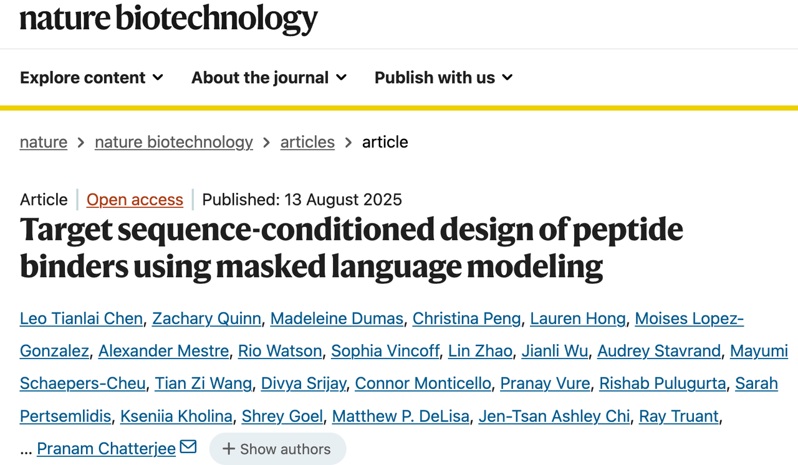
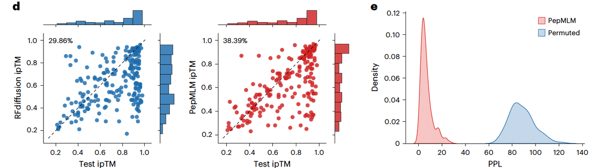
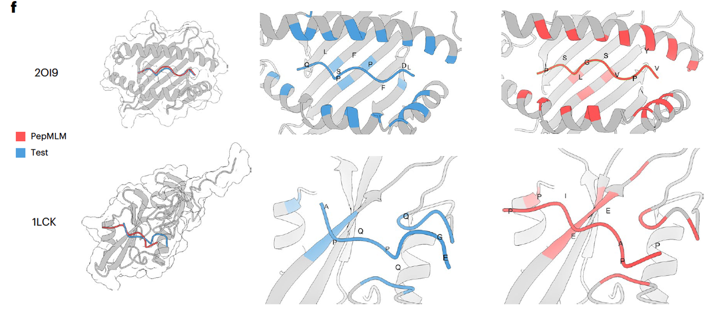
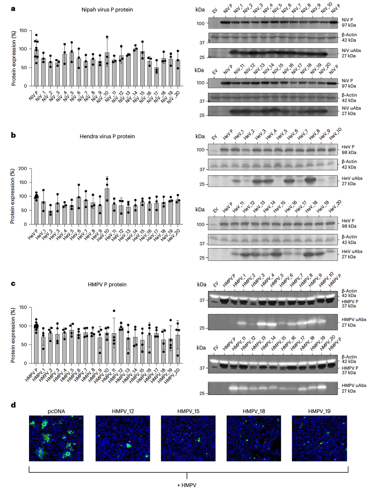

> 蓝极说：
>
> 在蛋白质设计的世界里，有一个长期存在的难题：**很多致病蛋白没有稳定的三维结构**，让药物分子无处下手。
>
> 这类靶点被称作“难成药”蛋白，它们往往正是癌症、神经退行性疾病甚至新发病毒中的关键驱动因子。
>
>
>
> 今天我要和大家分享的，是刚刚（2025.08.13）发表在 *Nature Biotechnology* 的一篇文章：
>
> **《Target sequence-conditioned design of peptide binders using masked language modeling》**（靶标序列驱动的肽结合物设计）。
>
>
>
> 这篇文章的亮点在于：
>
> * 它提出了一种全新的思路：完全不依赖蛋白质结构，**仅凭目标序列**，就能设计出能与其结合的肽。
>
> * 作者把这种方法命名为 **PepMLM**，通过语言模型，让模型“读懂”蛋白的语言，然后自己补全出能结合的肽。
>
> * 更重要的是，这不只是理论模型：作者还在癌症、亨廷顿舞蹈症、以及高致死率病毒上做了实验验证，效果非常亮眼。
>
>
>
> 也就是说，这篇文章展示了一种可能改变药物研发范式的新方法：
>
> **从“结构驱动”到“序列驱动”，让蛋白质语言模型直接生成药物候选肽。**

🔗原文链接：https://www.nature.com/articles/s41587-025-02761-2

💻Github链接：https://github.com/programmablebio/pepmlm

***

## **一、引言：为什么这项工作重要？**

在药物研发里，一个最关键的任务就是找到“结合物”——能牢牢黏住目标蛋白的小分子或者肽段。

小分子药物在过去几十年里成就斐然，但它们往往只能作用于有明确口袋或者沟槽的蛋白。很多“难成药”（undruggable）的靶点，比如转录因子、融合蛋白，根本没有现成的结合口袋，这让设计有效药物非常困难。

近年来，**结构预测工具（如 AlphaFold）** 的出现，为蛋白设计带来了巨大推动。基于结构的方法，比如 **RFdiffusion**，可以帮助设计新的结合蛋白。但问题是：

👉 这些方法仍然过度依赖目标蛋白的三维结构。

👉 而实际上，很多致病蛋白是**无序的（disordered）**，没有稳定结构可参考。

于是，这篇文章的作者提出了一个很新颖的想法：

> 能不能像自然语言处理那样，不依赖三维结构，只基于“蛋白质的语言”（序列），直接让模型去“写”出合适的结合肽？

这就是 **PepMLM** 的核心：

> 一个基于 **语言模型的肽设计框架**，只需要输入目标蛋白的序列，就能设计出与之结合的全新肽分子。

***

## **二、方法亮点：PepMLM是如何工作的？**

我们知道，语言模型的基本思路是——给它一个句子，把中间挖掉一些词，然后让模型去预测这些缺失的词。

PepMLM 就是把这个思路搬到蛋白质世界：

> 👉 输入：目标蛋白的氨基酸序列 + 一个被 **mask** 掉的肽段位置。
>
> 👉 输出：模型预测的 **结合肽序列**。

这样，模型就像在“补全句子”一样，学会如何生成能贴合目标蛋白的肽段。

**核心指标：Perplexity (PPL)**

* 文章引入了一个关键概念——**困惑度（perplexity, PPL）**。

* 简单理解：PPL 越低，说明模型对这个肽越“自信”，认为它越可能是真正的结合物。

* 作者把 PepMLM 的生成结果和真实已知的结合肽做比较，发现两者的 PPL 分布几乎重叠，说明模型能很好地模仿真实结合模式。

* **Fig.1b** 展示了不同方法生成肽的困惑度分布，可以看到 PepMLM 生成的肽分布（红色）几乎贴合真实肽（蓝色）。

* **Fig.1c** 则进一步证明 PepMLM 能明显区分“真”结合肽和“随机肽”，而原始ESM-2模型和随机序列就做不到。

> 换句话说，PepMLM 学会了“哪些肽是合理的结合物，哪些只是噪声”。

***

## **三、性能对比：PepMLM vs. 现有方法**

设计结合肽的挑战，不仅仅是“能生成”，更重要的是：

> 👉 它是否真的能和目标蛋白牢固结合？
>
> 👉 在和现有最强的结构驱动方法（比如 RFdiffusion）相比时，谁更强？

作者用了一系列对比实验来回答这个问题。

1. **PepMLM 的命中率更高**

他们用 **AlphaFold-Multimer** 来预测 PepMLM 设计的肽是否能和目标蛋白稳定结合，并用 ipTM 分数来衡量结合可信度。

结果显示：

* PepMLM 的命中率达到 **38%**，而 RFdiffusion 只有 **29%**。

* 如果进一步要求结合结构的可靠性更高（pLDDT > 0.8），PepMLM 依然保持优势（49% vs. 34%）。

**Fig.1d** 左右两图直接对比了 RFdiffusion 和 PepMLM 的命中率差异，直观展现了 PepMLM 的性能优势。

***

* **结合特异性验证**

为了确认 PepMLM 并不是“随便匹配”，作者做了一个 permutation test（打乱配对测试）：

* 如果把设计的肽随机分配到错误的蛋白上，PPL 分数明显升高。

* 说明 PepMLM 确实能识别“对的配对”，而不是生成一些泛化的粘性序列。

**Fig.1e** 蓝色曲线（正确配对）和红色曲线（错误配对）差异显著（P < 0.001），说明 PepMLM 生成的肽具备 **特异性**。

***

* **结构层面的对比**

作者还选取了两个具体例子：

* **小鼠 MHC 蛋白（PDB: 2OI9）**：PepMLM 生成的肽虽然序列不同，但结合方式和已知肽几乎一致。

* **人类酪氨酸激酶（PDB: 1LCK）**：PepMLM 生成的肽结合得甚至比已知肽更牢固（ipTM: 0.82 vs. 0.68）。

**Fig.1f** 直观展示了实验肽（蓝色）和 PepMLM 生成肽（红色）在蛋白上的结合结构，非常接近，说明 PepMLM 真的“学会”了结合模式。

***

**总结来看：**

> PepMLM 不仅在 **量化指标（命中率、PPL）** 上优于 RFdiffusion，还在 **结构层面** 展现出高度合理性。换句话说，它是一个 **既懂统计分布，又能落地到空间结构** 的方法。

***

## **四、实验验证：从序列到真实结合**

前面我们看到，PepMLM 在计算机模拟里表现很强。但科学界一向谨慎：

💡 **模拟再好，也要拿实验说话。**

于是，作者在三个层面做了验证：**癌症/生殖疾病 → 神经退行性疾病 → 病毒感染**。

***

1. **癌症与生殖疾病靶点**

作者首先测试了两个重要的受体：

* **NCAM1**：急性髓系白血病（AML）的标志物。

* **AMHR2**：多囊卵巢综合征（PCOS）相关的关键受体。

实验方法：ELISA（检测肽与蛋白结合能力）。

结果：

* PepMLM 生成的肽在 **纳摩尔级浓度** 就能检测到结合信号。

* 与 RFdiffusion 相比，PepMLM 的成功率和信号都明显更高。

* 而且这些肽不和 BSA 等无关蛋白结合，说明特异性强。

**Fig.2a–b** 展示了 ELISA 曲线，黑色对照线几乎无信号，而 PepMLM 生成的肽能在低浓度下就拉开差距。

***

* **亨廷顿舞蹈症（Huntington’s disease）**

这是一种因 **Huntingtin 蛋白突变** 引起的神经退行性疾病。

作者尝试把 PepMLM 生成的肽融合到 **uAb（合成泛素连接酶）** 上，让它们去标记病变蛋白进行降解。

实验结果：

* PepMLM 生成的肽能有效结合并引导降解 **MSH3**（与疾病进展相关的蛋白）。

* 更惊喜的是，它们还成功降解了突变的 **Huntingtin 蛋白**，在细胞里显著降低其水平。

**Fig.3b–d** 的免疫荧光和 Western blot 清楚展示了：在诱导表达后，Huntingtin 蛋白水平明显下降，PepMLM 肽确实起了作用。

***

* **病毒蛋白降解**

最后，作者把 PepMLM 用到 **新发病毒** 的关键蛋白上。

选择的靶点是 **病毒磷蛋白（P protein）**，它在病毒复制里非常重要。

测试的病毒包括：

* **尼帕病毒（NiV）**

* **亨德拉病毒（HeV）**

* **人偏肺病毒（HMPV）**

实验结果：

* PepMLM 生成的肽引导的 uAbs 能在细胞中显著降低病毒磷蛋白水平。

* 特别是在 HMPV 感染实验里，免疫荧光成像显示病毒蛋白几乎被“清空”。

**Fig.4a–d** 展示了 Western blot 的条带和免疫荧光图，绿色信号（病毒蛋白）在 PepMLM 处理组里明显减弱甚至消失。

***

**小结**

通过 **体外结合实验**、**细胞蛋白降解实验**，再到 **病毒感染实验**，作者证明了：

> 👉 PepMLM 生成的肽不仅能“理论上结合”，而且能在真实的生物系统里 **高效、特异性地结合并调控目标蛋白**。

这一步让 PepMLM 从“一个AI算法”真正跨入了“潜在药物研发工具”的行列。

***

## **五、意义与展望**

通过前面的实验可以看到，**PepMLM 的价值远不止“能生成肽”**。它实际上开辟了一条全新的药物设计路径：

1. **从“结构驱动”到“序列驱动”**

过去的蛋白设计方法往往依赖 **三维结构**，比如用 AlphaFold 预测结构，再基于结构建模结合位点。

但 PepMLM 证明了：

> 👉 **仅仅依赖目标序列**，模型也能学会生成合理的结合肽。

这让很多缺乏稳定结构的“难成药”靶点变得可攻击，比如转录因子、无序蛋白等。

***

* **应用范围的广阔性**

文章已经展示了几个应用方向：

* **肿瘤标志物与生殖疾病靶点**（NCAM1、AMHR2）；

* **神经退行性疾病**（亨廷顿舞蹈症相关蛋白 MSH3、突变 Huntingtin）；

* **新发病毒的关键蛋白**（尼帕、亨德拉、人偏肺病毒的磷蛋白）。

未来，任何只要知道序列的蛋白，都可能成为 PepMLM 的设计对象。

换句话说：它为 **“通用的、序列驱动的结合肽生成器”** 奠定了基础。

***

* **对药物研发的启发**

PepMLM 不仅能生成肽，还能作为 **降解剂（uAb 引导）** 的模块，帮助特异性地清除致病蛋白。

这意味着：

* 在癌症治疗中，它可以针对耐药蛋白或异常活化的通路蛋白。

* 在神经疾病中，它能靶向难以用小分子抑制的聚集蛋白。

* 在传染病中，它能快速响应新发病毒，直接从序列出发设计抗病毒肽。

未来，随着模型与实验闭环（比如高通量验证结合 AI 优化），PepMLM 有潜力成为一个 **“CRISPR for proteins”** ——像 CRISPR 对 DNA 那样，让研究者可以**编程化地控制蛋白质的命运**。

***

* **展望**

作者也提到了一些后续改进方向：

* 加入 **修饰信息**（比如翻译后修饰、变体信息），让设计更贴近真实生物环境；

* 结合 **环化、stapling** 等肽修饰策略，提高药物稳定性；

* 与 **高通量实验平台** 联合，形成“AI-实验反馈”的闭环，加速优化。

这些方向意味着，PepMLM 不仅是一个科研工具，还可能成长为 **药企和合成生物学公司实际可用的平台**。

***

**小结**

PepMLM 的最大意义在于，它证明了：

> 👉 **理解蛋白质的“语言”就足以设计结合分子**。

这是一个从语言建模走向药物研发的新范式。

它让我们看到，未来针对癌症、神经疾病乃至新发传染病，我们可能不再被“结构限制”，而是可以直接从序列出发，快速获得潜在药物候选。

***

## **六、总结**

在这篇文章中，作者提出了 **PepMLM** ——一个基于语言模型的靶标序列驱动肽设计方法。

它的亮点在于：

* **只需序列，无需结构**，也能生成特异性的结合肽；

* 在 **体外实验和细胞实验** 中都表现优异，能有效结合甚至降解疾病相关蛋白；

* 应用范围跨越 **癌症、神经退行性疾病到病毒感染**，展示出通用性和前景。

如果说以往的药物设计像是在黑暗中摸索结构口袋，那么 PepMLM 更像是直接“读懂”了蛋白质的语言，从语言中生发出结合策略。

> 它的意义不止在科研层面，更可能成为未来 **药物研发的新范式** ——一个真正的“序列即药物”平台。

