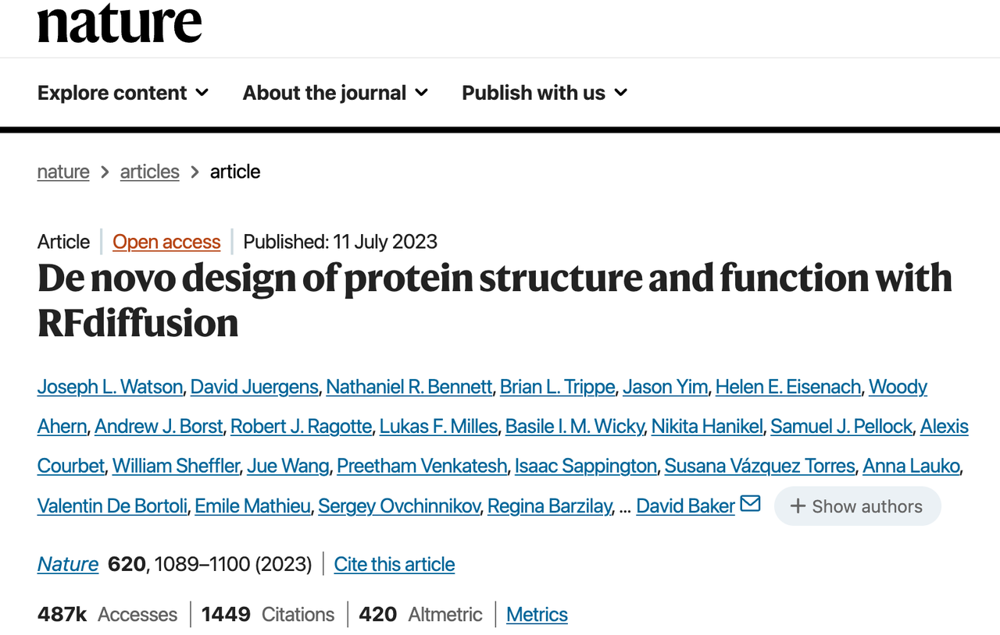
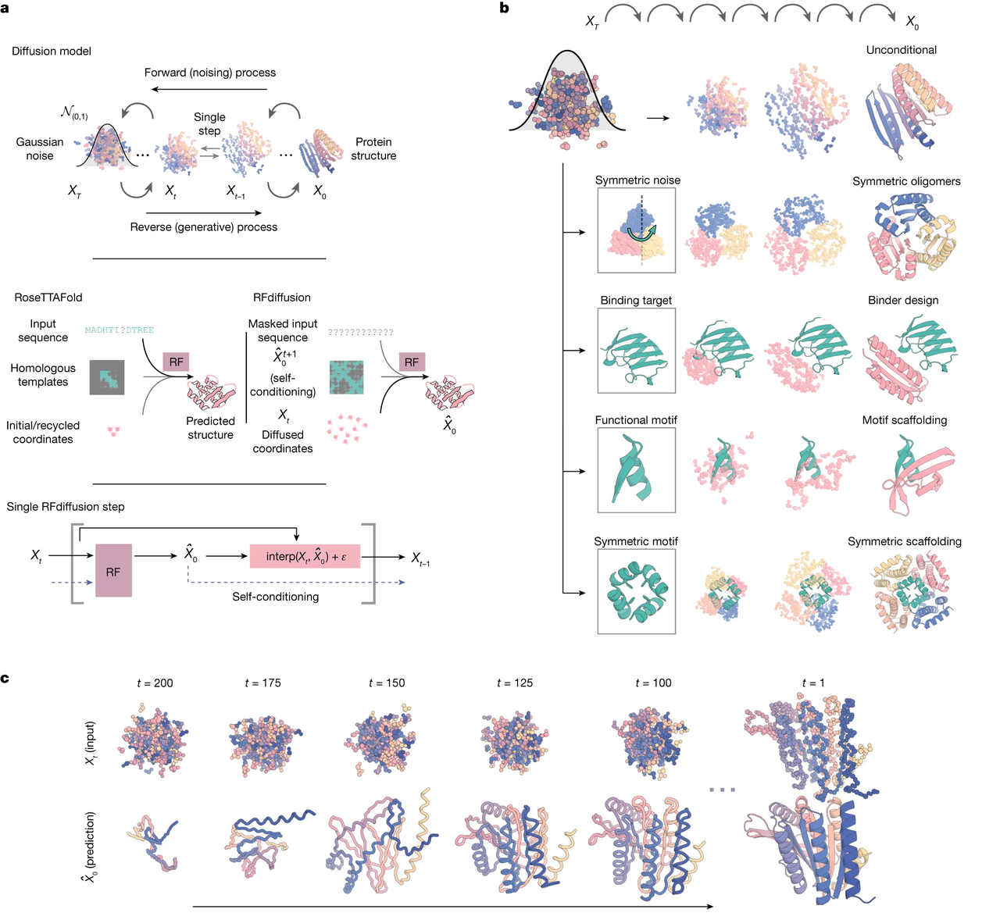
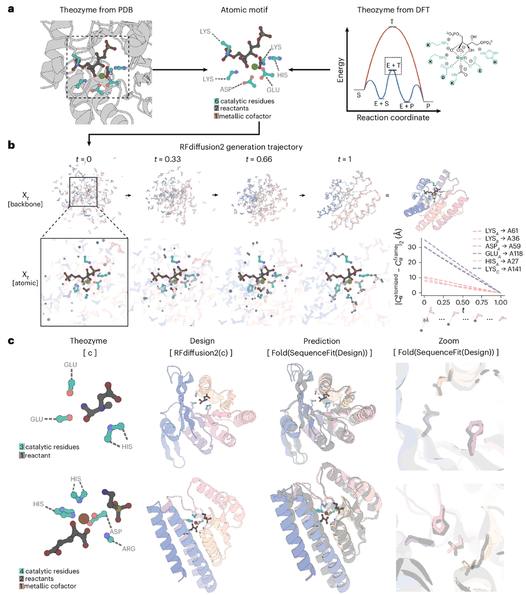
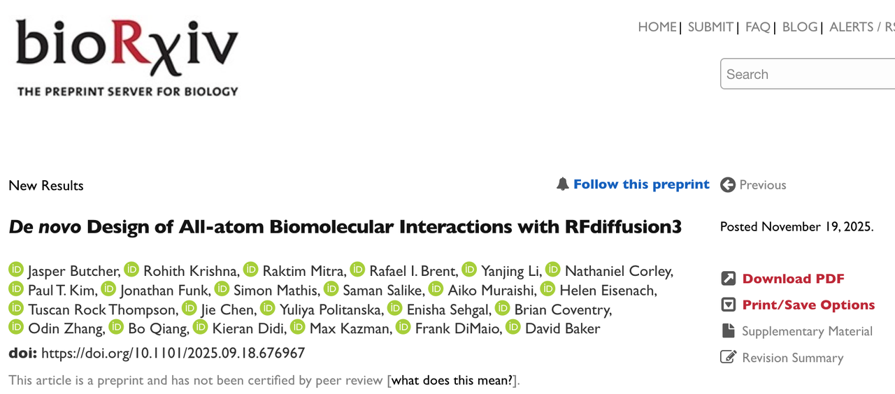
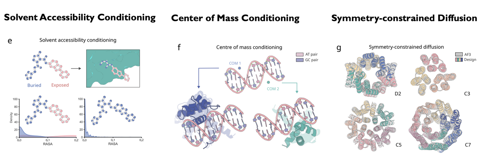
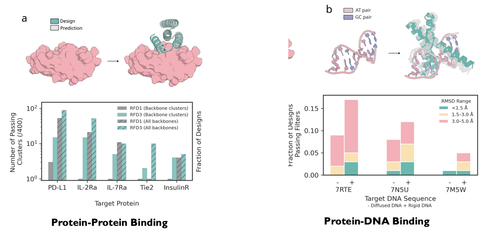
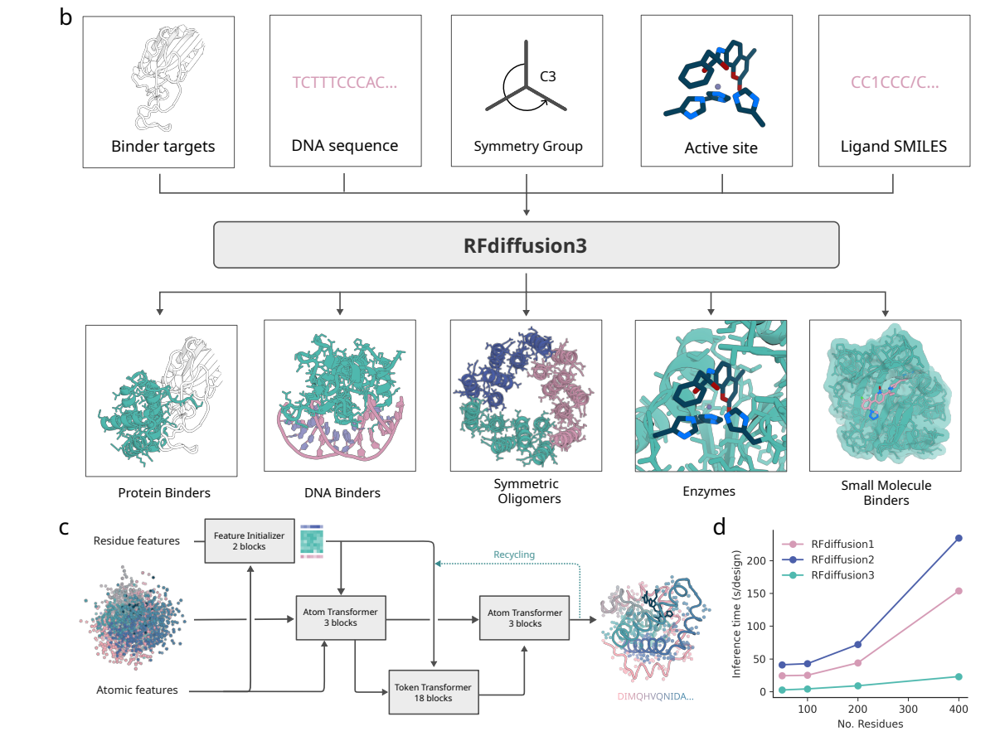
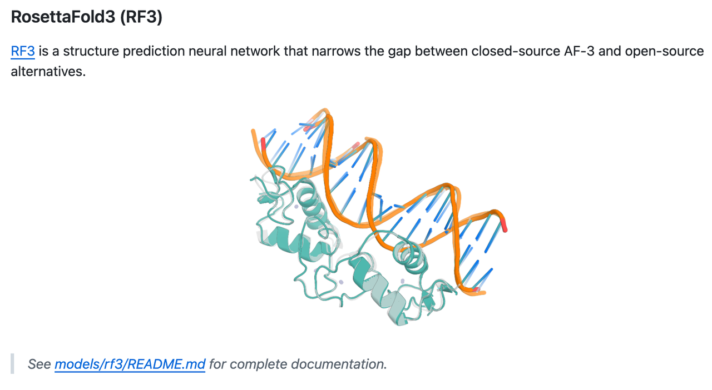
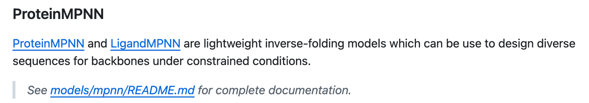

今天，千呼万唤始出来，华盛顿大学蛋白设计研究所（IPD）正式宣布：

**RFdiffusion3（RFD3）正式开源！（最爱的游戏终于更新了）**

RFdiffusion3是一个能够**从原子级别生成全新蛋白结构**的AI模型，它能让蛋白与**DNA、小分子、酶底物等各种生物分子**精准相互作用。

> “我们构建它时的目标，是让科学界能用它去创造那些我们尚未想象的东西。”
>
> —— *Rohith Krishna, PhD*，项目负责人

论文链接：https://doi.org/10.1101/2025.09.18.676967

开源代码链接：https://github.com/RosettaCommons/foundry

***

### &#x20;**一切都在变：AI开始理解“化学细节”**

几十年来，蛋白设计面临一个核心难题：

**要让蛋白与特定DNA或化学底物结合，必须精确控制每个原子的空间位置。**

这对于酶设计尤其困难，因为催化中心中的原子必须排列到“化学键”级精度。

*RFdiffusion 1*

过去的AI工具（包括RFdiffusion1和2）试图通过简化建模来降低难度，但这种简化也让它们难以真正“理解”分子的化学相互作用。RFdiffusion2也在昨天publish在Nature methods上，感兴趣的读者可以去看看原文(https://www.nature.com/articles/s41592-025-02975-x)，或者看我之前写的解读文章：

RFdiffusion2

RFdiffusion3 则完全不同。

它直接以“**原子为基本单位**”进行扩散生成，能够以前所未有的精度捕捉化学细节。

> “核心创新是**精确控制**。
>
> 我们终于能告诉模型：哪些化学作用最重要，然后它会自己构建出能实现这些作用的蛋白。”
>
> —— *Jasper Butcher, PhD*，模型首席开发者

关于RFdiffusion3的详细介绍，可以看我之前写的推送：

***

### **RFD3为什么值得关注——三大关键突破**

#### **1️⃣ 原子级扩散建模（Atom-level Diffusion）**

RFD3不再以残基为最小单元，而是直接&#x5728;**每个原子坐标上进行生成**。

它能**自动生成氢键网络、溶剂可及性分布、酶活性位点、质心约束、对称结构**，让设计者能够**像编程一样控制分子几何** 。

Conditional Control & Programmability of RF3

#### **&#x20;2️⃣ 高效与性能并存**

* 采用全新Transformer–U-Net结构（重写全部代码）

* 速度提升约**10倍**（相较于RFdiffusion2）

* 同时在四大任务中**全面超越前代模型**：

  * 蛋白–蛋白结合

  * 蛋白–DNA结合

  * 蛋白–小分子结合

  * 酶活性位点设计 &#x20;

#### **&#x20;3️⃣ 通用基础模型（Unified Foundation Model）**

RFD3首次将所有功能整合进**单一架构**：

从对称多聚体、酶催化中心，到小分子配体与DNA结合，研究者再也不需要多个独立工具。

这让“**通用分子生成模型**”的梦想变得现实。

关于RF3的详细内容，也可以看我之前的推送：

***

### **实验验证：**

* **DNA结合蛋白**：

  * 模型共生成5种设计，其中一个在实验中展现出

  * **微摩尔级结合力（EC50≈5.9 μM）**。

* **酶设计**：

  * 成功设计出可重复催化的半胱氨酸水解酶（Kcat/Km=3557），

  * 活性超过以往所有AI设计的同类酶

***

### **开源，共享，重塑科学**

RFD3的模型与训练代码已在 **Rosetta Commons Foundry (GitHub)** 上开源，Github库的链接为https://github.com/RosettaCommons/foundry。

这意味着全球科研人员——无论在**美国、中国**还是**南非**——都能使用同一份代码，去训练、改进、扩展这个模型。

> “当全世界的实验室都能自由地下载并改进这套代码时，
>
> 科学进步的速度会被成倍放大。”
>
> —— *David Baker, PhD*，IPD主任

## 快速上手指南：

### 本地安装指导：

下载代码库：

创建conda环境：

安装：

下载模型权重，可以使用以下命令将所有模型下载到目标文件夹：

这条命令会下载所有已支持的模型（包括 RF3 的多个检查点），

但如果你是初学者，可以先从以下命令开始：

> 请参阅 **examples/all.ipynb**，了解如何在笔记本（notebook）中运行每个模型

### Google Colab（新手推荐）

若想通过交互式的 Google Colab 笔记本了解如何使用 **RFD3、MPNN 和 RF3** 进行基础的蛋白设计流程，请参阅 [**IPD Design Pipeline 教程**](https://colab.research.google.com/drive/1ZwIMV3n9h0ZOnIXX0GyKUuoiahgifBxh?usp=sharing)。

主要包含以下三个主要模块：

***

欢迎大家分享自己的使用体验，我也要去试试全新开源的RFdiffusion3！（感觉像是喜欢玩的游戏突然更新了）

