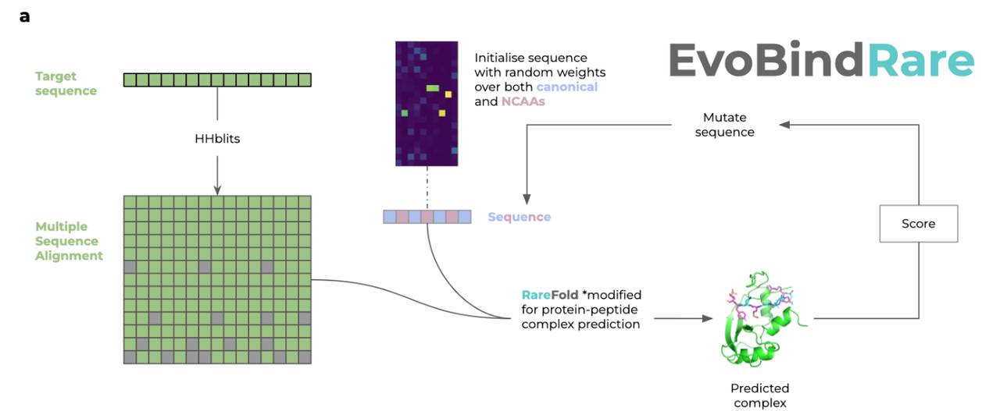
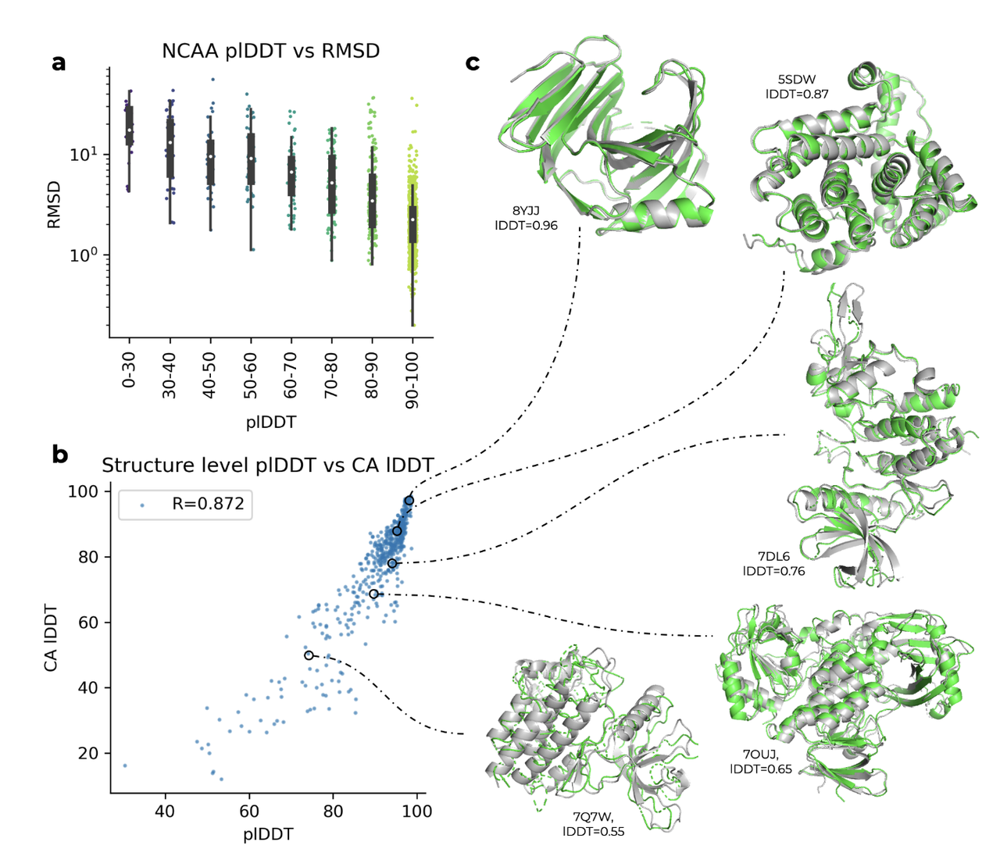
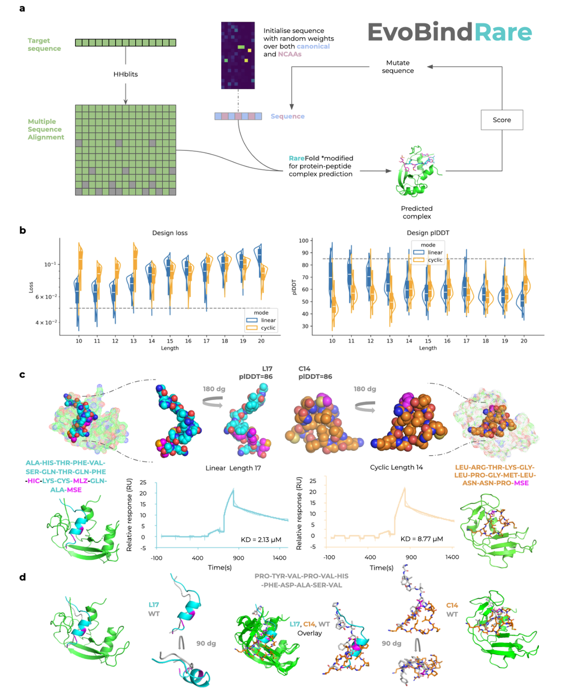
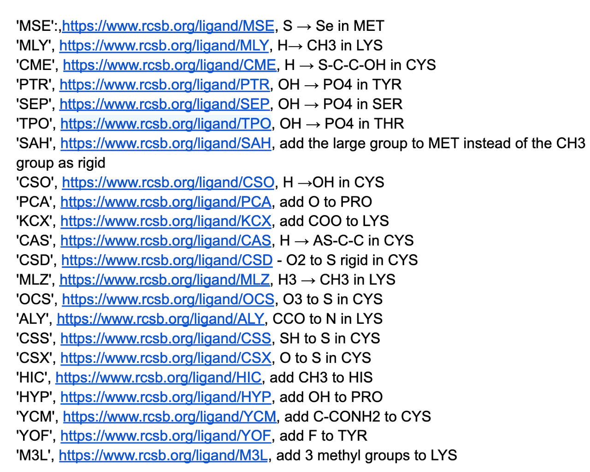
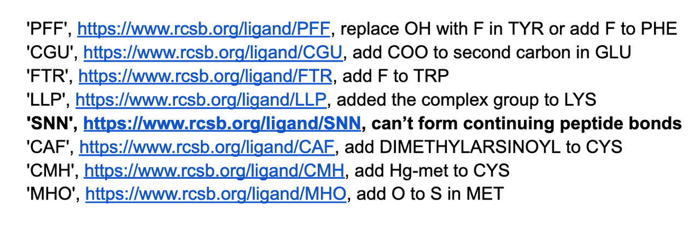
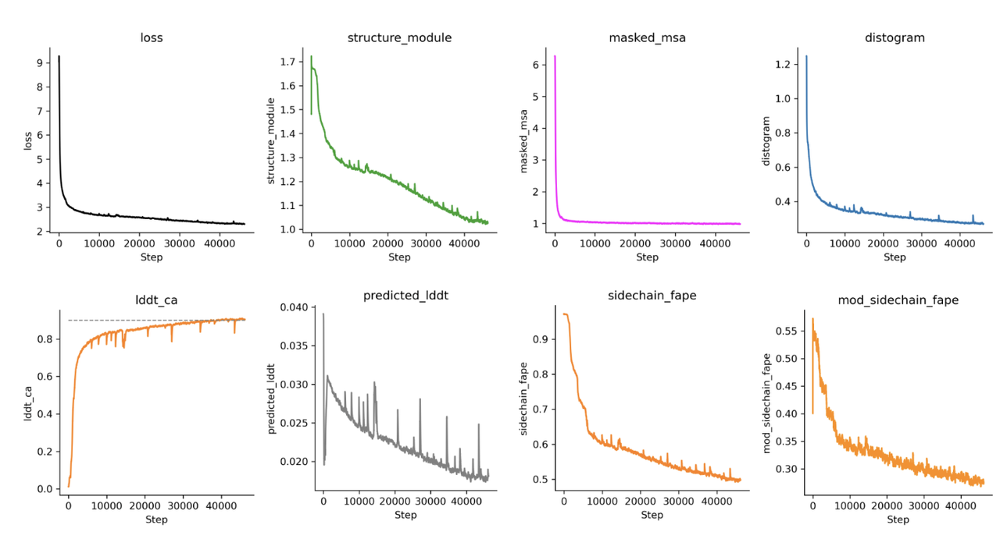
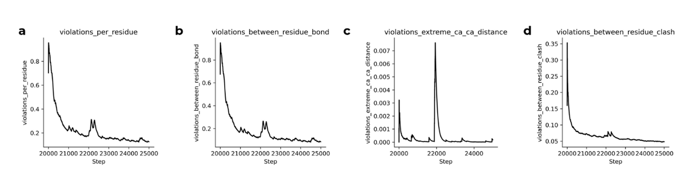

过去，像 AlphaFold2 这样的蛋白质结构预测软件只能处理20种天然氨基酸，这就像厨师只能使用20种食材做菜，难免受限。而在自然界和实验室中，其实还存在大量“非天然氨基酸”（Noncanonical Amino Acids，简称 NCAAs），它们拥有更丰富的化学性质，比如更稳定、不易被人体分解，甚至不容易引起免疫反应，非常适合用来设计药物。

但问题是——这些“新食材”之前缺乏合适的建模工具，使用起来非常困难。

今天要介绍的这篇论文《RareFold: Structure prediction and design of proteins with noncanonical amino acids》（发表于 2025 年 5 月23日）带来了全新的解决方案：作者开发出一个可以预测并设计**含非天然氨基酸蛋白结构**的深度学习模型，叫做 **RareFold**，它不仅精准，而且效率远超前人。

接下来，我们就一起来看看 **RareFold&#x20;**&#x662F;如何打破蛋白设计的边界的！

***

### 背景

在生命科学中，蛋白质是执行各种生物功能的“主力军”，从酶催化、信号传导，到免疫应答，几乎无所不在。而蛋白质的功能，很大程度上取决于它们的三维结构——就像工具的形状决定了用途。因此，**预测蛋白质结构**是理解生命机制和开发新药物的关键步骤。

过去几年，Google DeepMind 推出的 **AlphaFold2** 实现了蛋白质结构预测的巨大突破，精度接近实验测量，引发全球轰动。但它有一个重要局限：**只能处理自然界常见的20种天然氨基酸**。而在实际生物系统中，还有数百种“非天然氨基酸”（Noncanonical Amino Acids, 简称 NCAAs），它们可以带来更强的稳定性、更高的特异性，甚至更好的免疫逃逸能力，非常适合用于药物设计。

然而，由于 NCAAs 数据稀少、结构多样、现有模型无法识别，它们长期处于“有潜力但难应用”的尴尬状态。这正是本文所解决的问题 —— **如何突破传统模型的限制，把 NCAAs 纳入蛋白质结构预测与设计的工具链中**。

***

### **🔬 技术亮点**

1. **RareFold 模型设计**

   * 基于 AlphaFold2 的 EvoFormer 架构扩展，支持 20 种天然氨基酸 + 29 种 NCAAs。

   * 每种氨基酸被编码为独立“token”（包括NCAAs），使模型能学习残基特异的原子交互模式。

   * 支持结构预测和序列-结构共同优化（即可用于蛋白设计）。

* **EvoBindRare 设计平台**

  * 该平台反向使用 RareFold，用于设计**线性或环状肽类结合剂**，并结合多种NCAAs。

  * 成功设计出对核糖核酸酶（ribonuclease）有 μM 级亲和力的肽类（线性和环状各一），且包含非天然氨基酸。

* **准确性与效率**

  * 与 AlphaFold3 相比，在部分非天然氨基酸（如 MSE, SAH）上表现更优，能避免AF3中因扩散模块导致的不自然原子结构冲突。

  * 使用 token 表示法而非原子层级操作，计算更高效：在40GB内存下可运行 AF3 无法处理的结构。

* **RareFold相比AF3的核心改动**

**1.** **将氨基酸表示为离散 token**

* RareFold 不再依赖 AF3 的原子层级构建模块，而是将**每种氨基酸（天然或非天然）都编码为一个 token**，包括 20 种天然氨基酸 + 29 种 NCAAs。

* 这意味着每种残基都有独立的结构表示形式，允许模型学会其特定的结构和几何分布，而无需预定义原子坐标模板。

**2.** **调整原子映射模块**

* 在预测结构坐标后，RareFold 使用**残基特异性的原子映射规则**来确定每种氨基酸的原子布局，适应非标准侧链。

* AF3 的原子生成依赖模板/轨迹回归（如diffusion），但 RareFold 的方式更稳健，**避免了如 MSE 残基中出现的原子冲突问题**。

**3.** **简化模型架构，移除扩散模块**

* AF3 的生成式模块（如结构扩散）虽然强大，但对训练和推理资源要求极高，也容易在复杂化学结构中出错。

* RareFold 去除了这些复杂部分，改为**端到端结构回归 + token 解码器机制**，**显著降低显存需求并提高稳定性**。

**4.** **加入支持蛋白-肽复合物建模（用于设计）**

* RareFold 进一步调整了 AF3 的多链建模机制，允许预测**含NCAA的蛋白-肽复合结构**（特别用于 EvoBindRare 平台的设计任务）。

**5.** **可扩展表示结构（支持更多AA）**

* AF3 中氨基酸是静态定义的，RareFold 则可以根据训练数据动态加入新的NCAA，**具备更强的扩展性与迁移能力**。

***

### RareFold预测模型架构

RareFold整体的模型架构和AF2非常类似：

1. **输入序列**：输入的是包含“Rare”氨基酸的蛋白质序列。这些稀有氨基酸用新的 token 编码表示，打破了传统模型只支持20种天然氨基酸的限制。

2. **共进化信息提取**：

   * 通过多序列比对（MSA）获得进化相关性。

   * 同时构建“残基对表示”（Pair representation）用于提取结构间接关系。

3. **结构信息建模**：

   * 依赖 AlphaFold2 中的核心注意力模块，如行/列注意力和三角注意力（Triangle Attention）来捕捉三维空间关系。

   * 使用 IPA（Invariant Point Attention）实现蛋白质“共折叠”结构预测。

4. **回收机制（Recycling）**：模型会多次迭代优化预测结果，提高准确性。

5. **结构输出**：每种氨基酸（包括非天然的）都会被分配独立的几何坐标系，从而在最终3D结构中实现精准定位和原子映射（右上图）。

这张图详细说明了 RareFold 模型的架构、性能评估方法以及与 AlphaFold3 (AF3) 的对比，重点是对**非天然氨基酸（NCAAs）**&#x7ED3;构预测的能力。

展示 RareFold 的结构预测流程：

1. **输入蛋白质序列**（包含 Rare 氨基酸）

2. 通过 **MSA（多序列比对）** 和 **对位表示（pair representation）** 构建共演化信息

3. 应用 **行/列注意力** 和 **三角注意力（triangle attention）** 提取结构关系

4. 最后通过 IPA（Invariant Point Attention）对蛋白进行共折叠预测，得到3D结构

5. 每种氨基酸（包括 NCAAs）都分配独立坐标系，确保结构精确映射

6. **支持结构回收（Recycling）** 多次迭代优化结构输出

📌 **关键点**：RareFold 将非天然氨基酸视为独立 token，从而学习其特定的结构模式，增强泛化能力

**和alphafold2非常相似**

### AlphaFold3 和 RareFold谁更强？

AlphaFold3能够预测全原子结构，已经在结构预测任务中已经引入了对某些“修饰残基”的支持，例如 MSE（硒代蛋氨酸）等。因此和AlphaFold3做对比，也是RareFold 必须要做的事情。下表展示了AlphaFold3和RareFold的对比：

虽然 AF3 能在一定程度上处理非天然氨基酸，但它的核心设计依然是基于**原子级建模 + 扩散生成模块**，在处理复杂化学结构时容易出现原子冲突、建模不稳定、资源开销大等问题。而 RareFold 采用了完全不同的思路：**把每个氨基酸（包括 NCAAs）看作独立 token**，通过学习它们的整体结构与几何特征，实现预测过程的“抽象化”和“轻量化”。

这张图主要展示了 RareFold 相比 AlphaFold3 在预测**非天然氨基酸（NCAA）**&#x7ED3;构时的表现，具体包括结构准确性、预测置信度和蛋白长度对结构预测精度的影响。

##### **图 a：RareFold vs AlphaFold3 对 MSE 残基的结构预测**

* 展示的是蛋白 8VJ1 和 9J6M 中的 **MSE（硒代蛋氨酸）** 的结构预测比较。

* **绿色为主链结构**，**粉色/青色棒状为 MSE 残基的侧链原子**。

* 上排是 RareFold 的预测，**MSE 结构合理且无冲突**；

* 下排是 AlphaFold3 的预测，可以看到**存在原子间重叠（冲突）**，尤其是 MSE 中的硒原子与相邻原子过于接近，导致物理结构不合理。

📌 **结论**：RareFold 相较于 AlphaFold3 能更好地处理 MSE 这类NCAA，预测出的结构更物理合理，避免了常见的原子间冲突问题。

##### **图 b：RareFold 的预测准确度（Cα lDDT） vs 蛋白长度**

* X轴为蛋白序列长度（对数刻度），Y轴为预测结构的 **Cα lDDT 分数**（预测结构与真实结构的相似度，越高越好）。

* 数据显示：**随着蛋白长度增加，预测准确度略有下降**，但并无明显断崖式下降。

📌 **结论**：RareFold 在预测较长序列时会面临一定挑战，但整体仍维持较高准确度，说明模型具有较强的泛化能力。

##### **图 c：RareFold 的 NCAA 侧链预测误差（RMSD） vs IDDT**

* 横轴是 NCAA 的侧链 RMSD（预测与真实之间的误差，越小越好），纵轴是 IDDT（全局结构准确度）。

* 图像是一个 **密度图**，深蓝区域表示数据点密度高。

* 可以看到，在 **结构整体准确（高 IDDT）时，侧链误差也通常更小**。

📌 **结论**：整体结构预测质量（IDDT）与局部侧链精度（RMSD）之间存在正相关关系；即当结构整体预测得好时，非天然氨基酸的预测也更准确。

### **✅ RareFold 能预测得准吗？看准度也要看“自信心”（氨基酸准确性和置信度）**

AI 模型不仅要预测准，还要知道“自己预测得准不准”——也就是说，它的**置信度得分（plDDT）**&#x8981;能真实反映结构质量。RareFold 在这方面表现如何？这张图给出了非常直观的答案：

**核心结论：**

* **图 a 总结**：plDDT 越高，非天然氨基酸的结构预测误差（RMSD）越低，说明模型能判断预测是否可靠。

* **图 b 总结**：整个蛋白结构的平均置信度（plDDT）与真实结构相似度（IDDT）高度相关，R=0.872，反映整体预测可信度高。

* **图 c 总结**：高 IDDT 的预测结构与真实结构几乎重合，低 IDDT 则偏差明显，视觉上验证了模型置信度与准确度的一致性。

##### **图 a: plDDT vs RMSD（单个氨基酸层面）**

* **横轴：** plDDT（模型对每个残基的预测置信度，0–100）

* **纵轴：** RMSD（预测与真实结构的误差，log尺度）

* **每个点表示一个 NCAA 残基**

🔍 **观察结果：**

* plDDT 越高，RMSD 趋势越低：说明 **plDDT 可以用来判断预测是否准确**。

* 大多数预测位于 90–100 的高置信区间，共有 896 个点，RMSD 也较低，表示预测可信。

📌 **结论：** RareFold 能够通过 plDDT 成功识别哪些残基预测得准、哪些不准。

***

##### **图 b: plDDT vs Cα IDDT（全蛋白层面）**

* **横轴：** 平均 plDDT 分数（整个结构）

* **纵轴：** Cα IDDT（预测结构与真实结构在主链 α-碳原子上的相似性）

* **每个点代表一个完整蛋白结构**

🔍 **观察结果：**

* 两者呈高度正相关，**相关系数 R = 0.872**，即置信度高的结构预测也更精确。

* 大多数结构分布在高区间（右上角），说明整体预测质量高。

📌 **结论：** RareFold 的置信度评分不仅在单个氨基酸层面有效，也在整链结构层面准确反映预测质量。

***

##### **图 c: 可视化展示不同 IDDT 水平下的结构预测**

展示了几个具有代表性的蛋白质预测与原始结构的对比（绿色为预测结构，灰色为真实结构）：

* **8YJJ (IDDT=0.96)**：几乎完美预测

* **5SDW (0.87)**、**7DL6 (0.76)**：较好预测

* **7QUW (0.55)**、**7OUJ (0.65)**：预测效果下降，误差明显

📌 **结论：** 高 IDDT 的预测结果与真实结构非常接近，进一步验证 RareFold 的置信度评分与预测精度高度一致。

***

### **🔍 RareFold 对非天然氨基酸的预测到底准不准？**

既然 RareFold 主打“能看懂非天然氨基酸”，那它在实际预测中表现如何？作者通过大规模测试，把 RareFold 在不同氨基酸上的预测结果做了统计，从侧链误差（RMSD）和整体结构准确度（IDDT）两个维度，分别和天然氨基酸进行了对比。

结果很令人安心：

* 在预测精度上，**像 MSE、SEP、PTR 等常见的非天然氨基酸，其 RMSD 表现和 LEU、ALA 等天然氨基酸几乎处于同一水平线**，误差非常小，说明模型对这些结构“非常熟”。

* 即便从整条蛋白质的角度看，RareFold 在这些 NCAAs 上也能预测出高 IDDT 的主链结构，和天然氨基酸一样靠谱。

* 虽然一些极其稀有、样本极少的 NCAAs（比如 CAF、PFF 等）会存在波动，但这属于“训练数据稀缺”的客观现象，并不影响整体可靠性。

📌 **一句话总结**：RareFold 预测大多数非天然氨基酸的精度，已经足以和天然氨基酸一较高下，不再是“AI 看不懂的稀有语言”。这为后续结构设计和药物开发打下了坚实基础。

这张图（图4）展示了 RareFold 在结构预测中对**天然氨基酸（proteinogenic AAs）和非天然氨基酸（NCAAs）**&#x7684;表现比较，重点分析的是结构预测误差（**RMSD**）和准确度（**lDDT**）在不同氨基酸类型上的分布情况。

##### **📊 图 a：不同氨基酸侧链 RMSD（结构误差）分布**

* **横轴**：氨基酸类型（从左到右依次为天然 → 非天然）

* **括号内数字**：该氨基酸在验证集中的出现次数

* **纵轴**：侧链 RMSD（sc RMSD），越低表示预测越精确

**🔍 解读：**

* 天然氨基酸（如 LEU, ARG, THR）通常 RMSD 较低，但也有一定波动。

* 非天然氨基酸（如 CME, SEP, PCA）整体误差稍大，但差异可接受。

* 某些非天然氨基酸样本数很少（如 CAF 仅3个），误差波动较大。

📌 **结论：**

RareFold 对非天然氨基酸的预测误差在可接受范围，**如 CME 与 ARG 的 RMSD 分布范围类似**，说明该模型能较好地泛化到NCAAs。

***

### **🧬 用 RareFold 来反向设计蛋白：EvoBindRare 是怎么做到的？**

结构预测只是第一步，更激动人心的是——RareFold 不只“看懂”了非天然氨基酸（NCAAs），它还能反过来参与**设计**！这就是本文提出的 EvoBindRare 系统。

其实 EvoBindRare 本质上是之前工具 EvoBind2 的一次“插件升级”——原本使用 AlphaFold 作为预测模块，现在换成了 RareFold，因此就具备了处理 NCAAs 的能力，实现了对线性和环状肽结合剂的设计支持。

这张图（图5）展示了 RareFold 模型在蛋白质设计中的应用，特别是其子系统 **EvoBindRare（EBR）** **用于设计含非天然氨基酸（NCAAs）的肽类结合剂（peptide binders）**&#x7684;完整流程、性能评估和实验验证。

***

##### **🧬 图 a：EvoBindRare 的设计流程（流程图）**

展示了 EBR 的逆向设计架构：

1. **输入目标蛋白质序列** → 使用 HHblits 生成 MSA（多序列比对）

2. **初始化肽序列**（包含天然和非天然氨基酸） → 随机起始序列

3. 结构预测模型 **RareFold（改为预测蛋白-肽复合物）**&#x5BF9;该序列进行结构预测

4. 计算结构评分（loss）→ 用于指导序列的突变优化

$$\text{Loss}_1 = \text{peptide } plDDT^{-1} \cdot \left( \frac{1}{n} \sum_{j=1}^{n} d_j \right) + \% \text{clashes}
$$

* 不断迭代突变并打分，优化出具有高亲和力的肽结合剂

📌 **亮点**：该流程允许引入 **NCAAs**，拓展设计空间，最终实现高效肽类药物设计。

***

##### **📊 图 b：设计性能评估（设计损失与置信度）**

* **左图**：设计损失（越低越好）随肽长度变化（X轴：10–20肽长）

* **右图**：预测置信度（plDDT）随肽长度变化（Y轴越高越可靠）

颜色区分：

* **蓝色**为线性肽

* **橙色**为环状肽（更难设计）

**🔍 结论：**

* 大多数肽长都能设计出低loss且高plDDT的结构；

* 环状肽的plDDT略低，说明结构约束更复杂；

* 多数设计超越了置信度阈值（plDDT > 85）和损失阈值（loss < 0.05）。

📌 **亮点**：EvoBindRare 可以系统性生成可靠的多种肽结构设计。

***

##### **🧪 图 c：成功设计并验证的两个结合肽（线性 & 环状）**

展示了两个结合肽的设计、预测结构和实验结合验证：

* **左侧为线性肽（17肽长）**：包含多个 NCAAs（如 MSE, MLZ, HIC），plDDT=86，**Kd = 2.13 μM**

* **右侧为环状肽（14肽长）**：也包含 NCAAs，plDDT=86，**Kd = 8.77 μM**

* **底部为 SPR 实验曲线**，验证肽与目标蛋白结合的亲和力（μM 级）

📌 **亮点**：设计的肽不仅在结构上可靠，还在实验中表现出有效结合活性，证明 RareFold+EBR 的功能性。

***

##### **🧬 图 d：预测结构与已知结构比对（WT vs 设计肽）**

* 左：线性肽 L17 与已知天然肽（WT）叠加比较 → 二者结构相似但结合方式不同；

* 右：环状肽 C14 与 WT 比较 → 呈现出不同但合理的结合构象；

📌 **亮点**：EBR 不依赖模板，能设计出与天然结合肽结构不同但功能等效的新型肽。

***

##### **✅ 总结**

这张图展示了 RareFold 的设计模块 EvoBindRare：

* 能设计含NCAAs的高亲和力肽；

* 成功生成线性和环状结合肽；

* 并通过实验验证了其预测的功能性。

* Data Availability： https://zenodo.org/uploads/14892196. &#x20;

* Code Availability：https://github.com/patrickbryant1/RareFold

***

### 方法细节：

#### 数据：

1. **数据来源**：

   * 所有蛋白质结构均来自 PDB 数据库，提取时间为 **2024年12月10日**

   * 仅选择通过 **X射线衍射或电子显微镜（EM）测定，分辨率 ≤ 5 Å 的单体蛋白结构**

   * 总共选取了 **75,232 条结构**

2. **筛选标准**：

   * 每个结构文件只提取 **第一个蛋白链**

   * 保留序列中**非规则氨基酸（包含NCAAs）比例小于80%**，**序列长度大于50**

   * 满足以上条件的样本数为 **74,882 条**（占总数 99.5%）

##### **🧪 序列聚类处理**

* 为了降低冗余度，使用 **MMseqs2 工具** 对序列按 **20% 相似性** 进行聚类

* 最终得到 **9,031 个代表性簇**

#### 非天然氨基酸的描述

RareFold 需要对这些 NCAAs 进行结构预测，但 AlphaFold2 仅支持标准的 20 种天然氨基酸，因此作者扩展了结构表示框架，引入了新的残基原子坐标模板。

#### 多序列比对

##### **NCAAs 无法用于标准 MSA 编码**

* 多数非天然氨基酸没有**标准的一字母代码**，因此**无法直接参与多序列比对（MSA）**。

* 只有极少数 NCAAs 被编码为特殊字符：

  * SEC (硒代半胱氨酸) → 'U'

  * PYL (吡咯赖氨酸) → 'O'

  * GLX (模糊的谷氨酰/天冬酰胺) → 'X'（等价于未知/UNK）

🔍 **但问题在于**：

* 'X' 会被解读为“未知残基”（UNK），信息价值几乎为零

* 'U' 和 'O' 出现在实际蛋白数据中非常少（不在前50常见残基中）

##### **✅ 解决方法：将所有非标准氨基酸替换为** **'X'**

为进行 MSA 构建：

* 所有非标准残基（NCAAs）都被统一替换为 'X'

* 这样虽然牺牲了特异性，但保留了比对流程的兼容性

##### **MSA 计算的瓶颈与加速策略**

* RareFold 仅使用 **uniclust30\_2018\_08 数据库**

* 工具为 **HHblits**（HH-suite v3.1.0）

* 使用的命令行为：

#### 训练与验证集

为比较 RareFold 与 AlphaFold3 在预测非天然氨基酸结构方面的性能，作者构建了一个包含修改残基（NCAA）的训练和评估数据集。

1. **划分标准**：

   * 将 PDB 中的数据以 **2021-09-30 为时间界限**，这一天也是 AF3 的训练数据截止时间。

   * 所有早于此日期的结构用于训练；

   * 晚于此日期且未出现在AF3训练集中的结构用于测试；

   * 其余用于验证。

2. **训练集**：

   * 总计 62,530 个结构

   * 其中 **6,679 个包含非天然氨基酸（包含10个 SNN）**

   * 覆盖 8,125 个 20% 相似性聚类

3. **测试集**：

   * 从时间分割后新出现的结构中选出 **177 个包含非天然氨基酸的结构**

   * 这些结构不在 AF3 训练集中，适合作为独立对比基准

4. **验证集**：

   * 包含 12,175 个结构

   * 其中 743 个含有 NCAA

   * 用于训练中模型性能监控

#### 训练

1. **训练数据构成（非天然氨基酸优先）**：

   * 每个训练 batch 的一半样本**必须包含非天然氨基酸**。

   * 这些样本根据其在数据集中出现的“稀有程度”采样，确保模型能学习到罕见NCAAs的结构特征。

   * 另一半样本来自代表性蛋白序列（基于 20% 序列相似度簇），以增强模型泛化能力。

2. **训练配置**：

   * **batch size = 24**

   * 在 8 张 A100 GPU（每张80GB显存）上进行训练

   * 总训练步数：40,000步（前20,000步标准训练，后5,000步加上额外loss进行精调）

3. **损失函数定义：**

总损失由以下项加权组成：

$$\text{Loss} = 0.5 \cdot \text{FAPE} + 0.5 \cdot \text{AUX} + 0.3 \cdot \text{Distance} + 0.2 \cdot \text{MSA} + 0.01 \cdot \text{Confidence}$$

其中：

* **FAPE**：结构原子对齐误差（核心结构损失）

* **AUX**：由 FAPE 和角度误差组成的辅助损失

* **Distance**：残基间距离损失

* **MSA**：掩码多序列比对预测误差

* **Confidence**：预测 lDDT 与真实值之间的差异

这些损失项完全复用自 AlphaFold2 的定义。

#### 微调

**精调（Fine-tuning）阶段的**目的是进一步优化模型输出结构的物理合理性，减少**原子冲突和结构违规**，使得模型更适合反复调用的蛋白质设计任务。

##### **❗ 为什么要精调？**

* 模型初步训练后，可能存在结构中的**冲突或物理违规**，例如：

  * 残基之间的键长异常

  * 主链 Cα–Cα 距离过远或过近

  * 残基间原子发生碰撞（clashes）

这些问题在设计场景中必须避免，否则每次调用都要额外执行能量松弛（relaxation），计算开销巨大。

##### **✅ RareFold 的精调策略**

* 使用与 AlphaFold2 相同的损失函数与权重，**专注于以下违规类型**：

  1. 残基级违规（violations per residue）

  2. 残基之间键长违规（between-residue bond violations）

  3. Cα–Cα 距离违规（extreme Cα–Cα distance violations）

  4. 残基间原子冲突（between-residue clashes）

* **不包括残基内部（intra-residue）违规的精调**（因为这类错误影响相对较小或更难优化）

* 精调共进行 **5,000 步**，加上之前的 20,000 步总计 **25,000 步训练**，训练样本数为 600,000

#### 结构松弛

##### **🌿 什么是 Relaxation？**

Relaxation 是一种 **分子动力学（MD）模拟** 技术，用于：

* 缓解残基间的原子冲突（inter-residue clashes）

* 改善局部几何结构，使预测结果更加物理合理

##### **🛠 技术细节**

* 使用工具：**OpenMM**（开源分子模拟平台）

* 力场参数：**CHARMM36 力场**

* 积分方法：**Langevin middle integrator**（适用于温控条件下的分子模拟）

##### **🔄 非天然氨基酸如何处理？**

由于 OpenMM 不原生支持非天然氨基酸（NCAAs）：

1. 模拟时，**将NCAAs暂时替换为最相近的天然氨基酸（canonical analogues）**

2. 结构优化完成后，再将这些残基换回原始的 NCAAs

##### **⚠️ 影响评估**

* **结构形状不会显著变化**（即 relaxation 不会破坏原始预测结构）

* 但 **部分评估指标（如 RMSD、IDDT）会轻微下降**

  * 因为模拟优化的微小移动可能让预测值略偏离原始 ground truth

#### 验证方法和结果

##### **✅ 验证流程**

* 每隔 **10,000 步**在训练过程中进行一次模型验证：

  * 评估点包括训练步数 20,000、30,000、40,000 和 fine-tuning 后

* 验证使用的是 **743 个包含修饰氨基酸的样本**（来源于 Table 1）

📌 **评分成功率**：

* 成功打分的结构有 **731 个（98.3%）**

* 有 12 个样本因结构不一致被排除

📌 **松弛（relaxation）后表现**：

* 在 step 20,000 应用的结构松弛步骤**对整体准确性影响不大**

* 但由于 OpenMM 中缺乏部分非天然氨基酸的原子力场定义，只有 **679 个结构（93%）** 成功完成松弛

#### 打分

##### **🔹** **结构对齐与 RMSD 计算**

* 首先将预测结构与真实结构在 **Cα 原子（主链核心）上对齐**

* 然后对每一个**被修改的氨基酸（mod AA，即非天然氨基酸）**：

  * **整体 RMSD**：考虑该残基的所有原子（包括主链和侧链）

  * **侧链 RMSD（RMSD sc）**：主链原子（N, Cα, C）对齐后，仅计算侧链原子的 RMSD

##### **🔹** **全局结构评分**

* 使用 **Cα IDDT 分数（lDDT CA）** 衡量整个结构的准确性（分数越高表示与真实结构更接近）

#### **RareFold 的反向设计（inverse design）流程**

创建了一个名为 **EvoBindRare** 的平台，通过 RareFold 的结构预测能力，设计能与特定蛋白结合的肽（binder）。

1. **使用的氨基酸集合**：

   * 包含**20种天然氨基酸**

   * 加上**12种实验上可合成的非天然氨基酸（NCAAs）**

* **初始化与优化过程**：

  * 每条肽从**随机序列初始化**；

  * 使用下面这个 loss 函数对肽结构进行迭代优化（1000次迭代）：

$$\text{Loss}1 = \text{peptide } plDDT^{-1} \cdot \left( \frac{1}{n} \sum{j=1}^{n} d_j \right) + \% \text{clashes}
$$

* 每次设计任务运行 **1000次迭代，使用24种不同初始化序列**

* 支持**10\~20残基长度**，设计**线性或环状肽**

* 每个设计使用 **3次结构回收（recycle）**

* 使用改写后的 RareFold 模型，可以**并行设计24种肽**，只需一张 **NVIDIA A100 GPU（40GB 显存）**

***

### 使用简介

**RareFold** 能够预测包含稀有非天然氨基酸的单链蛋白质结构，并通过 **EvoBindRare** 框架实现新型肽类结合剂的设计。

RareFold 支持共 **49 种氨基酸类型**，包括：

* 20 种常见天然氨基酸；

* 29 种稀有非天然氨基酸，包括：

**MSE、TPO、MLY、CME、PTR、SEP、SAH、CSO、PCA、KCX、CAS、CSD、MLZ、OCS、ALY、CSS、CSX、HIC、HYP、YCM、YOF、M3L、PFF、CGU、FTR、LLP、CAF、CMH、MHO**

**EvoBindRare** 可直接从目标蛋白序列设计线性或环状结合肽，无需预先知道结合位点（但可选提供）。该框架通过引入非天然氨基酸，显著拓展了可用于设计的化学多样性，支持快速且灵活的肽类分子设计。

Prediction:

Input:

* fasta

* num\_recycles

* outdir

Output:&#x20;

* pdb

Design:

Input:

* num\_recycle

* binder\_length

* num\_iterations

* resample\_every\_n

* batch\_size

* rare\_AA

* cyclic\_offset

* save\_best\_only

* outdir

