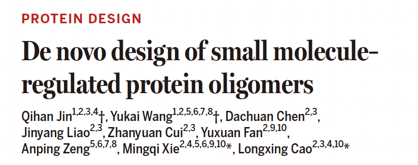
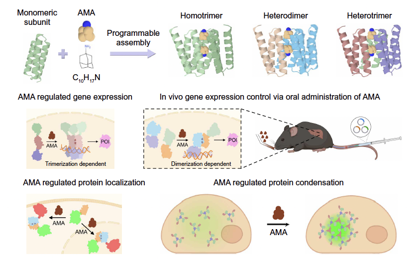
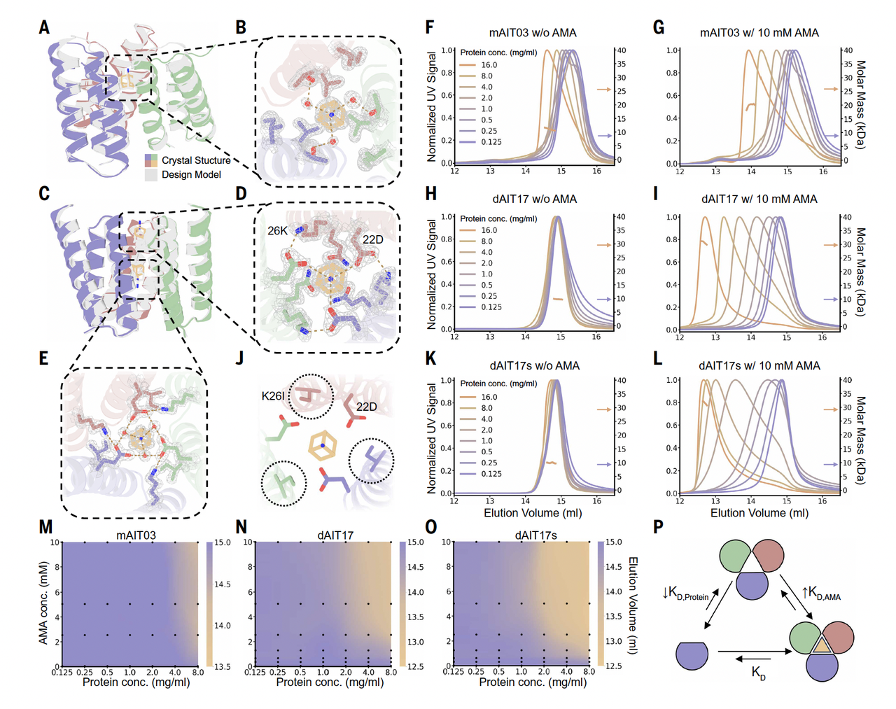

今天想和大家分享一篇刚刚（2026.01.02）发表在 **Science** 上的工作，来自西湖大学生命科学学院 **曹龙兴** 老师实验室，联合西湖大学医学院 **解明岐** 老师团队。

这篇文章做了一件在蛋白质设计领域里被讨论了很多年、但真正系统解决的工作并不多的事——

**从头设计一个“会动”的蛋白质系统，并且让这种动态可以被小分子精准控制。**

更具体地说，他们不是设计了某个“刚好会变化”的例子，而是构建了一套**可复用的蛋白质多聚化“遥控器”**：

通过口服小分子药物，按下“开关”，就能让蛋白质按设计好的方式完成组装或解体，而且这一过程在细胞里、甚至在小鼠体内都成立。

这篇文章的意义，并不只在于多了一套好用的合成生物学工具。

它更重要的一点在于：**作者从一开始就把“动态”当作设计目标本身，而不是结构之后的附赠品。**

下面这篇解读，我想顺着论文的配图，一步一步讲清楚三件事：

1. 他们要解决的难题是什么；

2. 他们是如何把“动态”真正写进设计流程的；

3. 以及这件事，为什么可能会改变我们之后设计功能蛋白的方式。

原文链接：https://doi.org/10.1126/science.ady6017

***

## **从“静止”到“变化”：为什么设计一个会动的蛋白这么难？**

在蛋白质的世界里，很多关键时刻都不是一个“独角戏”。

病毒入侵细胞时，几个细长的蛋白从不同方向靠近，像对接舱段一样精准咬合，才能打开细胞的大门；

免疫系统被激活时，原本分散的受体蛋白迅速聚拢，像听到号令的士兵，列阵迎敌；

而在细胞内部，一次信号传递往往依赖多个蛋白短暂集结、又迅速解散，把信息一级一级送达。

这些过程的共同点只有一个：

**功能发生在变化中，而不是停留在某一个静态结构上。**

过去十几年，蛋白质设计领域进展飞快。

我们已经能从头设计出稳定折叠的蛋白，能让它们精准结合靶标，甚至能生成自然界从未出现过的新结构。

但越往前走，一个问题越发明显——

> 真正难的，从来不是“能不能折起来”，而是**能不能按需要动起来。**

***

## **PART 01｜难题：为什么“从头设计动态蛋白”一直这么难？**

如果你回顾过去的蛋白质设计工作，会发现一个耐人寻味的事实：

**最成功的案例，几乎清一色都是“静态问题”。**

* 设计一个稳定的折叠

* 设计一个高亲和力的结合界面

* 设计一个结构固定的功能模块

这些问题，都有一个共同特征：**目标是单一结构。**

而一旦问题变成——

“这个蛋白需要在两种状态之间切换”、

“只有在某种构象下功能才会打开”、

“构象变化本身就是功能的一部分”，

设计难度就会陡然上升。

原因并不复杂。

### **第一，动态不是“一个结构的问题”**

构象变化意味着什么？

意味着你要同时满足至少两个稳定状态，还要让它们之间存在一条**合理、可跨越的转换路径**。

这已经不是“结构设计”，而是在设计一个**能量景观**。

### **第二，现有工具很难直接处理“变化”**

无论是结构预测，还是大多数生成模型，本质上都在回答一个问题：

> 给定序列，它最可能长成什么样？

但“动态”关心的却是另一个问题：

> 同一条序列，在不同条件下，**能不能稳定存在于不同构象**？

这不是多预测几个结构就能解决的事。

### **第三，“会动”不等于“乱动”**

在很多语境里，“动态”常常被简化成“柔性”。

但在真实的生物系统中，关键的动态几乎从来不是随机抖动，而是：

* 有明确差异的状态

* 有方向性的转换

* 有功能后果的切换

换句话说，真正有价值的动态，是**可控的状态切换**。

***

## **破题的关键：先定义“怎么动”，而不是“长什么样”**

正是在这样的背景下，曹龙兴老师团队的这篇 Science 把问题摆在了一个非常不同的位置。

他们没有从“我想要一个什么样的蛋白结构”开始，而是先问了一个更根本的问题：

> **如果一个蛋白的功能依赖构象变化，那这种变化本身，能不能成为设计目标？**

在论文的 Fig.1 中，这个立场被表达得非常直接：

作者关注的不是一个“最好看的结构”，而是**同一条蛋白在不同状态下的关系**。

两个构象都需要是合理、可折叠的；

构象之间的差异不是随意的；

而它们之间的转换，是整个设计的核心。

这一点看似简单，却几乎决定了后面所有方法选择的方向。

因为一旦你承认：

**动态不是结构之后的附赠品，而是设计一开始就要解决的对象**，那么，后面的设计逻辑就必须全部重来。

也正是从这里开始，这篇文章真正走上了一条与传统蛋白质设计截然不同的路。

***

## **PART 02｜方法：他们是怎么把“动态”写进设计流程的？**

如果说 Fig.1 解决的是“要设计什么”，那 Fig.2 回答的就是更棘手的问题：

**这件事到底怎么做？**

在传统的蛋白质设计流程里，步骤往往很清晰：

先选一个目标结构 → 再围着这个结构优化序列 → 最后希望它在现实世界里折成那个样子。

但一旦目标不再是“一个结构”，而是“两个状态及其关系”，这条路就走不通了。

因为你无法简单地告诉模型：

> “请同时折成 A 和 B。”

作者在 Fig.2 中做的第一件事，就是**彻底放弃“单一目标结构”这个前提**。

***

### **不再设计“一个答案”，而是设计“一组条件”**

从 Fig.2 的示意中可以看到，作者真正给模型的，不是某个确定的三维构象，而是一套**约束条件**：

* 哪些区域在两个状态中必须保持相似

* 哪些区域允许、甚至必须发生变化

* 变化的幅度大概在什么范围内

* 哪些相互作用在状态 A 中存在、在状态 B 中消失，反之亦然

换句话说，他们不是在问：

> “这个蛋白应该长什么样？”

而是在问：

> **“有没有一种结构，能同时满足这些互相矛盾、但又被精心定义的要求？”**

这一步的转变非常关键。

它把蛋白质设计，从“寻找最优结构”，变成了“寻找满足条件的解”。

***

### **动态，被转化成了几何与能量的约束**

Fig.2 里还有一个容易被忽略，但非常重要的点：

作者并没有试图直接让模型“理解动态”。

他们做的，是把动态**拆解成模型本来就能处理的东西**：

* 空间几何关系

* 接触与分离

* 稳定与不稳定

* 能量偏好

在模型眼里，这不再是“会不会动”，而是“在不同条件下，哪些构象是允许的，哪些是不允许的”。

这种处理方式非常工程化，也非常现实。它承认一个事实：

> 我们不需要模型真正“理解运动”，只需要它能**尊重运动所带来的约束**。

***

### **为什么这一步很“反直觉”，但又很聪明？**

很多人第一次看到这个思路，都会有一个直觉反应：

> 那不就是给模型加了更多限制吗？会不会更难设计？

恰恰相反。

当你设计一个静态结构时，模型需要在极大的自由空间里寻找一个“最好”的答案；

但当你清楚地告诉它：

* 哪些地方不能动

* 哪些地方必须动

* 动到什么程度算合理

搜索空间反而被**压缩到了一个更有意义的范围内**。

也正因为如此，作者后面才能设计出一整批满足动态要求的候选，而不是零星的“幸运样本”。

***

### **Fig.2 隐含的一条核心逻辑**

如果用一句话概括 Fig.2 的方法论，那就是：

> **不是先设计结构，再希望它有动态；**
>
> **而是先定义动态，再让结构去满足它。**

这句话在读的时候很顺，但在做的时候，其实是一次彻底的范式切换。

它要求设计者放弃对“理想结构”的执念，转而接受：

**结构只是实现动态的一种手段。**

也正是在这一步之后，这篇文章开始真正和以往的蛋白质设计工作拉开距离。

到这里，我们已经知道三件事：

1. 他们想设计的不是“更柔的蛋白”，而是**可切换的状态系统**

2. 动态被拆解成了一套可计算、可约束的设计条件

3. 设计目标从“一个结构”变成了“满足条件的解空间”

接下来的问题就变得非常具体了：

**按这套方法设计出来的蛋白，真的会按预期在两个状态之间切换吗？**

***

## **PART 03｜结果：设计出来的蛋白，真的在“按设计动”吗？**

到这一步，其实读者心里都会有一个共同的疑问：

> 设计思路听起来很漂亮，但这些蛋白在现实世界里，真的会照着设计那样切换状态吗？

这不是一个多余的怀疑。

在蛋白质设计领域，**“设计得通”和“现实中能实现”之间，隔着一条很深的鸿沟**。

尤其是当目标从“折叠”升级为“构象切换”，任何一个环节的偏差，都可能让结果彻底失效。

Fig.3，正是作者正面回应这个问题的地方。

***

### **先看 Fig.3 在“验证”什么**

如果你仔细看 Fig.3，会发现作者并没有急着展示复杂的应用或功能，而是非常克制地只做了一件事：

> **证明这些蛋白，确实存在设计中预期的多种构象状态。**

这听起来很基础，但恰恰是最关键的一步。

因为如果连“两个状态”本身都站不住，后面所有关于调控、响应、功能的讨论，都没有意义。

***

### **不是“结构不一样”，而是“状态真的可分”**

Fig.3 中展示的结果有一个共同特点：

**不同构象不是模糊连续的，而是可以清楚区分的。**

你能看到：

* 在不同条件下，蛋白更倾向于稳定在不同的构象

* 这些构象之间的差异，与设计时定义的变化区域高度一致

* 而那些被设计为“保持稳定”的区域，确实没有发生无序塌陷

这点非常重要。

它说明模型并不是随意生成了一堆“可能的形状”，而是真的在遵守那套关于“哪里该变、哪里不该变”的约束。

***

### **构象变化是“有方向的”，而不是随机漂移**

另一个值得注意的细节是：

作者反复强调，这些构象变化并不是不可控的热噪声，而是**在预期的构象之间来回切换**。

换句话说，蛋白不是在“乱晃”，而是在两个设计好的状态之间**做选择**。

这正是前面 Fig.1 和 Fig.2 所铺垫的目标：设计的不是柔性，而是**可识别的状态切换**。

***

### **Fig.3 给出的第一个强信号**

如果只从 Fig.3 得出一个结论，那会是这一句：

> **动态，第一次被证明可以作为“设计结果”本身出现，而不是事后观察到的副产物。**

这一步虽然不显山露水，但意义非常大。

它说明那套“先定义动态、再让结构满足”的设计逻辑，至少在物理层面是自洽的。

但到这里，作者其实只完成了**一半的验证**。

因为还有一个更现实的问题在等着——

即便蛋白在体外、在理想条件下能切换状态，**这种切换真的能被外界信号精准控制吗？**

而这，正是下一部分要回答的。

***

## **PART 04｜控制：怎样用一个小分子，真正“遥控”蛋白的组装与解体？**

到目前为止，作者已经证明了一件事：

他们设计的蛋白，确实能够在不同构象状态之间切换。

但如果动态只能“自发发生”，那它的意义依然有限。

真正让这项工作跨出关键一步的，是接下来的问题：

> **这种构象变化，能不能被外界信号精准控制？**

在生物体系中，最理想的“遥控信号”其实早就写好了答案——**小分子药物**。

***

### **为什么一定要是“小分子”？**

Fig.4 之前，作者其实已经做了一个非常现实的取舍。

在所有可能的调控方式里，小分子有几个几乎无法替代的优势：

* 能口服、能进细胞

* 起效快、可逆

* 剂量可控，随时停药

如果真的想把“动态蛋白设计”推向应用层面，小分子几乎是绕不开的选择。

但问题也恰恰出在这里。

***

### **难点不在“找一个能结合的小分子”**

很多蛋白都能结合小分子。真正困难的是：

**让小分子的存在，改变蛋白之间的相互作用方式。**

换句话说，小分子不是“塞进一个口袋”，而是要充当一个**几何与能量上的枢纽**：

* 有它时，蛋白更愿意组队

* 没有它时，蛋白就乖乖分开

* 而且这一切，必须是干净、可逆、可预测的

这对天然蛋白都很难，更不用说从头设计的蛋白。

***

### **Fig.4 的关键设计思想：让小分子成为“装配的一部分”**

Fig.4 展示的不是一个简单的结合模型，而是一种非常明确的设计策略：

> **小分子不是外来的调节因子，而是被当作“结构的一部分”写进了设计中。**

在作者的设计里：

* 蛋白单体本身并不会稳定聚在一起

* 只有当小分子出现时，它们之间的界面才“拼得完整”

* 小分子相当于补上了装配所需的关键几何与相互作用

这一步非常重要。

它意味着调控不是靠“增强或削弱亲和力”，而是靠**改变装配是否在物理上成立**。

***

### **从二聚体，到三聚体，再到更复杂的组合**

Fig.4 中，作者并没有停留在一个“成功案例”上，而是系统性地展示了：

* 小分子诱导的同源多聚体

* 小分子诱导的异源二聚体

* 以及进一步扩展到更复杂的装配形式

这一连串结果传达了一个很清晰的信息：

> 这不是一次性的设计巧合，而是一套**可以复用、可以扩展的设计逻辑**。

你可以把它理解成一组“模块”：

设计好的蛋白单元 + 合适的小分子 → 可控的组装行为。

***

### **Fig.4 给出的第二个强信号**

如果说 Fig.3 证明了“动态可以被设计”，那 Fig.4 则进一步证明了：

> **动态不仅能被设计，还能被人为操控。**

而且这种操控，不是靠极端条件，也不是靠复杂外部装置，而是靠一个现实中已经存在、可口服的小分子。

这一步，已经明显超出了“方法学展示”的范畴，开始触及真正的功能设计。

但作者并没有在这里收手。

因为还有最后一个、也是最严苛的问题：

> 这些在试管里、在理想条件下成立的“遥控”，**在真实的细胞、甚至活体里，还能奏效吗？**

***

## **PART 05｜验证：当“遥控器”进入细胞，甚至进入活体**

如果一项蛋白质设计工作，只在试管里成立，其实并不罕见。

真正罕见的是：当你把它放进细胞，甚至放进动物体内，它还能不能按照设计逻辑工作。

作者显然很清楚这一点。

所以在 Fig.5 中，他们把“遥控器”直接推到了一个更严苛的环境里——**真实的生物系统**。

***

### **在细胞里：不是“能不能动”，而是“会不会乱动”**

Fig.5 的前半部分，展示的是在细胞层面的验证。

这里作者做得非常克制，也非常聪明：

他们并没有一上来就追求复杂功能，而是先验证**控制是否干净**。

几个关键观察点很清楚：

* **没加小分子时**，系统几乎完全安静

* **加了小分子后**，蛋白迅速组装，信号被激活

* 整个过程是可逆的，撤掉小分子后，系统回到初始状态

这一点其实比“激活得多强”更重要。

因为在任何调控系统里，**漏启动**往往比“启动不够强”更致命。

从这些结果来看，这套设计在细胞中表现得非常“守纪律”：

该动的时候动，不该动的时候不乱来。

***

### **用“遥控组队”，实现真实功能操作**

接下来，作者展示了几种更贴近应用的例子。

他们把这套小分子诱导的组装系统，接到了不同的功能模块上：

* 用来控制基因表达的开关

* 用来改变蛋白在细胞内的定位

* 甚至用来诱导蛋白形成可控的凝聚体

这些实验的共同点不是“花哨”，而是**逻辑一致**：

无论接上什么功能模块，**控制权始终掌握在那一个小分子手里**。

这说明“遥控器”本身是一个相对独立、可靠的模块，而不是只能在某个特定场景下工作的“特例”。

***

### **到了活体：这是最不讨巧、也最有说服力的一步**

真正让这篇文章站得很稳的，是最后一步——**动物实验**。

作者把这套系统引入小鼠体内，通过口服给药的方式，观察是否能在特定组织中启动预期的生物过程。

结果非常直接：

**小分子给下去，信号就开；不给，系统就关。**

这里没有复杂修辞，数据本身已经足够说明问题。

这意味着什么？

意味着这套“遥控器”不是一个只能存在于理想条件下的设计品，而是**已经跨过了从概念到系统工具的那道门槛**。

***

### **Fig.5 隐含的一个重要判断**

如果把 Fig.5 放回整篇文章的脉络里，它其实在回答一个非常关键的问题：

> **从头设计的动态蛋白，能不能承受真实生物环境的复杂性？**

作者给出的答案是：至少在这套体系中，是可以的。

而这，也让前面关于“动态作为设计目标”的讨论，真正落了地。

***

到这里，这篇 Science 的**核心证据链已经完整闭合**：

* 动态被明确地定义

* 被写进设计约束

* 在体外被验证

* 被小分子精准控制

* 并最终在细胞和活体中工作

最后，我们就差一步了。

***

## **PART 06｜结语：当“动态”成为设计对象，蛋白质设计在变什么？**

回头看这篇文章，真正让人印象深刻的，其实不是某一个具体结果——

不是某个蛋白聚成了三聚体，也不是某个小分子成功当了“遥控器”。

而是作者在一开始，就**换了一种提问方式**。

过去我们常问的是：

> 能不能从头设计一条蛋白，让它稳定折叠、完成某个功能？

而这篇 Science 问的是：

> 如果功能本身依赖变化，那这种变化，能不能被直接设计出来？

这两种问题，看起来只差了一点点，但背后的设计逻辑几乎完全不同。

***

### **他们真正做成的，不只是一个“工具”**

当然，从应用角度看，这套小分子可控的蛋白“组队遥控器”已经足够亮眼：

它安全、可逆、灵敏，还能在细胞乃至动物体内工作。

但如果只把这篇文章理解为“又多了一种合成生物学工具”，其实是低估了它。

更重要的是，作者证明了一件长期被认为“很难系统解决”的事：

> **动态，不再只是结构设计之后的自然产物，**
>
> **而是可以被提前定义、被计算约束、被实验验证的设计目标。**

一旦这一点成立，很多原本看似“太复杂、太不稳定”的蛋白功能，都会重新变得可被讨论。

***

### **从“造结构”，到“造行为”**

如果用一句话来概括这篇工作的定位，我会更愿意这样说：

> 这不是在教我们如何造一个更复杂的蛋白，
>
> 而是在教我们，如何开始设计蛋白质的“行为”。

行为意味着什么？

意味着状态、切换、条件、响应。

意味着蛋白质不再只是一个静态零件，而是一个**可编程的系统单元**。

这一步，可能正是蛋白质设计走向更复杂生命功能之前，绕不开的门槛。

***

### **那接下来呢？**

文章最后，作者并没有给出过于宏大的承诺。

但顺着这条思路，其实已经能看到很多自然的延伸方向：

* 更复杂的构象切换

* 更多类型的小分子输入

* 多重信号的逻辑组合

* 以及与真实疾病、治疗场景更紧密的结合

这些都不是“如果有一天”，而是**已经站在门口的问题**。

***

也许若干年后再回头看，这篇文章的重要性不在于它设计了哪一套具体系统，

而在于它让越来越多的人开始认真思考一件事：

> **如果生命活动的本质是动态的，**
>
> **那蛋白质设计，也该从“静止”走向“变化”。**

而这一步，已经有人先走出来了。

