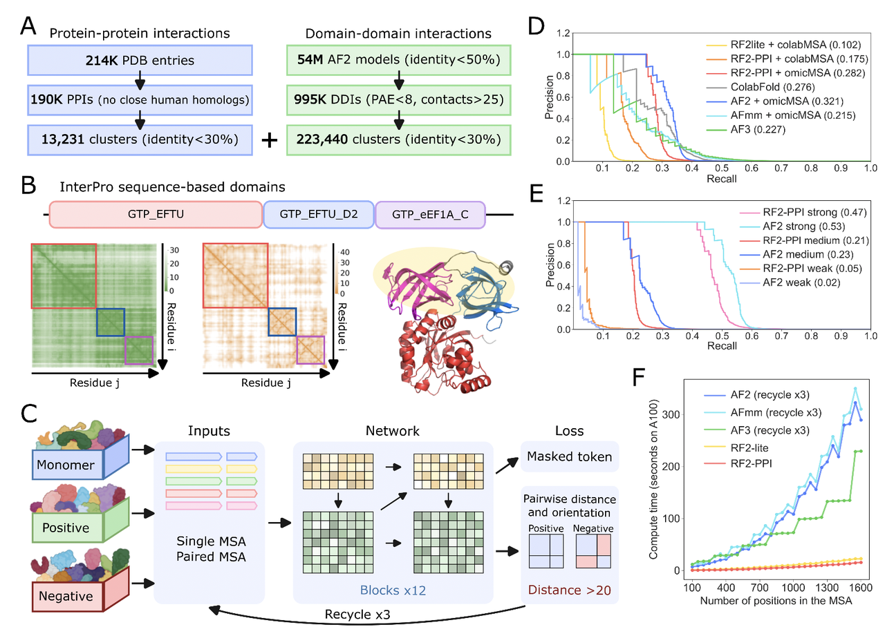

> **蓝极说：**
>
> **我愿称这篇文章为“人类互作组”的开山之作！**

***

### 第一部分：背景介绍

蛋白质之间如何相互作用，决定了几乎所有细胞生命活动的进行。从信号转导、能量代谢，到免疫防御、疾病发生，蛋白质-蛋白质相互作用（Protein-Protein Interactions, PPI）都扮演着核心角色。

然而，我们对人类蛋白质互作网络的认知仍然远远不够。实验方法，如酵母双杂交（Y2H）和亲和纯化-质谱（APMS），虽然在过去几十年推动了互作组学的发展，但它们往往存在两个问题：

1. **假阳性与假阴性率高**，导致结果不够可靠；

2. **在非生理条件下测得的互作**，可能无法反映真实的体内情况。

一个直观的例子就是文章中的 **图1A**：研究团队对比了三大主流数据库（UniProt、BioGRID、STRING）的“高置信度”互作数据，结果发现三者的交集**仅有3988对**。这意味着，即便是我们最“可信”的实验结果，不同数据库之间的重合度也极低，显示出目前人类互作图谱的碎片化和不一致性。

正因如此，人类完整的“互作组地图”一直被视作系统生物学的重大挑战。近期，来自**德州大学西南医学中心的丛倩教授（Qian Cong）团队**联合**华盛顿大学David Baker实验室**与**首尔大学Minkyung Baek团队**，在 *Science* 杂志（2025年9月）发表了重要研究成果：

> **“Predicting protein-protein interactions in the human proteome”**（Zhang et al., Science 2025, DOI: 10.1126/science.adt1630）

这项工作首次在人体水平上，通过大规模计算预测，构建出&#x4E86;**迄今为止最大、最精确的人类蛋白质互作图谱**。这不仅极大地扩展了我们对细胞内蛋白质网络的理解，还为疾病机理研究和新药靶点发现提供了前所未有的资源。

***

### **第二部分：技术突破——从30 PB数据到新一代深度学习网络**

&#x20;

面对“人类互作组预测”的巨大挑战，作者团队在数据和算法两个层面上都做出了突破性的创新。

1. **数据层面的革新：omicMSA**

在蛋白质互作预测中，一个核心依赖就&#x662F;**共进化信号**。如果两个蛋白在进化过程中总是协同变化，那么它们更可能存在互作关系。但要捕捉到这样的信号，前提是 **足够深的多序列比对（MSA）**。

过去的互作预测主要依赖 **UniRef** 等数据库构建MSA。然而，这类数据库虽然整理得很规范，但覆盖面有限，尤其是在多细胞真核生物中，序列数量不足，导致MSA往往太“浅”，无法提供稳定的共进化信息。

这篇文章的作者采取了一条更“硬解”的路线：直接从 **NCBI的基因组和转录组数据** 中构建MSA。

* 他们收集了 **21,414个真核物种** 的数据，数据量超过 **30 PB**。

* 其中只有约20%的物种有完整的蛋白注释，大部分需要研究团队自己完成组装与蛋白预测。

* 最终得到的MSA被称为 **omicMSA**，它的平均深度相比UniRef提高了 **7倍**。

这种大规模数据处理带来的提升非常直观。

* **Fig. 1B–C** 清楚地展示了omicMSA的构建流程，以及与传统数据库相比在覆盖度上的差距。

* 更深的MSA意味着更丰富、更可靠的共进化约束信号，直接提升了互作预测的灵敏度和稳定性。

* **Fig. 2D** 的结果进一步说明了这一点：在相同的模型框架下，使用omicMSA比使用colabMSA能显著提高预测的召回率。

> omicMSA提供了一个新的“数据底座”。它不仅弥补了公共数据库在真核生物中的不足，还让深度学习模型第一次能够在全人类蛋白质范围内，依&#x8D56;**真正足够的进化信息**&#x6765;进行互作预测。
>
> **omicMSA的出现，相当于把人类互作预测的输入数据质量提升了一个量级，这是整篇文章能成立的前提条件之一。**

* **算法层面的革新：RF2-PPI**

如果说 **omicMSA** 解决了“输入数据不够深”的问题，那么 **RF2-PPI** 就是专门为“如何更快、更准地预测蛋白互作”而设计的新工具。

**为什么需要新算法？**

现有的结构预测工具（例如AlphaFold-Multimer）在处理蛋白互作时有两个局限：

1. **速度不足** —— AlphaFold设计的初衷是单体或少量复合物建模，计算一个复合物往往需要几分钟到几个小时。面对 **1.9亿蛋白对**，几乎不可行。

2. **缺乏“否定能力”** —— AlphaFold总是会给出一个复合物结构，但不擅长判断“一对蛋白是否真的互作”。这就导致它在大规模筛选时会引入大量假阳性。

因此，需要一种既能快速处理大规模数据，又能明确区分“真互作”和“假互作”的新模型。

**RF2-PPI的核心思路**

RF2-PPI的设计基于RoseTTAFold2的架构，但加入了几个关键改进：

* **训练数据的扩展**：

  * 传统方法依赖PDB里的复合物结构，但数据量有限。作者在此基础上，又利用了 **2亿个AlphaFold单体模型**，从中切分出结构域（domain），并筛选得到 **22万+ 结构域-结构域互作（DDIs）**。

  * 这让训练集规模比PDB里的真实互作大了 **17倍**，极大缓解了数据不足的问题。

* **输入信息的优化**：

  * RF2-PPI不仅使用单体的MSA，还使用“配对MSA”（paired MSA），结合omicMSA的数据优势，能更好地捕捉共进化信号。

* **目标函数的改造**：

  * 模型训练时引入了“正/负样本对比”机制：即不仅学习已知互作的特征，还要学习如何拒绝随机配对的蛋白。这一点正是AlphaFold所欠缺的。

#### **性能与效率**

* **性能**：在 **Fig. 2D** 中，RF2-PPI结合omicMSA，在高精度要求（80%–90% precision）下的召回率明显超过ColabFold和AlphaFold，尤其是在小界面、弱互作上表现更好。

* **效率**：RF2-PPI比AlphaFold快约 **20倍**。这意味着过去不可想象的全人类规模预测，在这套框架下真正变得可行。

**RF2-PPI的价值在于：它把“预测蛋白是否互作”从AlphaFold的副产品，变成了一种专门优化过的能力。速度和准确性的提升，使得人类互作组的全景预测第一次真正落地。**

> **数据深度 + 算法创新** 的双重突破，使得这项工作第一次能够在“人类蛋白质全景图”层面上，既规模庞大，又保持高置信度地预测PPI。

***

### **第三部分：成果——规模与精度的双重突破**

在解决了数据和算法的瓶颈之后，研究团队将这套框架应用到全人类蛋白质组，得到了目前最大规模的蛋白质互作预测成果。

1. **从1.9亿对到数万高置信度互作**

研究起始于 **19,528个人类蛋白**（AlphaFold数据库中有结构的条目），所有可能的组合约 **1.91亿对**。

* 首先利用 **DCA（直接耦合分析）** 进行粗筛，去掉明显不相关的组合。

* 接着用 **RF2-PPI** 对候选互作进行预测，进一步缩小范围。

* 最后再用 **AlphaFold2** 精细建模，对最有可能互作的蛋白对进行结构层面的验证。

整个流程层层筛选，既保证了规模覆盖，又确保了预测质量。

* **结果：17,849对高置信度互作**

最终得到的结果：

* **29,257对互作** 在80%精度阈值下成立；

* 其中 **17,849对** 互作达到90%精度，被视为“高置信度”。

* 更重要的是，其中有 **3,631对互作此前没有任何实验数据支持**，属于真正的“新增发现”。

> **Fig. 3A**：展示了整个筛选流程，从1.9亿对一路缩小到最后的数万对。
>
> **Fig. 3B–D**：性能评估，证明RF2-PPI + omicMSA显著提高了准确率。

* **可靠性：功能与定位的一致性**

为了验证这些预测的可信度，作者进一步检验了互作蛋白的生物学属性：

* 在功能注释（Gene Ontology, GO terms）上，互作的蛋白往往属于同一类生物学过程；

* 在亚细胞定位上，预测的互作蛋白也倾向于出现在相同的细胞区室。

这种功能/定位的一致性是互作真实性的独立佐证，也说明这些预测并不是“模型幻觉”。

> **Fig. 3F–G**：显示预测互作显著富集在功能一致和定位一致的组合中，而随机配对则没有这种趋势。

* **扩展已有的三维互作结构库**

除了互作对本身，这些预测也带来了高质量复合物结构的“爆炸式扩展”。

* 已知高分辨率复合物数量在几千个量级；

* 本文的预测新增了数万个结构模型，使得三维互作组的规模扩展了 **近三倍**。

这意味着，现在研究者能够以前所未有的规模，从结构层面理解蛋白质网络。

> **这项工作交付了迄今为止规模最大、精度最高的人类蛋白质互作图谱，既补全了已有知识的空白，也为发现全新的生物学规律提供了资源。**

***

### **第四部分：生物学与疾病机制的新发现**

除了规模上的突破，这套预测真正的价值在于：**它能揭示新的生物学机制，尤其是和疾病相关的互作线索。** 作者团队挑选了几个典型案例，展示这些预测如何帮助我们理解生命过程。

1. **GPCR信号通路的新互作（Fig. 4C–D）**

* **GPR143 – HPS1**：

  * GPR143是一种定位在溶酶体和黑素体的GPCR，已知与眼部白化病相关。预测显示它与HPS1（一种参与黑素体形成的蛋白）直接互作。更有意思的是，GPR143的多处致病突变正好落在预测的互作界面上，这强烈暗示互作破坏可能是疾病机制之一。

* **C5AR2 – ELANE**：

  * C5AR2是免疫细胞表面的炎症受体，而ELANE是中性粒细胞的蛋白酶。预测结果表明二者互作，可能是一种负向调控：ELANE通过结合C5AR2抑制过度炎症反应。这为理解免疫平衡提供了新角度。

* **免疫调控中的互作新线索（Fig. 4E–F）**

* **OTUD4 – ASB8**：OTUD4是去泛素化酶，能稳定抗病毒蛋白MAVS；ASB8则是泛素连接酶家族成员。预测它们互作，提示可能存在一种互作网络：ASB8促进降解，OTUD4反向调控，二者共同维持先天免疫的平衡。

* **KLRG1 – TLR3**：预测显示NK细胞抑制受体KLRG1可能直接结合TLR3（一个病毒RNA识别受体），这意味着抑制信号可能比我们以往理解的更“直接”，跨越了不同通路。

* **线粒体复合物的装配机制（Fig. 4G–H）**

* **MT-CO2 – COX20**：确认了已知的复合物IV组装因子作用。

* **C8orf82 – ETF复合物**：一个此前功能未知的小蛋白C8orf82，被预测与电子转移黄素蛋白复合物结合。这暗示它可能是装配辅助因子或新的调控亚基。这样的发现为未注释蛋白的功能研究提供了重要切入点。

* **多蛋白复合物的新组成（Fig. 5）**

* 作者根据预测结果，识别了 **404个新的多蛋白复合物**。

* 例如，微管相关的 **Tubulin polyglutamylase（TPG）复合物** 被预测新增了3个亚基（包括TBC1D19），而且这些新增亚基在结构上与已知催化亚基形成合理互作。

* 另一个例子是 **NOL10、DDX47 等核相关蛋白**，被预测形成一个新型复合物，可能同时参与转录调控与核糖体生成，揭示了两个核心细胞过程之间潜在的交叉点。

***

### **第五部分：意义与未来展望**

这项工作不仅是一份“预测结果”，更像是人类互作组研究的一个新起点。

1. **意义**

* **规模前所未有**：这是目前最大的人类互作预测数据集，包含 **17,849对高置信度互作**，大约占人类互作组的 8–22%。

* **填补实验空白**：超过 **3,600对互作** 过去从未被实验捕捉，尤其是膜蛋白、跨膜复合物等“实验盲区”。

* **疾病相关性强**：作者将已知致病突变映射到预测互作界面，发现约 **16,000个突变**落在这些位置，说明PPI破坏可能是致病的重要机制。

* **功能注释的潜力**：通过互作网络，许多未注释蛋白可以被推断出潜在作用路径，这是理解基因功能的重要途径。

2. **局限**

* **弱互作和瞬时互作难以捕捉**：这些往往由无序区（IDR）介导，计算预测和实验检测都不擅长。

* **覆盖度仍有限**：即便有近1.8万对高置信度预测，这可能只占全人类互作组的12–32%，距离完整图谱还有相当距离。

3. **展望**

* **数据会越来越深**：随着更多物种的基因组测序，omicMSA将不断扩展，进化信号会更强。

* **方法会持续进化**：未来的网络架构可能更好地处理IDR互作，弱互作的预测能力也有望提升。

* **实验与预测结合**：计算预测可以提供大规模假设，实验方法则可以针对性验证，这种结合将加速人类\*\*三维互作图谱（3D interactome）\*\*的完整绘制。

> **这项工作为人类互作组研究提供了前所未有的资源和方法学突破，也让“完整的人类3D互作组图谱”从遥远的目标变成了可以预期的未来。**

原文链接：https://doi.org/10.1126/science.adt1630

作者也开放了在线网站，大家感兴趣可以去在线网站进行互作预测。

网站链接：http://prodata.swmed.edu/humanPPI/