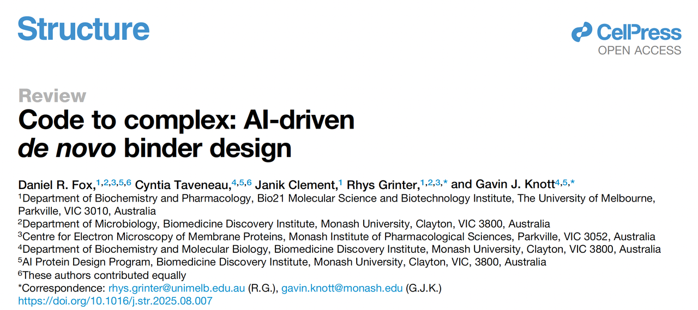
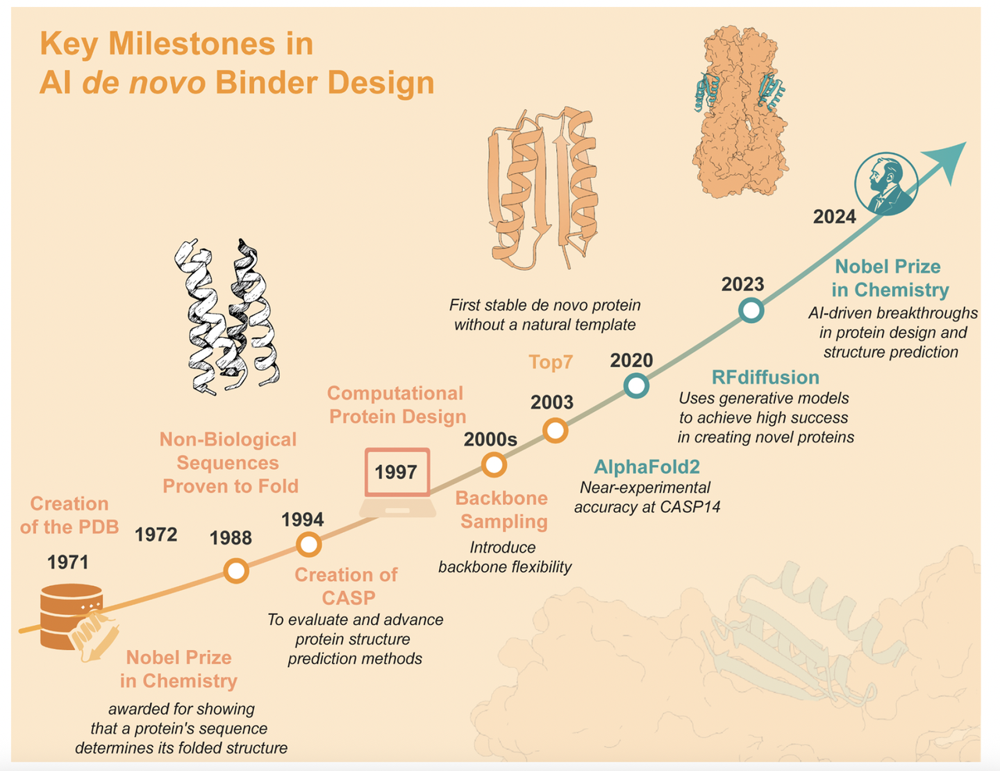
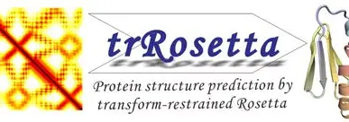
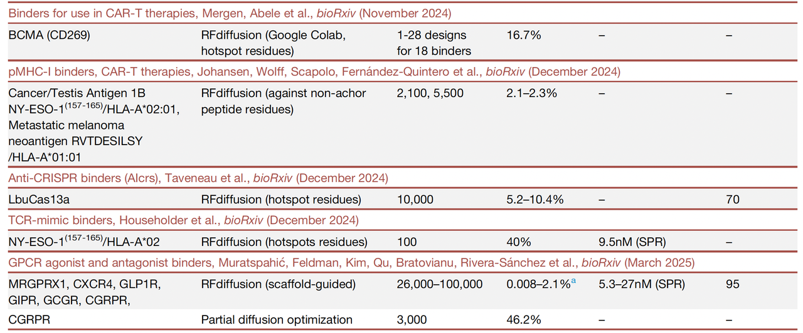

> 蓝极说：
>
> 如果你对蛋白质设计感兴趣，但总觉得门槛太高、不知道从哪开始读起，那么这篇综述正好适合你。

今天看到一篇刚在Cell旗下的Structure杂志上online的综述文&#x7AE0;**《Code to Complex: AI-driven de novo binder design》** ，感觉写的非常好，可以看作是一本蛋白质设计入门级的“导航图”。

它帮你把蛋白质设计的发展脉络、AI 技术的切入点，以及最新的应用案例串联了起来。读完之后，你能对这个领域有一个系统的“鸟瞰视角”：

* 蛋白质设计是怎么从实验室里的理性设计，一步步走到今天 AI 驱动的生成模型？

* 为什么说“binder design”是最具代表性的突破口？

* 未来它还能在哪些疾病、疗法或者新材料方向发挥作用？

文章的标题 **“Code to Complex”** 也很有意味：

* “Code” 不只是指计算机算法，也是蛋白质序列这套天然的编码语言；

* “Complex” 则是目标结合物——新设计出来的蛋白质，精准地抓住它的靶点。

在正文展开之前，作者用一张**时间线（Figure 1）**&#x4F5C;为开场。这张图从1988年第一例人工设计蛋白开始，经过 2003 年的 TOP7、2020 年的 AlphaFold2，一直延伸到 RFdiffusion 等生成式 AI 工具。它告诉我们：

> **短短几十年，蛋白质设计已经从零散的探索，走到了 AI 主导的全新时代。**

***

## **二、历史脉络：从能量函数到深度学习**

要理解今天的 AI 驱动蛋白质设计，最好先看看它的“进化史”。文章里的 **Figure 1 时间线** 就像一张导览图，把过去 40 年的关键节点浓缩在一页纸里。

1️⃣ **1988年：理性设计的起点**

第一例人工设计的蛋白质——四螺旋束（four-helix bundle）诞生。这是靠着对疏水/亲水规律的理性分析拼出来的，证明了“人造序列也能折叠成稳定结构”。

> **意义：蛋白质设计不是痴人说梦。**

2️⃣ **2003年：TOP7 的突破**

Baker 团队设计出了 **TOP7**，这是第一个完全 **de novo**（不依赖天然模板）的折叠蛋白。它的出现说明：通过能量函数和计算优化，科学家真的能从零开始写出一个蛋白质。

> **意义：蛋白质设计从“能折叠”进入“能计算”的阶段。**

3️⃣ **2010s：功能性 binder 的探索**

随着能量优化和骨架采样方法的改进，研究者开始尝试设计功能性结合蛋白，比如针对流感血凝素的 binder。但效率不高，依赖大量实验筛选。

> **意义：有功能的蛋白设计出来了，但还很笨重。**

4️⃣ **2020–2021年：AlphaFold2 的出现**

AlphaFold2 在 CASP14 上达到近似实验的预测精度，彻底改变了结构生物学的格局。它让人们第一次有信心大规模预测并评估设计结果。

> **意义：AI 把“预测”变得几乎等于“实验”。**

5️⃣ **2023–2025年：生成式 AI 工具爆发**

* **RFdiffusion**：用扩散模型直接生成蛋白质骨架，再配合 ProteinMPNN 补全序列。

* **BindCraft**：通过共折叠优化设计靶点结合物。

* 这些方法让 binder 的设计效率提升两个数量级，实验验证成功率达到 7–35%，远超以往。

> **意义：从“能预测”跨入“能生成”。**

整体来看，Figure 1 告诉我们：

* 蛋白质设计的第一阶段靠“理性规则”；

* 第二阶段靠“能量优化”；

* 第三阶段进入“AI 驱动”。

> **现在的 de novo binder design，已经是这个时间线上的巅峰成果。**

***

## **三、AI 工具箱：从“幻觉”到“扩散”**

如果说早期的蛋白质设计是“摸着石头过河”，那么 AI 出现之后，科学家终于有了一套“工具箱”。文章里提到的几种代表性方法，正好对应了 AI 在蛋白质设计上的逐级进化。

1. **幻觉（Hallucination）：从预测到生成的第一步**

* 起点是 **trRosetta** 框架。研究者反向使用结构预测模型：不是给序列预测结构，而是让模型“幻觉”出可能的骨架。

* 后续发展出了“受限幻觉”（constrained hallucination）和“inpainting”，能把关键的结合基序嵌入到新骨架里。

> &#x20;意义：**AI 不只是预测，它能创造全新的蛋白骨架**。

* **表面指纹法（MaSIF）：让 AI 识别“结合热点”**

* 思路是用几何深度学习，直接在蛋白质表面提取“交互指纹”。

* 再把这些“指纹”嵌到兼容的骨架上，得到能精准贴合靶点表面的 binder。

* 代表成果包括设计出结合 SARS-CoV-2 spike 蛋白和 PD-L1 的 binder。

> 意义：**AI 开始学会“看懂”靶点表面的几何特征**。

* **扩散模型（RFdiffusion）：真正的生成引擎**

* 类似 DALL·E 生成图像的方式，**RFdiffusion** 通过“加噪-去噪”的过程生成蛋白骨架。

* 配合 **ProteinMPNN**，在骨架上填充合理的氨基酸序列。

* 再用 AlphaFold2 评估（pLDDT、RMSD 等指标），筛选出最靠谱的设计。

* 成功率比过去高出 100 倍，往往只需要几十到上百个设计就能找到高亲和力结合物。

> 意义：**de novo binder 设计进入大规模、实用化阶段**。

* **BindCraft：考虑靶点的柔性**

* 与 RFdiffusion 不同，BindCraft 在生成时会让靶点和设计的 binder 同时“共折叠”。

* 这样能更好地处理靶点的柔性问题（比如受体的构象变化）。

* 成功率高到只需 10 个设计就能找到有效 binder。

> 意义：**binder 设计不仅追求“生成”，还要追求“适配”**。

***

结合 **Figure 1 的后半部分**，这些方法清晰地勾勒出一个趋势：

* **Hallucination** → 打开了“AI 生成”的可能性；

* **MaSIF** → 让 AI 懂得“靶点几何”；

* **RFdiffusion** → 成为当前最强大的通用生成模型；

* **BindCraft** → 向“更接近真实生物环境”的方向演进。

> 一句话总结：**AI 工具箱让设计 binder 不再是少数专家的艺术，而逐渐成为可复用的工程化流程。**

***

## **四、应用展示：从毒素中和到免疫调控**

如果说前面讲的工具和方法还比较抽象，那么文章中的 **Figure 2** 就让一切变得直观：它把 AI 设计出来的蛋白结合物（binders）的主要应用场景画成了一张全景图。我们可以从中看到，这些小小的人工蛋白，正在从实验室里走向实际的生物医学挑战。

1. **毒素中和：人工抗毒血清**

* **案例一：蛇毒 α-神经毒素**

* 研究者利用 **RFdiffusion** 设计出一批可以紧紧结合蛇毒的 mini 蛋白。在动物实验中，这些人工 binder 在毒蛇咬伤 15 分钟后注射，依然能让小鼠 **100% 存活**。

> 相比传统的抗体或抗血清，这些 binder 更小、更稳定、更容易大规模生产。

* **案例二：艰难梭菌毒素B (TcdB)**

* 另一组研究者通过 MotifGraft + docking 的方法，设计出可以同时阻断毒素多个结合位点的迷你蛋白。最后甚至把两个 binder 融合成一个“双特异性小蛋白”，在小鼠肠道模型里表现出良好的保护作用。

> 显示出 de novo 设计在抗感染领域的巨大潜力。

***

* **免疫调控：精准调节免疫反应**

* **TNFR1 拮抗剂 / TNFR 超家族激动剂**

传统抗 TNF-α 药物常常“一刀切”，既抑制有害炎症，也误伤有益信号。AI 设计的 mini binder 可以专门阻断 TNFR1，却不影响 TNFR2；甚至还能通过小改造，让同一类 binder 变成 OX40 或 4-1BB 的激动剂，促进抗癌免疫。

> 意义在于：AI 可以做出 **“定制化免疫开关”**。

* **IL-23R 与 IL-17A 小蛋白**

已经在小鼠炎症性肠病模型里表现出 **口服给药有效**，并且耐受消化道环境。

> 意义在于：mini 蛋白不仅能替代注射的抗体疗法，还可能进入口服药物的世界。

***

* **其他新兴应用**

除了毒素和免疫调控，AI binder 的触角已经伸向更多方向：

* **抗癌**：通过设计 pMHC 或 TCR mimic，直接激活 T 细胞杀伤。

* **抗 CRISPR**：设计能阻断 CRISPR 系统的 AI 抑制蛋白，用于基因编辑安全控制。

* **抗耐药病菌**：比如针对铁摄取通道 ChuA 的 binder，可以阻断细菌的营养获取。

* **诊断与传感**：mini 蛋白稳定、可设计性强，非常适合做生物传感器或快速诊断工具。

***

**Figure 2 把这些应用串联在一起**，让人看到 de novo binder 不再是停留在“能做出来”的科学奇迹，而是正在逐步走向 **抗毒、抗癌、免疫治疗、抗感染和诊断**等实打实的临床和产业前沿。

> 一句话总结：**AI 设计的 mini 蛋白，正在成为下一代“抗体的替代品”。**

***

## **五、挑战与展望：不只是技术问题**

AI 驱动的 de novo binder 设计听起来无所不能，但文章也很清楚地指出：

> 从计算到临床，中间还有很多“最后一公里”的障碍。我们可以把它们归纳为**四大类挑战**。

***

**挑战一： 技术与资源门槛**

* **计算资源瓶颈**：训练和运行生成模型需要大量 GPU 算力，这对很多中小实验室来说是“硬门槛”。

* **专业知识依赖**：要用好这些工具，需要既懂结构生物学、又懂深度学习的交叉人才，目前仍很稀缺。

> 文章提到 **ColabFold** 等开源平台，算是降低了门槛，让更多人能“在线”运行 AlphaFold2 和 RoseTTAFold，但真正的大规模生成仍受限于算力。

***

**挑战二：预测与现实之间的差距**

* 虽然有 pLDDT、pAE\_interaction、RMSD 等筛选指标，但它们和真实结合亲和力之间仍不完全对应。

* 成功率虽已大幅提高，但并非“必胜公式”。

> 一个可能的解决方向是：把越来越多的实验数据回流到模型里，帮助 AI 逐步学会“贴近实验现实”。

***

**挑战三：靶点与结构的局限**

* 当前的设计更偏向 α 螺旋结构，β 折叠或更复杂拓扑的设计仍不成熟。

* 靶点选择上，AI 更擅长对付刚性蛋白，对柔性靶点（比如 GPCR、IDPs）还存在挑战。

> 不过文章也提到，**BindCraft** 通过“共折叠”已经在解决靶点柔性的问题，这也是未来的发展方向。

***

**挑战四：转化与伦理考量**

* **免疫原性与递送问题**：人工蛋白虽然小而稳定，但仍有可能引发免疫反应；给药方式（口服、注射、mRNA 递送）也需要进一步验证。

* **伦理与监管**：

  * 谁是这些设计的“发明人”？是人类研究者，还是 AI？

  * 技术可能存在“双重用途”：既能救人，也可能被滥用。

> 文章特别强调：需要新的法律、伦理和监管框架来跟上技术的发展，就像当年 CRISPR 出现时一样。

一句话总结：**AI 设计 binder 已经能解决“能不能”的问题，现在需要解决“能不能安全、普及和合规”的问题。**

***

## **六、结语：范式转变与未来方向**

在短短五年时间里，从 AlphaFold2 的横空出世，到 RFdiffusion、BindCraft 等生成模型的成熟，**de novo 蛋白质结合物设计已经完成了一次“范式转变”**。

过去，科学家要花数年时间才能筛出一个候选分子，如今 AI 能在几天内生成上千个方案，并且实验成功率成倍提升。过去，设计蛋白还是少数顶尖实验室的“手工艺”，现在正在逐渐走向工程化、平台化。

这篇综述的题目 **《Code to Complex》** 也道出了这个变化：

* 从序列和算法（Code）出发，

* 最终实现与靶点精准结合的复合物（Complex）。

未来的问题已经不再是 **“AI 能不能设计出蛋白？”**，而是 **“我们能用它解决哪些现实难题？”**。

* 是抗毒血清？

* 是口服小蛋白药物？

* 还是快速应对下一次突发的传染病？

这些可能性都在被逐步打开。可以说，**蛋白质设计正在从实验室里的“科学奇迹”，变成现实世界里的“生物工具”**。

原文链接：https://doi.org/10.1016/j.str.2025.08.007

