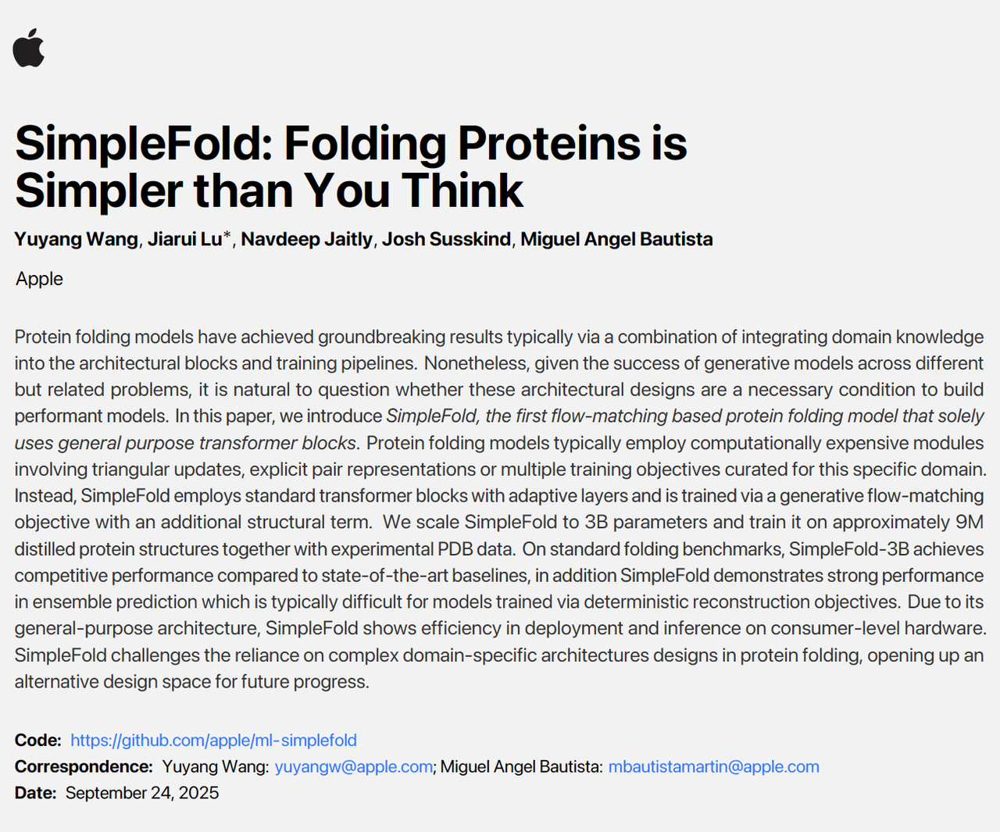

> 今天突然发现苹果也开始做蛋白质预测了，相当震惊，于是读一下苹果的蛋白质预测，甚至是生物学方面的处女作。

***

## 一、背景

在蛋白质结构预测领域，大家最熟悉的名字无疑是 **AlphaFold2** 和 **RoseTTAFold**。这两类模型在方法论上有一个共同点：依赖大量的领域特定设计，例如 **多序列比对（MSA）**、**pair 表示**、以及 **triangle updates** 等复杂模块。这些设计的初衷，是把我们对蛋白质结构形成的先验知识“硬编码”进模型里，从而提升准确性。

今天惊讶的发现：**苹果公司也开始做蛋白质折叠预测了。**&#x6CA1;错，就是卖手机卖电脑的巨头苹果。他们发布了一个名为 **SimpleFold** 的模型。顾名思义，这个模型最大的特点就是“简单”——它几乎抛弃了前人构建的各种复杂结构，仅仅用标准的 Transformer 堆叠起来，却依然能达到接近甚至超越主流模型的表现。

如果你先看文章中的图 1(a)(b)，就会更直观地感受到这个结果：图中展示了 SimpleFold 在两个目标蛋白（7QSW 和 8DAY）上的预测结构（深蓝色）和实验结构（浅蓝色）的对比。两者几乎完美重合，说明即便没有繁琐的模块，SimpleFold 依旧能给出高度准确的预测。

***

## **二、研究出发点**

在过去几年里，蛋白质折叠预测的突破主要来自 **高度定制化的架构设计**。比如 AlphaFold2 引入了**多序列比对（MSA）**&#x6765;捕捉进化信息，用 **pair representation**建模残基之间的相互作用，再通过 **triangle updates** 模块来强化几何约束。

这些设计虽然有效，但也带来两个问题：

1. **计算昂贵** —— 运行一次完整预测往往需要大量算力；

2. **泛化受限** —— 模型对孤儿蛋白（几乎没有同源序列的蛋白）往往表现不佳。

苹果团队的思考很直接：

> ***这些复杂的领域特定模块，真的必不可少吗？***

他们的答案是 —— **不一定**。与其依赖“人类专家的手工设计”，不如借鉴在图像、文本生成领域已经被验证有效的思路：**完全用通用的 Transformer 架构，通过大规模数据和生成式训练目标，让模型自己学习蛋白质的对称性和规律**。

这就是 **SimpleFold** 的设计理念：

* 不用 MSA

* 不建 pair representation

* 不做 triangle updates

* 完全依靠 **Transformer + flow-matching 生成目标**

如果你对照文章中的 **Figure 2**，会更清晰地理解这种“简化”思路。图中展示了 SimpleFold 的核心架构：

* 左侧是 **原子编码器**，负责将输入的“噪声原子坐标”转化为特征；

* 中间是 **残基主干（Residue Trunk）**，承担主要计算任务；

* 右侧是 **原子解码器**，将特征还原为 3D 结构。

* 整个流程只用了一种通用的 Transformer block，没有任何 AlphaFold2 那种复杂的几何模块。

这意味着：**SimpleFold 重新定义了蛋白质折叠问题，把它当成一个“条件生成任务”——从氨基酸序列出发，生成原子级别的三维结构**。

***

## **三、方法核心**

1. **生成式建模思路**

传统模型大多把折叠当作“回归问题”——给定氨基酸序列，直接预测对应的结构。

SimpleFold 则换了一个角度：**把折叠当作生成任务**。

* 输入：氨基酸序列，相当于生成模型的“条件”

* 输出：完整的原子级三维坐标，相当于“生成的结果”

* 过程：从高斯噪声出发，逐步“流动”到合理的蛋白质结构，这就是 **flow-matching** 的核心思想。

这个思路和图像生成（text-to-image）、三维生成（text-to-3D）如出一辙，只不过这里生成的对象是蛋白质结构。

***

* **模型架构**

在 **Figure 2** 里，作者展示了 SimpleFold 的整体框架：

* **原子编码器 (Atom Encoder)**：

将带噪声的原子坐标和基本原子信息（类型、电荷等）转化为特征表示。

* **残基主干 (Residue Trunk)**：

模型的核心部分，基于标准 Transformer 进行序列建模；

同时引入了 **蛋白质语言模型 (ESM2-3B)** 的 embedding 作为条件输入。

* **原子解码器 (Atom Decoder)**：

将残基级别的特征还原到原子层面，输出预测的结构坐标。

与 AlphaFold 系列最大的不同在于：

* 没有 pair 表示

* 没有 triangle updates

* 也没有专门的等变（equivariant）几何模块

* 模型仅依赖 Transformer 的自注意力机制和数据驱动的学习。

***

* **数据与规模**

SimpleFold 之所以能站得住脚，核心在于 **大规模训练数据**：

* PDB 实验结构：约 16 万条

* AFDB 和 ESM Atlas 的蒸馏数据：数百万条

* 最终，最大模型 **SimpleFold-3B** 用了 **约 900 万个结构**进行训练，参数量达到 **30 亿**。

这种规模的训练，使得即使架构简化，模型依旧能学习到复杂的折叠规律。

对应 **Figure 4** 的 scaling 曲线可以看到：随着参数量和数据量增加，SimpleFold 的表现稳步提升，尤其在复杂任务上，3B 模型的提升非常明显。

***

### **小结**

SimpleFold 的方法核心可以概括为三句话：

1. 用 flow-matching，把折叠当作生成任务；

2. 架构极简，仅由 Transformer 组成；

3. 依靠大规模训练数据与模型规模扩展，保证预测精度。

***

## **四、性能与结果**

1. **基准测试表现**

在两个常用的折叠基准上，SimpleFold 都展现出强劲的表现：

* **CAMEO22**：这是一个持续更新的蛋白质结构预测评测平台。SimpleFold 在这里取得了与 ESMFold、AlphaFold2 等主流模型接近的成绩，部分指标甚至超过了 ESMFlow（同样是生成式方法）。

* **CASP14**：更具挑战性的盲测基准。SimpleFold-3B 的成绩明显优于 ESMFold，并在多个指标上接近 AlphaFold2 和 RoseTTAFold2。

如果你看文章中的 **Figure 1(d)**，会发现模型规模和性能几乎呈现线性关系：从 100M 到 3B 参数，模型越大，性能越强。这说明 **SimpleFold 的“简化架构”并没有成为瓶颈**。

***

* **真实案例对比**

论文中的 **Figure 1(a)(b)** 给出了两个具体蛋白的预测：

* **7QSW**（RubisCO 大亚基）

* **8DAY**（Dimethylallyltryptophan synthase 1）

图中浅蓝色是实验结构，深蓝色是 SimpleFold 的预测，几乎完全重合（TM-score > 0.98）。

这直接说明：**即使没有复杂模块，SimpleFold 的预测依然可以非常精准。**

***

* **多构象与柔性建模**

传统回归式模型往往只能输出“单一最优构象”。而 SimpleFold 由于采用生成式目标，天然能生成 **多样的合理构象**，这在药物发现等场景尤其重要。

* **Figure 1(c)** 展示了一个 Flagellar hook 蛋白（6DNW）的不同构象集合，SimpleFold 能够捕捉到其柔性变化。

* 在 ATLAS 分子动力学数据集和 Apo/Holo 任务上，SimpleFold 的多态生成效果超过了 ESMFlow、AlphaFlow 等方法，证明它在 **建模蛋白质柔性和动力学方面有独特优势**。

***

* **推理效率**

另一个值得关注的点是 **推理效率**。

* 在 **Figure 1(e)** 里，作者展示了不同规模 SimpleFold 的推理速度；

* 即便是 3B 模型，在 MacBook Pro (M2 Max, 64GB) 这样的消费级硬件上也能运行；

* 更小的 SimpleFold-100M 模型在速度和准确性上达到很好的平衡（恢复了约 90% 的性能）。

这让 SimpleFold 更接近“普惠”科研工具，而不只是依赖超级计算机的实验室项目。

***

### **小结**

从结果来看，SimpleFold 用“更简单的架构”达到了 **接近最复杂模型的准确率**，同时在 **多构象预测和推理效率** 上有额外优势。

***

## **五、意义与影响**

1. **方法论上的颠覆**

过去几年，AlphaFold 系列几乎“定调”了蛋白质折叠预测的技术路线：**依赖复杂的领域特定模块**，比如 MSA、pair representation和triangle update。

而 SimpleFold 证明了另一条道路也同样可行：

* **抛弃复杂结构**，完全依靠通用 Transformer；

* **依靠规模化训练**，让模型直接从数据中学习蛋白质的几何规律。

* 这为未来的研究打开了新的思路：*也许不需要生物学家“手工设计”的模块，通用大模型就能捕捉自然界的规律。*

***

* **工程与应用价值**

SimpleFold 的“简化”不仅是学术上的好奇心，更带来了实际好处：

* **计算效率更高**：不再依赖昂贵的 MSA 搜索和复杂几何模块，推理速度更快；

* **部署门槛降低**：在消费级硬件上也能运行，让蛋白质预测更普及；

* **多构象能力强**：生成式框架天然支持蛋白质柔性和多态预测，对药物设计、结合口袋发现等任务意义重大。

***

* **行业层面的信号**

苹果的入局本身也是一个强烈信号：

* 过去，蛋白质折叠预测的核心突破主要来自学术界和专门的研究机构（DeepMind、Baker 实验室等）；

* 如今，苹果这样的科技巨头也投入其中，说明 **蛋白质预测已不再是“科研小圈子”的事情，而正在成为通用 AI 的一部分**。

* 这可能意味着未来：

工业界会更快把蛋白质预测模型应用到药物开发、材料设计等实际场景；

通用大模型的“跨界能力”将成为生命科学研究的一股重要推动力。

***

### **小结**

SimpleFold 的重要性，不仅在于它的表现接近 AlphaFold2，而在于它 **证明了复杂设计并非唯一解法**，并且把蛋白质预测带向了“通用 AI 架构 + 大规模数据”的新范式。

***

## **六、总结**

如果要用一句话概括 SimpleFold：

**它用最简单的 Transformer 堆叠，实现了接近最复杂折叠模型的效果，还额外带来了多构象生成和更高效的推理。**

这背后有三个值得记住的亮点：

1. **架构简化**：不再依赖 MSA、pair representation、triangular update，完全基于通用 Transformer；

2. **生成式建模**：通过 flow-matching，把折叠当作一个“从噪声到结构”的生成任务，自然支持多构象预测；

3. **可扩展性与可用性**：在大规模数据和参数扩展下持续提升，同时在消费级硬件上也能运行。

因此，SimpleFold 不仅是苹果在蛋白质设计领域的首次亮相，更可能代表一种新的范式：**从复杂设计走向简洁通用，用数据和算力推动科学突破。**
