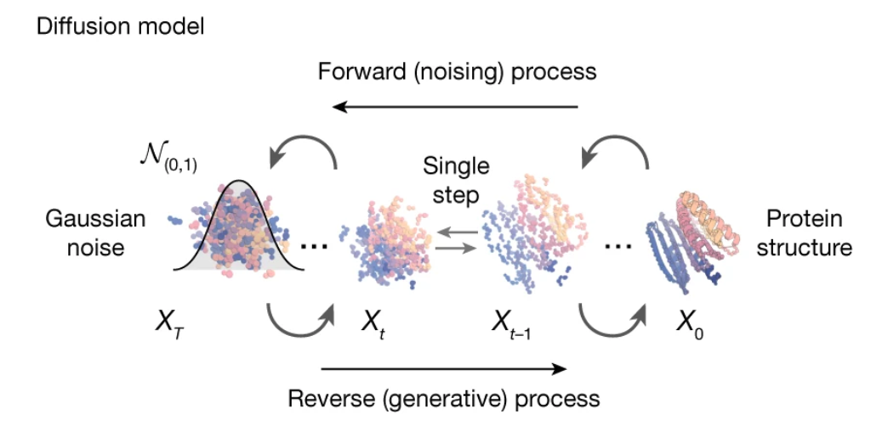
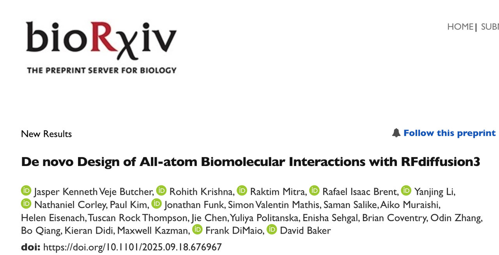
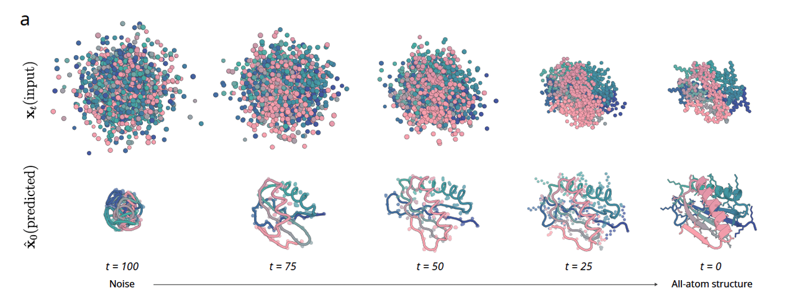
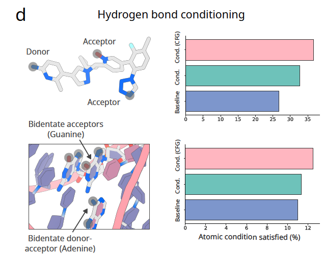
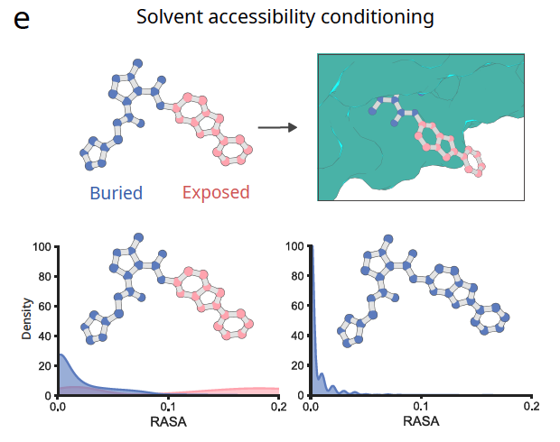
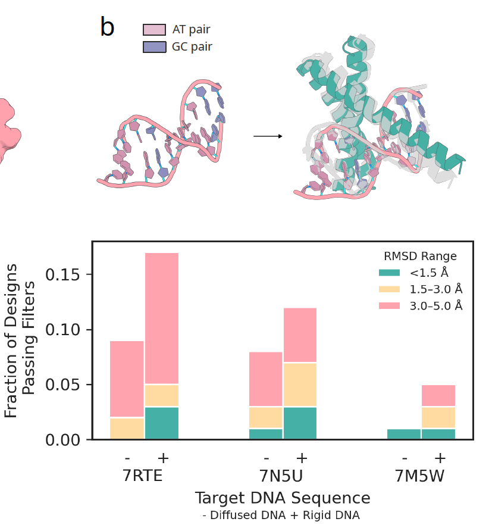

在蛋白质设计领域，扩散模型的引入堪称一次革命。2023 年，Baker 团队在 *Nature* 发表的 **RFdiffusion（RFD1）** 为 de novo 蛋白设计提供了一条全新的路径：只要给出功能性约束，就能在计算机中“长出”全新的蛋白质结构。利用rosetta系列工具做出的一系列设计，也让David Baker获得了2024年的诺贝尔奖。随后推出的 **RFdiffusion2（RFD2）** 又进一步解决了部分活性位点嵌入的问题，让一些简单的催化功能得以实现。

不过，前两代方法仍然存在明显的瓶颈：

* **精度不足**：它们主要在残基层面建模，无法直接处理每一个原子的位置，这让小分子结合、DNA 识别等原子级任务依然难以实现。

* **限制较多**：设计时只能对少数关键原子进行约束，无法全面控制氢键、溶剂可及性或复杂的非蛋白组分。

就在昨天（2025年9月18日），华盛顿大学 David Baker 团队在 bioRxiv 上发表了最新工作 **《De novo Design of All-atom Biomolecular Interactions with RFdiffusion3》**。在这篇文章中，研究人员提出了 **RFdiffusion3（RFD3）** ——一个全原子级的扩散模型，不仅能生成蛋白主链和侧链，还能同时处理小分子、DNA 等非蛋白分子。相比前代，它在计算效率上提升了一个数量级，同时在蛋白–蛋白、蛋白–DNA、蛋白–小分子结合以及酶设计等多类任务中全面超越了旧有方法。

这项工作标志着蛋白质设计进入了一个新阶段：**从残基到原子**，设计的分辨率第一次与分子相互作用的真实尺度对齐。

🔗原文链接：https://doi.org/10.1101/2025.09.18.676967

***

## **一、方法与架构：全原子扩散的实现**

RFdiffusion3 的最大创新，是&#x628A;**扩散建模的基本单元从“残基”提升到“原子”**。这意味着，模型不仅关心主链如何折叠，还同时追踪每一个侧链原子的空间坐标。在此基础上，它还能在同一个体系中处理非蛋白质分子，例如小分子、DNA 或 RNA。

### **图 1a：扩散过程**

这一部分展示了 RFD3 如何从完全噪声出发，逐步还原出有序的蛋白质结构。不同时间点的快照让人直观感受到：原子级扩散并不是“一下子生成”，而是一个不断消除噪声、逐渐逼近真实结构的过程。与前两代相比，这次不仅骨架在收敛，**侧链的细节也在同步生成**。

### **图 1b：适用范围**

这张图像是一份功能清单：RFD3 能覆&#x76D6;**蛋白–蛋白相互作用、蛋白–DNA 结合、蛋白–小分子结合、酶活性位点设计以及对称性寡聚体生成**。过去这些任务往往需要不同工具分别处理，而现在通过一个统一的架构就能实现，体现了模型的通用性。

### **图 1c：模型架构**

RFD3 采用了一个轻量化的 transformer–U-Net 架构：

* **特征下采样** → 把原子和残基的局部信息编码；

* **稀疏注意力** → 强调几何邻近的原子之间的交互；

* **跨层注意力** → 在原子级和残基层特征之间建立联系；

* **特征上采样** → 输出每个原子的空间坐标更新。

### **图 1d：速度对比**

速度是另一个重要亮点。RFD3 在相同任务下比 RFD2 快了约 **10 倍**，这一点对实际应用意义重大。它意味着研究人员可以在更短时间里生成和筛选更多设计，提高整个设计–实验循环的效率。

整体来看，Figure 1 向读者传达了一个核心信息：**RFD3 不是局部改良，而是一次从架构到任务范围的全面升级**。

***

## **三、条件控制与可编程性：让设计进入“原子操作”时代**

如果说全原子扩散让 RFD3 拥有了分辨率，那么**条件控制**则赋予了它“可编程”的能力。研究人员可以在生成过程中直接设定原子层面的几何或化学条件，从而引导模型生成满足特定功能的结构。

### **图 2a：酶活性位点的扩散**

这一部分展示了 RFD3 如何处理酶催化所需的原子集合。**模型不是简单地把活性位点固定在某个残基上，而是让网络在扩散过程中“自己决定”最合适的残基来承担这些原子**。结果是：**活性位点自然嵌入蛋白骨架，形成合理的化学环境。**

### **图 2b–c：蛋白–DNA与蛋白–小分子共同生成**

传统方法往往把 DNA 或小分子看作固定的外部对象，只设计蛋白部分。而在 RFD3 中，DNA 构象或小分子构象可以和蛋白一起被扩散生成。这样，结合界面不再是硬对接，而是动态适配，最终得到更加自然的相互作用模式。

### **图 2d：氢键约束**

设计蛋白–小分子或蛋白–DNA 结合时，研究者可以**明确指定哪些原子要作为氢键供体或受体**。图中结果显示，有了这种约束后，氢键形成的比例显著提高。

### **图 2e：溶剂可及性控制**

通过给出原子的溶剂可及性（RASA），模型可以决定某个小分子是否**深埋在蛋白内部，或者暴露在表面**。这为调节**结合口袋的“开放”程度**提供了直接手段。

### **图 2f：质心位置**

设计者甚至可以控&#x5236;**蛋白质整体相对于配体的空间位置**。例如在 DNA 结合任务中，可以设定不同的蛋白质质心，模型会自动调整生成的构象来匹配。

### **图 2g：对称性约束**

只要在扩散输入中加入**对称噪声**，RFD3 就能生成符&#x5408;**指定对称群的蛋白寡聚体**。图中展示了 D2、C3、C5、C7 等对称性设计，结果与 AlphaFold3 的预测高度一致。

***

Figure 2 展现的，是 RFD3 从“**会生成**”到“**能被精确操控**”的关键跨越。它让蛋白设计真正具备了**像编程一样的自由度**：**研究者不再只是被动等待模型输出，而是能在原子层面对结构施加精细指令**。

***

## **四、设计任务上的表现：全面超越前代**

有了全原子扩散和灵活的条件控制，RFD3 在一系列核心任务上的表现都大幅提升。Figure 3 用四组对比展示了它的优势。

### **图 3a：蛋白–蛋白结合**

研究团队把 RFD3 和 RFD1 在五个经典结合靶标上进行比较（PD-L1、IL-2Ra、IL-7Ra、Tie2、InsulinR）。结果显示，RFD3 不仅成功率更高，而且能找到更多**结构多样化**的解决方案。平均每个靶标能得到 8.2 个成功簇，而 RFD1 只有 1.4 个。这意味着，**RFD3 不再局限于单一构象，而是能探索出多条可能的结合路径。**

### **图 3b：蛋白–DNA结合**

DNA 结合一直是设计难点，因为 DNA 构象本身灵活、极性强。RFD3 的做法是**同时生成 DNA 构象和蛋白界面**。测试结果表明，即便不给定 DNA 的结构（只给出序列），RFD3 依然能生成合理的结合界面，并保持在 5 Å RMSD 以内的精度。这是此前方法几乎无法做到的。

### **图 3c：小分子结合**

过去的扩散模型往往需要固定小分子的构象再来设计蛋白。RFD3 则能把小分子与蛋&#x767D;**一起扩散生成**，捕捉到不同的结合姿态。对四个小分子（包括常见的 FAD、SAM，以及不常见的 IAI、OQO）的测试中，RFD3 全面优于上一代方法，不仅成功率高，还能给出更低的结合能量和更丰富的新颖结构。

### **图 3d：酶设计**

酶设计需要对活性位点的原子精确定位。在 Atomic Motif Enzyme 基准测试中，RFD3 在 41 个活性位点任务里，有 90% 的案例超过了 RFD2。尤其是在包含多个残基岛（分散的残基片段）的复杂情境中，RFD3 的成功率远高于前代。这说明它能&#x591F;**更好地在复杂骨架中嵌入活性中心**。

Figure 3 的四个子图合在一起，传递的核心信息非常直接：**无论是结合蛋白、核酸、小分子，还是催化活性位点，RFD3 都在成功率、结构多样性和能量学合理性上全面胜出。**

***

## **五、实验验证：从计算机到现实**

再漂亮的计算机模型，如果不能在实验室里验证，就只能停留在理论。研究团队专门挑选了两个最能体现 RFD3 原子级优势的挑战：**DNA 结合蛋白设计**和**酶设计**，并把结果带到了实验台上。

### **图 4a–b：DNA 结合蛋白**

研究者首先用 RFD3 对一段随机生成的 DNA 序列进行设计。在第一轮生成后，他们选择了预测可靠的构象，再通过“重支架化”方法优化结合区，最终得到 5 个候选设计。将这些设计表达并检测结合活性后，结果发现其中有一个能稳定结合目标 DNA，且达到 **低微摩尔级亲和力（EC50 \~ 5.9 μM）**。

在蛋白质设计领域，这是一个相当有说服力的验证：**模型不仅能设计出能“折叠”的结构，还能精确识别特定 DNA 序列。**

### **图 4c–d：酶设计**

第二个测试是一个更具挑战性的任务：设计一类**半胱氨酸水解酶**，它需要经典的 **Cys–His–Asp 催化三联体**来完成底物水解。研究团队用 RFD3 根据最小的活性原子集合进行 scaffolding，随后在实验中检测设计的催化活性。

在 190 个设计中，有 35 个表现出多轮催化活性，其中最优的一个酶达到 **Kcat/Km = 3557**，超过了之前使用 RFD2 的成果。

**这意味着 RFD3 在催化中心的原子排布上足够精确，能够直接产生活性。**

***

Figure 4 展示的，不只是两个实验结果，而是一个**完整的闭环**：

* 从计算机上的原子级扩散；

* 到模型生成合理的结合界面或活性位点；

* 再到实验室验证其功能确实可行。

这一闭环让 RFD3 的价值更加清晰：**它不只是一个漂亮的算法，而是一个可以真正加速分子设计周期的实用工具。**

***

## **六、总结与展望：原子级的未来**

RFdiffusion3 的出现，让蛋白质设计第一次真正进入了**原子级的时代**。它具备三个核心特征：

1. **分辨率**：以原子为建模单元，不再停留在残基层面；

2. **可编程性**：研究者可以直接设定氢键、溶剂可及性、对称性等条件，引导设计走向目标；

3. **效率**：在全面提升精度的同时，比前一代方法快了一个数量级。

从 Figure 1 到 Figure 4，我们看到的不仅是模型架构的升级，更是任务范围和实验结果的全面突破：

* 蛋白–蛋白结合更加多样；

* 蛋白–DNA 结合首次实现同时生成 DNA 构象；

* 小分子结合不再局限于固定构象；

* 酶设计成功率显著提高；

* 实验验证证明它能真正产生活性分子。

这些进展让我们能够想象一个全新的场景：未来在药物研发、合成生物学、工业酶设计中，研究者或许可以像编程一样，直接在原子层面“写下”自己想要的功能，然后由模型生成候选分子，再快速走向实验室测试。

但同时也可以看到的是，所谓的All-atom设计，其实也并不够“All-atom"，蛋白质的翻译后修饰、糖蛋白的设计等任务都没有涉及。而且，David Baker也是做&#x4E86;**妥协**，RFD3采用了Alphafold3来代替Rosettafold-AllAtom，所以可能性能的提升是来自于结构预测工具的改变，而在这一点上，又有一点为别人做嫁衣的感觉。

不过，作为用户，我们希望的还是能用上一个更好的设计工具，能够针对具体的科学问题，得到我们想要的结果，在这一点上，看起来RFD3还是非常具有突破性的！

