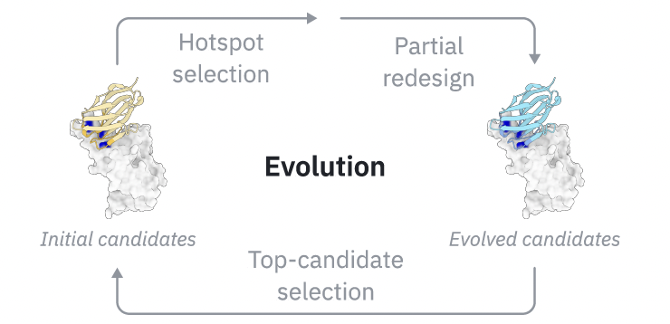
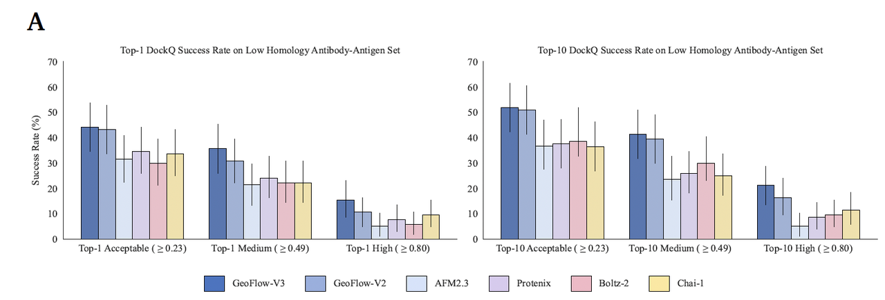

> 蓝极说：
>
> 今天要分享的是百奥几何(Biogeometry)团队最近发布的技术报&#x544A;**《Rapid De Novo Antibody Design with GeoFlow-V3》**。
>
> 
>
> 为什么要介绍这篇文章呢？
>
> 1. 在技术方面。百奥几何团队首次将多步推理引入蛋白质设计，让模型具备“自我评估、自主进化”的能力
>
> 2. 在效果方面。他们在多个靶点、指定表位的从头设计任务中做了测试，只需测试数十条序列即可找到 nM 级的 binder 分子，平均湿实验验证命中率达到 15.5%
>
>
>
> * **免费试用 GeoFlow V3：**&#x68;ttps://prot.design
>
> * **GeoFlow V3 技术报告：**&#x68;ttps://prot.design/report

***

### **一、引言——从“生成结构”到“推理设计”**

在过去几年中，基于深度学习的蛋白质结构预测取得了显著突破，AlphaFold、RoseTTAFold 等模型几乎解决了“如何预测蛋白结构”的问题。然而，在蛋白质设计，尤其是**抗体从头设计（de novo antibody design）**&#x9886;域，真正高效、可靠的计算框架仍然稀缺。

抗体–抗原界面的复杂性、CDR 区域的高度柔性、以及传统方法对实验筛选的高度依赖，使得抗体设计长期停留在“低命中率、高实验负担”的阶段。传统 pipeline 往往需要从数百万序列中进行筛选，才能在数月后找到少量活性分子。

**GeoFlow-V3 的提出，改变了这一范式。**

GeoFlow-V3 构建于百奥几何团队半年前发布的全原子蛋白大模型 **GeoFlow-V2** 之上。V2 是首个在统一框架下同时实现**蛋白质结构预测与从头设计（de novo design）的原子级模型，并已在多种蛋白设计与改造任务中展现出卓越的通用性。**

**在此基础上，GeoFlow-V3 进一步引入了扩散模型（diffusion model）机制，发展为一个统一的原子级扩散生成框架（atomic diffusion model）**，能够在原子尺度上同时执行高精度结构预测与序列生成设计。

更为关键的是，GeoFlow-V3 首次在蛋白设计中引入了**多步推理（multi-step reasoning）与自我进化（in silico evolution）**&#x673A;制，使模型具备类似免疫系统“亲和力成熟”的能力：

通过自我评估与迭代再设计，模型可在虚拟空间中持续优化候选分子，逐步收敛至更优的结合构象。

配图（Figure 1）展示了这种新范式的闭环流程：从指定表位（epitope）出发，GeoFlow-V3 首先生成针对该表位的候选抗体，然后在虚拟环境中模拟结合与进化，最终仅需筛选几十个候选序列，即可在三周内获得经过湿实验验证的 nM 级结合分子。

这一“从表位到验证”的闭环能力，是 GeoFlow-V3 相比所有前代模型最具颠覆性的特征。

***

### **二、核心机制——让模型“思考”与“进化”**

GeoFlow-V3 的技术核心在于，它并非一次性生成抗体序列，而是引入了类似生物体“亲和力成熟（affinity maturation）”的多步推理框架，使模型具备了“自我优化”的能力。

#### 1. **从“生成–筛选”到“生成–评估–再设计”的跃迁**

此前几代设计模型（包括 GeoFlow-V2、RFdiffusion、Chai 系列等）多采用单轮的生成与过滤策略：模型生成一批候选序列，计算预测其与目标的结合能或结构置信度，再从中筛选得分最高者。

这一流程虽然高效，但有两个显著局限：

* **一次性决策，缺乏反馈闭环**：生成过程无法利用评估结果进行再优化；

* **易陷局部最优**：模型往往在首轮采样中受限于初始表位定义或结构噪声。

GeoFlow-V3 的突破在于，它引入了**多轮 in silico evolution**策略——一种“虚拟的抗体进化”。如 Figure 2 所示，模型首先根据指定表位生成初始候选（Initial candidates），然后依据内部置信度（confidence score）进行自我评估，自动识别结构或序列中“低置信”区域，特别是 CDR 区域中潜在的亚最优残基。

在下一轮中，GeoFlow-V3 会部分重设计这些区域（Partial redesign），并重新运行扩散过程（reverse denoising steps）。这种过程可以看作是在结构空间中“反复试探”，逐步将抗体引导至更高置信度的结合状态。

#### 2. **模拟“免疫进化”的推理式生成**

这一设计逻辑高度借鉴了自然免疫系统的机制：

V(D)J 重组、体细胞高变与亲和力成熟共同塑造了抗体库的多样性与高特异性。

GeoFlow-V3 在算法层面复现了这种迭代式进化，但以完全计算的方式完成。

模型在每一轮推理中都进行两类更新：

* **结构层面**：通过部分反扩散（35–45% diffusion steps）微调局部构象，使其更符合抗原表面几何约束；

* **序列层面**：基于 residue-level 的预测误差指标（CDR-ipAE）筛选低置信残基，执行局部重设计。

多轮推理之后，GeoFlow-V3 能在高维的序列–结构空间中持续逼近更优能量构象，实现真正意义上的“自我进化”。

#### 3. **技术意义**

这一机制带来了两个深远影响：

* **模型具备“推理”能力**：它不再被动输出，而能根据内部不确定性主动调整策略；

* **大幅提升设计成功率**：即使在噪声较大的表位输入下，模型仍能通过多轮演化得到高置信度候选。

简言之，GeoFlow-V3 使蛋白质设计模型从“生成器”升级为“推理系统”，这不仅是算法层的突破，更是 AI 蛋白设计范式的一次质变。

***

### **三、性能验证——从高精度结构到自我置信判断**

GeoFlow-V3 的核心理念之一是：**结构预测质量决定设计成功率。**

因此，团队首先在低同源抗体–抗原复合物数据集上系统评估了模型的结构预测能力与置信度判别性能。结果显示，GeoFlow-V3 不仅在 DockQ 精度上达到当前最优，还首次证明了“模型自信度”可以可靠地映射至真实结合正确性。

***

#### 1. **结构预测精度：更高的 DockQ，更可靠的结构**

在 104 个低同源抗体–抗原复合物上，GeoFlow-V3 相比前代版本 GeoFlow-V2 实现了显著性能跃升：

* **高质量（High DockQ ≥ 0.8）预测成功率提升 45%（Top-1）**，

* **中等精度预测成功率提升约 18%（Top-10）**。

这意味着 GeoFlow-V3 能更精确地重现抗体–抗原界面原子排列，达到亚埃级（sub-angstrom）对接精度。

值得注意的是，GeoFlow-V3 的高 DockQ 命中率（Top-1 达 15.4%，Top-10 达 19.2%）在同类模型中居领先地位，**成为 de novo 设计能力的重要前置指标**。

研究团队甚至提出一个经验规律：高 DockQ 成功率可作为蛋白设计模型实际设计能力的量化 proxy——因为能准确重建真实复合体结构的模型，更有可能生成真实结合的序列。

***

#### 2. **约束引导机制：结合结构与表位信息的精细控制**

Figure 3B 展示了 GeoFlow-V3 在不同推理约束条件下的结构预测表现。结果表明：

* 当提供**多点表位约束（four-epitope constraints）**&#x65F6;，DockQ 成功率显著提升，说明模型能准确遵循设计热点（hotspot）；

* 当结合**全构抗原约束（holo-antigen conditioning）**&#x65F6;，高精度（High DockQ > 0.8）预测率提升最明显；

* 两者结合时表现最佳，Top-1 高质量成功率达到 **44.2%**，Top-10 达 **57.7%**，为当前所有抗体–抗原结构预测模型中最高水平。

这表明 GeoFlow-V3 不仅能“盲目生成”，还能在获得局部或整体实验信息时，实现真正意义上的**可控生成（controllable generative design）**。

这一能力对于靶点导向型抗体优化、复杂抗原多位点结合等任务尤为关键。

***

#### 3. **置信度与真实性：模型的“自我判断”能力**

Figure 4 展示了模型预测置信度与真实 DockQ 分数的对应关系。

GeoFlow-V3 的 confidence score（类似 AlphaFold 的 pLDDT，但强化了界面特征）能以 0.8 为阈值精准区分正确与错误结构。

结果显示：

* 当置信度 > 0.8 时，预测正确率（precision）超过 **80%**；

* 低置信度结果几乎从未对应真实结构。

换言之，GeoFlow-V3 已具备类似人类科学家“结果可信度判断”的能力。

这种自评机制不仅使其在**虚拟筛选（in silico screening）**&#x4E2D;具备可靠排序依据，也为后续的进化性生成（Section 2）提供了量化反馈信号。

***

#### 4. **小结：高精度 + 自我置信 = 更强泛化**

凭借这一结构层面的双重突破——

**高 DockQ 精度（结构可靠）** 与 **高置信区分度（评估可靠）**，

GeoFlow-V3 不仅在预测层面超越现有模型，更为“从头设计”的有效性提供了坚实的理论与实践基础。

它第一次让“AI 自己判断自己对不对”成为现实，这种自评能力是其“多步推理–自我进化”体系的核心支点。

***

### **四、从模型到现实——快速从头设计与湿实验验证**

GeoFlow-V3 的价值不仅在于更高精度的结构预测，更在于它真正将**计算设计落地为可验证的抗体分子**。

这一部分的实验验证展示了一个完整闭环：从指定表位出发，模型生成候选 nanobody（VHH）分子，经 in silico 筛选与一轮湿实验，即可在三周内得到 nM 级结合分子。

这代表着**抗体发现流程从数月压缩至数周，从数百万样本缩减至数十个样本**，实现了药物发现领域期待已久的“低样本、高命中”范式。

***

#### 1. **实验设计与目标靶点**

团队选择了五个具有治疗潜力的靶标蛋白：

**TSLP、IL-33、IL-13、CCR8、PD-1**。

这些靶点涵盖细胞因子、GPCR 与免疫检查点受体，代表不同类型的药物发现挑战。

在设计时，每个靶点最多提供 10 个结构意义明确的表位残基（epitope residues），模型在每次前向推理时随机选取其中四个作为约束输入，生成针对特定表位的抗体。

每轮仅保留 50 条序列进行湿实验验证，采用标准的 **Bio-Layer Interferometry（BLI）** 测定结合曲线。

无任何已知抗体模板或参考序列被用作先验输入，确保设计完全 **de novo**。

***

#### 2. **高命中率：平均 15.5% 的实验成功率（Figure 8A）**

结果令人瞩目：

* 在所有 8 个设计任务（5 个靶点 × 多个表位）中，**每个任务均成功找到至少一个活性 binder**；

* 平均命中率达 **15.5%**，比主流算法高出两个数量级；

* 每个任务仅需测试约 50 条序列，即能获得 nM 级结合的分子。

Figure 8A 直观展示了不同靶点的成功率分布：在多个表位上均出现双位数命中，充分体现 GeoFlow-V3 的稳健性与普适性。

相比传统的噬菌体展示（phage display）或酵母展示（yeast display）实验，这一效率提升可谓革命性——从数百万序列筛选降至数十个样本，意味着实验成本降低超过百倍。

***

#### 3. **设计的创新性与多样性（Figure 8B）**

高命中率并非来自“已知模式”的重现。

GeoFlow-V3 生成的 VHH 分子在序列层面与已知抗体数据库（SAbDab-nano）几乎无重叠：

* 所有设计的 CDR 序列与最相近的已知 nanobody 均保持至少 **10 个氨基酸的编辑距离（CDR Edit Distance ≥ 10）**；

* 框架 RMSD 聚类分析显示，不同靶点的 binder 呈现多个独立构象簇，表明模型不仅能生成正确结合构象，还能探索多种可能的结合模式。

换言之，GeoFlow-V3 不仅“命中”，而且“创新”——它能在结构合理性的约束下，发明出前所未有的抗体序列。

***

#### 4. **高亲和力与湿实验验证（Figure 8C）**

BLI 实验进一步验证了这些 de novo 设计分子的实际亲和力：

* 多个靶点的结合常数（KD）达 **nM 级别**（如 224 nM、225 nM、346 nM 等），

* 这些结果来自单轮实验，无需后续优化或突变筛选。

在抗体药物开发流程中，这意味着 GeoFlow-V3 已能够**直接生成具有生物活性的候选抗体**，为 AI 驱动的抗体药物发现提供了实际可用的技术路径。

此外，后续实验还显示这些 binder 具有良好的特异性和低多反应性（low polyreactivity），进一步证明其药用潜力。

***

#### 5. **小结：计算驱动的实验可验证性**

GeoFlow-V3 的实验结果标志着计算设计进入新的阶段：

* **不是生成“看起来合理”的结构，而是生成“在实验中有效”的分子。**

* 它在抗体设计中实现了真正的闭环验证：

* 从 *AI 生成 → 模型自评 → in silico 演化 → 实验确认*，

* 全过程仅需三周。

这不仅是一项模型性能的突破，更是一种 **AI 驱动分子发现范式（AI-native drug discovery paradigm）** 的具体实现。

***

### **五、总结与展望——AI 驱动的抗体设计新范式**

GeoFlow-V3 的发布标志着抗体设计进入了一个新的阶段：**从“生成模型”迈向“推理模型”**。

这一转变不仅是算法层面的性能提升，更是蛋白质设计思想的根本革新。

***

#### 1. **科学意义：从结构生成到推理式设计**

在技术上，GeoFlow-V3 是首个实现**多步推理（multi-step reasoning）**&#x7684;原子级扩散模型。

它通过模拟自然免疫系统中的进化与亲和力成熟过程，实现了模型层面的“自我评估—自我演化—自我修正”闭环。

这一机制带来了两个重要突破：

* **自主评估（self-assessment）**：模型能以高置信度区分正确与错误的预测（>80% 准确率），为去人工化的虚拟筛选提供了可靠依据；

* **自主进化（self-improvement）**：通过多轮迭代优化序列与结构，模型可在无外部数据监督下持续提高候选质量。

这种“自驱动推理”特征使 GeoFlow-V3 成为迄今最接近生物系统思维方式的蛋白质设计模型。

它不再仅仅预测自然界已有的分子，而能在计算层&#x9762;**“发明”新的生物功能体**。

***

#### 2. **实践意义：低样本、高命中的抗体设计体系**

GeoFlow-V3 让过去数月的抗体发现流程浓缩为三周：

* 仅需 50 条候选序列即可找到至少一条 **nM 级 binder**；

* 平均湿实验命中率 **15.5%**，远高于传统 pipeline（<0.1%）；

* 可在多个靶点、多个表位任务上保持稳定性能。

这意味着：

> 计算模型不再只是加速实验，而是在实验之前，就已能筛选出高置信的活性分子。

这一结果对于制药产业具有直接影响——从抗体药物到多肽、酶及蛋白配体，GeoFlow-V3 的架构为“低样本药物设计”（low-N discovery）提供了通用基础。

***

#### 3. **未来方向：从可设计到可开发**

尽管 GeoFlow-V3 已展示出前所未有的效率与成功率，但团队也明确指出其当前的局限：

* 模型尚未显式优化 **developability** 属性（如热稳定性、溶解性、聚集倾向等）；

* 结合亲和力虽达 nM 级，但距离临床应用级别（pM 级别）仍有提升空间；

* 多目标优化（affinity–specificity–stability）仍是下一阶段的核心挑战。

未来的 GeoFlow 版本预计将引入：

* **多目标生成优化（multi-objective generative optimization）**；

* **结合实验数据的反馈学习（experiment-informed retraining）**；

* **多模态扩展（结合配体、糖基化、PTM 等修饰）**。

这些改进将使模型逐步从“设计能力”走向“开发能力”，真正实现 **AI 驱动的端到端抗体发现**。

***

#### 4. **结语**

GeoFlow-V3 展示了一个清晰的未来图景：

> 蛋白质设计不再是随机探索的高代价实验，而是一场由 AI 主导、理性推理驱动的科学过程。

它让“AI 能设计出真正可用的抗体”成为现实，为结构生物学、免疫学与药物化学的交叉研究打开了新的方向。

在这一意义上，GeoFlow-V3 不仅是一个模型，更是一种 **科学范式的转变**——

它让 AI 从“预测自然”走向“创造生命”。

