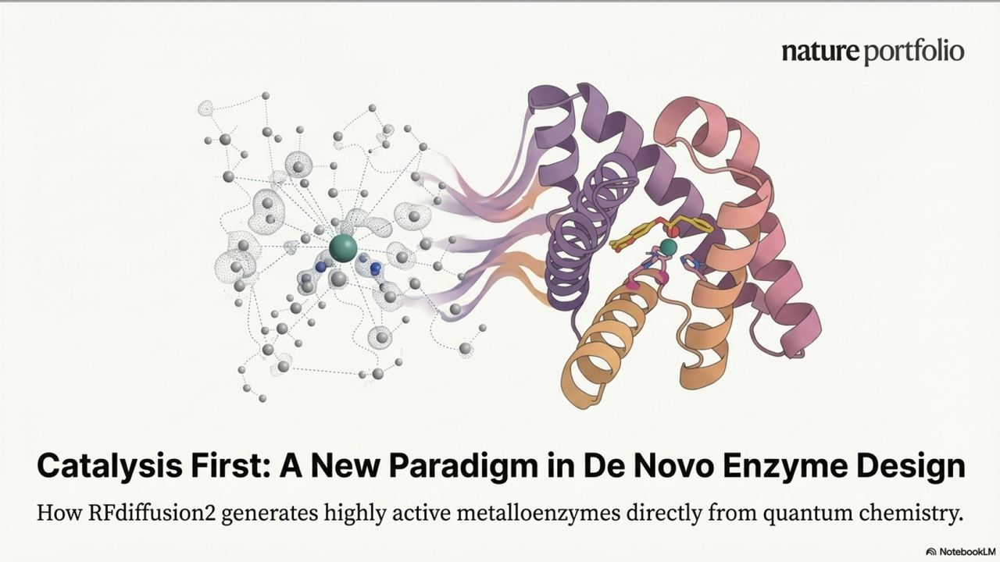

今天给大家介绍一下David Baker课题组这周刚发在Nature上的文章《Computational design of metallohydrolases》。这篇文章宣称：**“我们让 AI 直接围着 DFT 给出的催化几何长出一条酶。**

我想做的，是把这篇文章的逻辑讲清楚：

* 为什么旧方法设计不出这样的酶？

* RFdiffusion2 为什么能？

* ZETA 系列背后到底代表着什么？

下面，我们就顺着文章的图——从噪声到酶，从几何到功能——把故事完整讲一遍。

***

## **一、为什么要重新设计金属水解酶？——从一张反应示意图说起（对应 Fig.1a）**

这篇文章一开头就给出了一张非常“朴素”的化学反应图：

一个锌离子（Zn²⁺）抓住一分子水，把它变成进攻性极强的 Zn–OH⁻，对准底物 4-methylumbelliferyl phenylacetate（4MU-PA）上的酯键，一刀切下去，生成荧光产物 4-methylumbelliferone 和苯乙酸。

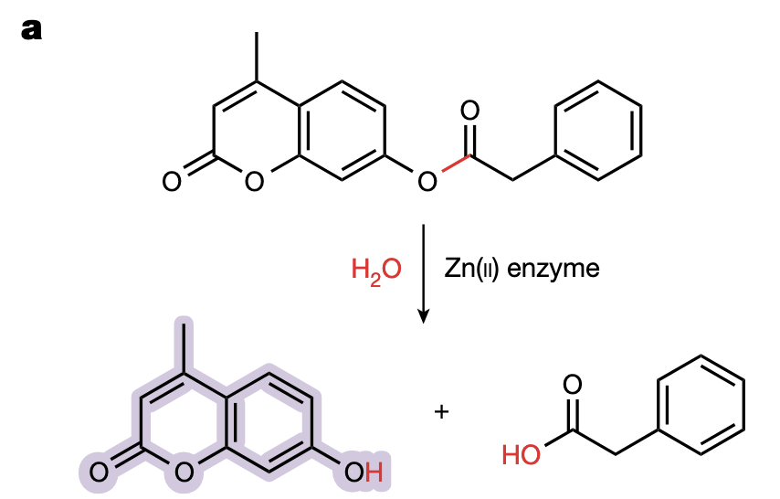

如果你盯着 Fig.1a 多看几秒，会发现作者其实在用这张图暗示三件事：

1. **金属水解酶是“高难度反应”的专家**

在生物体系里，要在温和条件下切断一个稳定的酯键、酰胺键甚至磷酸酯键，本身就是高难度任务。

* 单靠水分子自己去攻击，既不够“狠”，也找不准角度。

* 锌离子一旦登场，就能同时完成三件事：

  * 1）极化底物羰基，

  * 2）活化水分子，

  * 3）在过渡态阶段稳定阴离子中间体。

* 也正因为这种“多线操作”，天然锌酶（如碳酸酐酶、金属β-内酰胺酶）在催化效率上往往可以达到 10⁴–10⁶ M⁻¹ s⁻¹ 的量级。

* **现实需求远远超出现有天然酶的“业务范围”**

图中选用的 4MU-PA 只是一个实验室用的荧光底物，但作者在正文里很明确地把视角拉向更广的应用场景：

* 塑料、农药、工业合成中出现的各类“新型”酯类、酰胺类、磷酸酯类污染物；

* 演化历史上，它们出现得太晚、太“反常”，自然界根本没有足够时间为它们定制高效水解酶。&#x20;

* 换句话说，人类造出了大量“没人负责清理”的化学键，而金属水解酶是最有希望接这个活儿的那一类酶。

* **传统 de novo 金属酶设计离“理想状态”还差得很远**

文中顺带回顾了前人的工作：

* 之前的 de novo 金属水解酶，kcat/KM 通常只有几到几十 M⁻¹ s⁻¹；

* 想要逼近天然酶，几乎都要经过多轮定向进化才能勉强够得着。&#x20;

* 也就是说，过去的路线更像是：

> 先在计算机里凑出一个“能用”的原型 → 再交给实验室用进化慢慢打磨。

而这篇文章想做的，是把路线反过来：

> **能不能只从“反应需要的关键原子几何”出发，让 AI 一步到位长出一个真正高活性的金属水解酶？**

接下来，作者就从这个简单的反应图，一步步走向真正的计算设计框架：

先是用量化计算精确锁定过渡态（Fig.1b），再对比旧一代 RFdiffusion 的局限与 RFdiffusion2 的新思路（Fig.1c），最后用一条“从噪声到酶”的推理轨迹（Fig.1d）把故事铺开。我们下一部分就顺着这组三连图往下讲。

***

## **二、旧方法的瓶颈在哪里？——从 Fig.1b–1c 看清“为什么以前设计不出来”&#x20;**&#x20;

在 Fig.1a 讲清了金属酶催化的核心后，作者紧接着在 Fig.1b–1c 中埋下了文章的第二个主线：

**既然知道催化需要什么几何，那么为什么我们还是很难直接设计出高效金属水解酶？**

这一部分的三幅图（Fig.1b、Fig.1c、以及 Extended Data Fig.1 的思想）实际上构成一个非常鲜明的“旧方案 vs 新方案”的逻辑对比。

***

### **（1）Fig.1b：从量化计算到 theozyme —— 最小催化几何长什么样？**

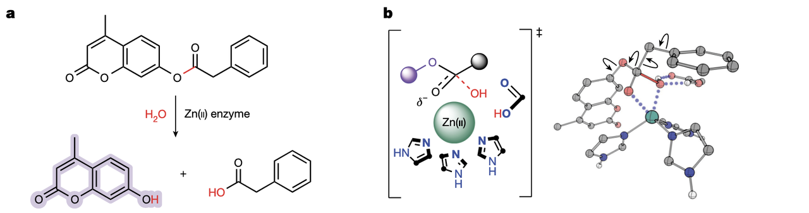

Fig.1b 展示的是作者基于**密度泛函理论（DFT）**&#x6C42;出的过渡态三维模型：

* 三个 His 的咪唑环构成 Zn²⁺ 的三齿配位；

* Zn–OH⁻ 指向 4MU-PA 的酯键羰基碳，形成典型的**四面体过渡态**；

* 还考虑了不同构型的“oxyanion hole”（补偿负电荷的环境）。

**为什么这一步重要？**

因为过去 de novo 酶设计的一大核心难点是：

> 你必须提前假设催化残基在哪里、怎么排布。

而 DFT 直接给出了“反应最应该长成的样子”，这相当于把催化问题**数学化、几何化**——这是后面所有 AI 设计的基础。

***

### **（2）Fig.1c：旧版本 RFdiffusion 的根本限制**

Fig.1c 是整篇文章“问题定义”的关键图。图中的两条路线构成鲜明对照。

***

#### **旧方法：RFdiffusion（图的上半部分）**

旧模型有两个必须“提前指定”的东西：

① 催化残基在蛋白质序列中的**具体位置（position）**

② 每个催化残基的**完整主链构象与侧链转动角（χ1/χ2 等）**

这两个需求的问题在图里表现为：

* 你要把三条 His 放到确切的三个位置（例如某序号的氨基酸）；

* 每条 His 还要指定其侧链旋转情况，以便恰好抓住 Zn²⁺ 并对准过渡态；

* 甚至还要让骨架延展到合理位置来托住这些 His。

这是什么概念？

> 就像在没有看到房子的情况下，先决定“客厅灯的螺丝孔在哪里、朝哪边倾斜”，然后再让 AI 去设计整个建筑——荒谬但旧方法只能这样做。

论文计算过：

即便用很粗糙的取样方式，**可能组合仍然达到 10¹⁸ 种级别**！

这就意味着：

* 绝大部分输入组合都是不合理的；

* 模型每次只能看见这一种输入，无法“跨组合推理”；

* 实际找到催化几何正确的设计 → 靠**运气**。

***

### **（3）新方法：RFdiffusion2（图的下半部分）**

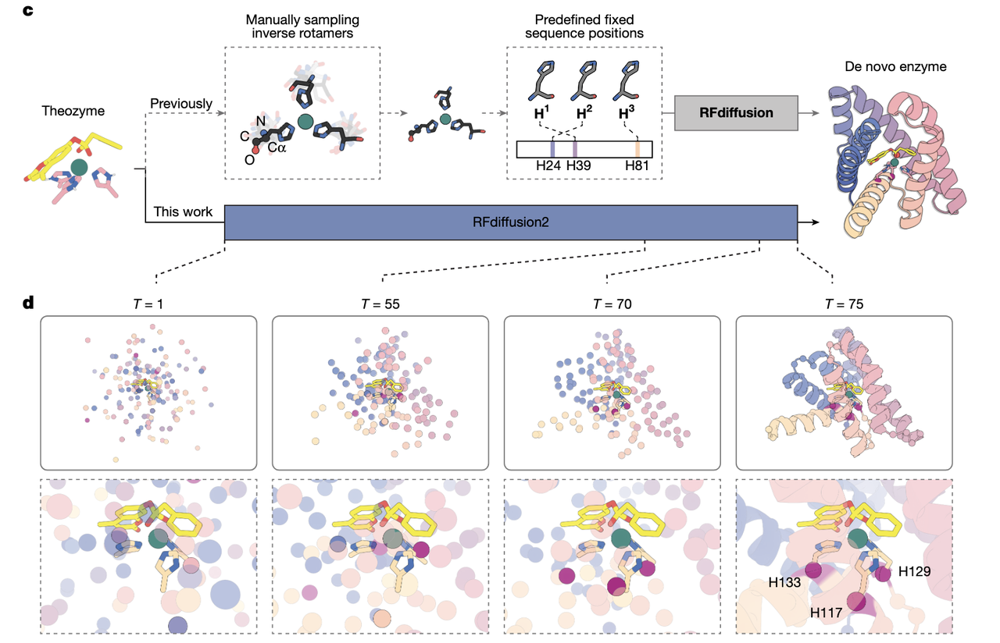

图中蓝色路线展示了完全不同的思路：

* 输入不再是完整的 His 残基（包含主链与侧链）。

* 只需要输入**关键原子的空间位置**：

  * Zn、三个 His 的 Nε 或 Nδ

  * 过渡态模型的关键原子（C、O 等）。

换句话说，你不再决定 His 在序列中是第 15 位还是第 87 位；

也不再决定 His 的 χ1 是 60° 还是 180°。

模型会在推理中自己决定：

* 哪个 Cα 应该移动到这些功能团附近；

* 哪段骨架可以延伸成正确的折叠支架；

* 哪些序列更能稳定该结构。

***

## **三、AI 是怎样从一团随机噪声里长出一条酶的？——读懂 Fig.1d 的诞生轨迹**

如果说 Fig.1b–1c 解决的是“为什么以前设计不出来”，那么 Fig.1d 则回答了一个更迷人的问题：

> **当 RFdiffusion2 真正开始设计时，它眼中的世界是什么样？**
>
>
>
> 更具体一点：
>
> **一个酶，是如何从一团完全没有意义的“噪声”中长成现在我们看到的折叠蛋白？**

这一幕非常像观看一个加速播放的宇宙诞生纪录片，只不过这里不是星云塌缩成星球，而是一条从未存在过的蛋白质，被“催化几何”牵引着一点点成形。

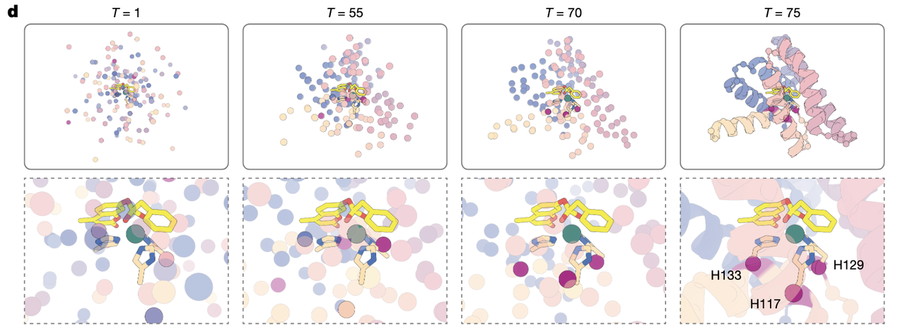

***

### **（1）起点：所有 Cα 都是“自由粒子”，它们不知道自己是谁**

Fig.1d 的最左侧，是一堆毫无结构的透明点云。这些点就是未来蛋白质的 Cα 原子，每一个都悬浮在空间中，没有连接关系，没有折叠逻辑——

它们一开始甚至不知道它们要成为“第 57 位亮氨酸”还是“第 13 位丝氨酸”。

只有一件事是确定的：

> **那团来自 DFT 的催化原子（His 的配位原子、Zn²⁺、过渡态结构）被牢牢固定在中心。**

这一团结构就像“世界的种子”，它不会动，它等待着周围的混乱逐渐自发变得有序。

***

### **（2）中段：结构开始“围着催化核心生长”**

随着时间步推进，噪声不再是噪声——

点云开始收缩、聚类、拉出片段，逐渐形成具有方向性的骨架雏形。

这时你会注意到一个非常有趣的现象：

* 固定在中央的那三个 His 的**侧链功能团先出现**；

* 但它们对应的 Cα（也就是整条氨基酸所在的位置）**暂时并未就位**。

这是整个过程最“魔幻”的时刻：

> **模型知道这些功能团必须在正确位置，但它还不知道身体应该如何靠过去。**

于是你会在中间帧看到一个极不自然但极富启示性的场景：

* 三个 His 的侧链像“钉子”一样钉在空间里；

* 但支撑这些钉子的“木板”（蛋白主链）还在远处游荡。

人类设计者绝不可能想象这种过渡态，但 AI 却天然地以这样的方式工作。

***

### **（3）收敛：骨架主动“贴上去”，完成连接**

当推理进行到后段时，一个神奇的画面出现了：

那些原本在空间另一侧游荡的 Cα 逐渐**向催化基团靠拢**，

像是被某种力牵引着——那种力来自模型内部对“可折叠蛋白质”的统计认知。

而当某个 Cα 移动到恰到好处的位置时：

* 它的侧链方向被调整；

* 结构自动判断：“哦，你应该是承担配位任务的 Histidine。”

* 于是它与先前固定的 His 功能团**自动连接起来**。

这种“先有功能团，再长出残基位置”的方式，与我们人类常用的从序列出发建模的思路截然不同：

> **在人类的世界，是氨基酸决定功能。**
>
> **在 AI 的世界，是功能决定氨基酸。**

这也是 Fig.1d 最值得深玩的一层含义。

***

### **（4）终态：蛋白质围绕催化几何“长成一个整体”**

在 Fig.1d 最右侧，你看到的已经是一条颇具自然折叠特征的蛋白结构。

能观察到两个关键点：

1. **催化核心仍然纹丝不动地保持着 DFT 的精确几何**；

2. 整个蛋白像是从外向内塌缩，最终形成包裹催化中心的稳定折叠。

其中最值得注意的一点是：

> **催化 His 的序列位置不是预先写死的，而是在推理过程中“被模型选出来的”。**

这意味着 RFdiffusion2 不仅在生成结构，而且在生成“结构与功能的匹配”。

***

### **（5）为什么 Fig.1d 的过程如此重要？**

因为这段轨迹展示的，是过去二十年酶设计中最难实现的一件事：

**让功能先于结构，让结构为功能让路。**

传统方法必须先设定结构位置，再塞催化残基进去；

RFdiffusion2 则让催化需求成为整个结构生成的源头——

就像在蛋白宇宙的中心点燃了一颗星核，其周围物质开始按照物理规律与几何约束自然聚集，最终形成一颗前所未有的“催化星体”。

***

## **四、第一轮设计：当计算机把一百条候选交到实验室，故事才刚刚开始（Fig.2）**

如果说 Fig.1 是“酶如何在 AI 的脑海里生长出来”，那么 Fig.2 展示的，就是这些在数据空间中出生的结构，第一次接受现实世界的考验。

你可以把 Fig.2 想象成一段选择性的叙事蒙太奇：

从电脑里涌出的海量结构，经过层层筛选，最终只剩下少数，等待那盏紫外灯亮起——发光就表示“它是真的动起来了”。

***

### **（1）从 5120 条虚拟骨架，到实验室里的 96 条真实蛋白**

RFdiffusion2 的设计是一种大规模生成：

* 5120 条不同的骨架，

* 每条再经过 ProteinMPNN 生成序列，

* 再经过 AlphaFold2 预测是否能折回到设计结构，

* 再用 LigandMPNN 和 Rosetta 对活性位点微调。

这一连串步骤像是给每个候选做了一遍“虚拟模拟训练”：

> 他们先要在计算世界里证明自己可能折叠、可能稳定、可能抓住 Zn、可能进行催化，才能拿到进入现实世界的“签证”。

最终，96 个设计获得签证，进入湿实验环节。

你能从 Fig.2a 看到它们的“身份证照”——

不同长度、不同折叠方式、不同构型，就像是 96 个完全不同风格的陌生人站成一排，每一个都声称：“我可以做金属水解酶。”

***

### **（2）实验的第一道门槛：能不能表达？能不能溶？**

蛋白质天生挑剔，有些序列折不起来，有些折错了，有些干脆变成包涵体。

Fig.2 没有直接展示这一部分，但正文里给了一个关键数字：

**86/96 可以溶性表达。**

这是一个令人惊讶的高数字。

在传统 de novo 设计中，溶性表达往往是第一个大坎，能过一半就算运气不错。

而这里 96 个当中有 86 个都“能在细菌里做成蛋白”，说明 RFdiffusion2 生成的结构不仅合理，而且非常容易折叠——这也是一个侧写：**AI 在结构生成上的能力已经成熟得远超以往模型。**

***

### **（3）第二道门槛：能不能动？能不能催化？（Fig.2b）**

接下来是 Fig.2b——96 个蛋白各自被加入同一底物 4MU-PA 中，实验人员盯着荧光曲线，等待某个曲线能够真正“亮起来”。

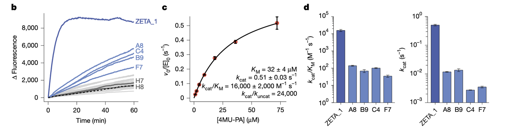

大部分曲线都平得像一条线，但有五条突然崛起：

**A1、A8、B9、C4、F7。**

图中上升的那一小段斜率，就是计算结构第一次在现实世界里表现出“我是活的”的信号。

这是本文第一次真正意义上的成功时刻：

**AI 随机生成的结构中，有 5 条真的会催化反应。**

在过去十几年的酶设计中，哪怕你花好几个月人手优化、反复计算、连做几十个变体，也不一定能得到 5 条真正有活性的。

而这次，系统性地第一次尝试，就得到了 5 条。

***

### **（4）ZETA\_1 的出现：图 2c–2d 讲述的是“一个完全陌生的序列，却拥有天然酶级别的速度”**

五条 hits 中最耀眼的是 A1，也就是后来命名为 **ZETA\_1** 的设计。

Fig.2c–2d 展示了它的动力学曲线：

* kcat/KM ≈ 16,000 M⁻¹ s⁻¹

* kcat ≈ 0.5 s⁻¹

* KM ≈ 32 μM

如果你把这些数字放在背景里看，会更震撼：

> **这是一个完全不存在于自然界的蛋白，序列是 AI 编出来的，结构从噪声中长出来的，却拥有天然锌酶 1–10% 的效率。**

在传统 de novo 设计中，第一代原型酶通常是“慢如乌龟”的。能动已经是奇迹，让它动得快更是奢望。往往需要经过十轮八轮的定向进化才能提升一个数量级。

而 ZETA\_1 一出生就是高活性的。

这不是偶然，而是 RFdiffusion2 的设计逻辑第一次在实验室被证实为有效。

***

### **（5）为什么 ZETA\_1 强？Fig.2e–2h 给出第一条答案：它的活性位点几乎“不摇晃”**

PLACER 的结果（Fig.2e–2h）非常关键——

它告诉我们：

* ZETA\_1 的底物在活性位点的位置几乎不动；

* 催化残基的位置也非常固定；

* 相比之下，失活设计 H7、H8 的底物在口袋里乱跑，残基也不定位。

这意味着：

> **真正的高活性来自“预组织化”——**
>
> **活性位点的原子已经提前站到正确的位置上，不需要靠诱导契合或大幅构象变化。**

ZETA\_1 之所以快，是因为它没有“犹豫时间”，底物一来就正位，水分子一来就攻击。

PLACER 的这一段图，是 AI 设计方法学中最重要的证据之一：

它证明了 RFdiffusion2 不是在“随机生成幸运结构”，而是在生成真正具有催化几何的蛋白质。

***

Fig.2 对整篇文章来说，是一个断点式的时刻：

* 理论几何（Fig.1）已经被实现；

* 噪声生成的结构（Fig.1d）在现实中折叠良好；

* 其中一个结构直接达到天然酶量级的活性（ZETA\_1）；

* 活性来源可以由独立方法（PLACER）解释；

* 并且这些结构与自然界完全不同（Fig.2a）。

换句话说：

> **酶设计史上第一次，计算机从零开始设计出“能用、好用、还稳定”的金属水解酶，而且是不经优化直接能用的。**

这一成就为第二轮设计铺平了道路，也为 Fig.3–5 的深入解析奠定基础。

***

## **五、ZETA\_1 的解剖：一条从噪声中诞生的酶，为什么一上来就这么强？（Fig.3）**

第一轮实验中，五条 hits 像五个“新人演员”站在镁光灯下，而 ZETA\_1（A1）就是那个一下子抓住所有人视线的人。

Fig.3 就像对这位“主角”进行的全方位镜头扫描：

它的脸、它的骨骼、它的动作逻辑、它的武器、它的弱点、它对金属离子的依赖，它在高温下的表现，它的结构是不是如 AI 所想——这些问题都在这里一一得到回答。

下面我们就按图的视觉顺序，把 ZETA\_1 的故事讲清楚。

***

### **（1）Fig.3a：ZETA\_1 的“脸”——一个为催化而生的口袋**

Fig.3a 左侧是全结构，中间是活性位点，右侧是口袋的表面形状。

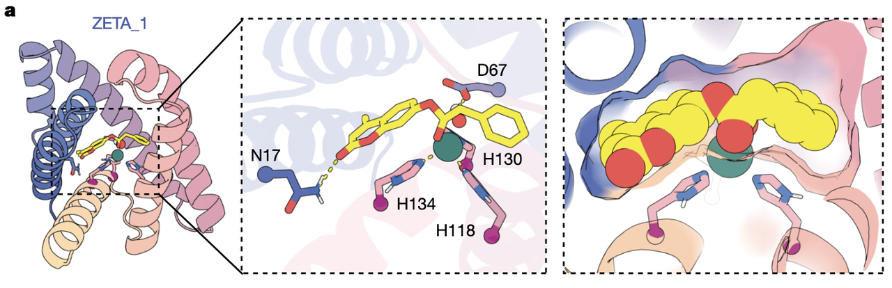

这张图传达了一个非常关键的信息：

> **ZETA\_1 并不是“刚好能催化”，而是显然专门“为催化而折”。**

你会注意到三个 His 围着 Zn²⁺ 排列得非常干净，

Asp 位置恰好能充当潜在 general base，Asn 则用一个温柔但关键的氢键抓住底物环系，整个 pocket 干燥、紧凑、疏水、形状互补。

如果你把 Fig.3a 和 Fig.1b 的 theozyme 对比，会发现：

* 过渡态需要的几何关系，ZETA\_1 完整保留了；

* 甚至连底物进入口袋的角度，都与 DFT 模型高度一致。

这说明 RFdiffusion2 不是凭运气，而是真正学会&#x4E86;**“围绕催化原子长出合适几何”**。

***

### **（2）Fig.3b–d：结构稳不稳？能不能折起来？**

这几张图其实回答一个看似简单但极其关键的问题：

> **ZETA\_1 是一条真正能在现实世界折叠的蛋白吗？**

#### **● Fig.3b：SEC（凝胶过滤）**

一个漂亮的、清清楚楚的单峰。这意味着 ZETA\_1 是**单体、均一、没有聚集**。

很多 de novo 设计最容易死在这里——设计得好看却不折叠。ZETA\_1 显然没有这个问题。

#### **● Fig.3c–d：CD（圆二色）**

如果你把这两张图连在脑中回放，你会看到：

* ZETA\_1 随温度上升从 25°C 加热到 95°C；

* 光谱逐渐改变，但主结构元素仍然存在；

* 冷却后又基本回到原始状态。

这意味着 ZETA\_1 **不仅折叠良好，还具备一定可逆的热稳定性**。

换句话说，它不只是“能折叠”，而是“折得非常稳”。

***

### **（3）Fig.3e：一个关键数字——1000 次以上的 turnover**

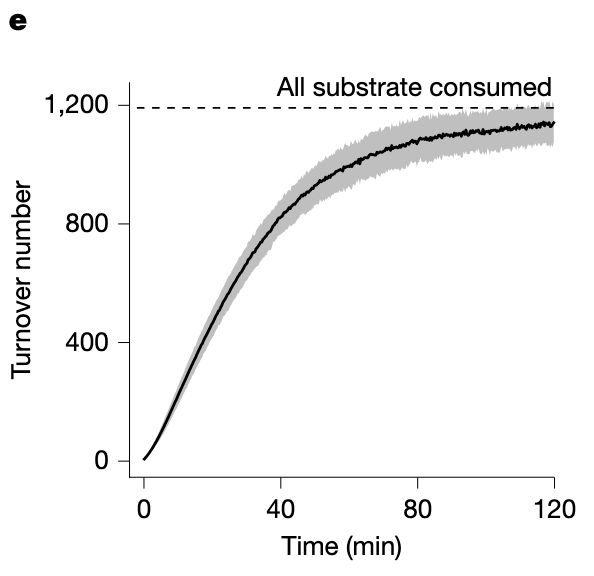

如果 ZETA\_1 只是速度快，那叫“瞬时能力强”；

但 Fig.3e 告诉我们：

> **它可以连续催化超过 1000 次，不明显衰减。**

这意味着三件大事：

1. 活性位点没有塌陷；

2. 结构不会被底物或产物破坏；

3. 金属不会轻易流失。

对一个第一次见光的 de novo 酶来说，这种稳定度接近惊人。

***

### **（4）Fig.3f–g：ZETA\_1 的生命线——Zn(II)**

#### **● Fig.3f：拿掉 Zn，它立刻死；加回 Zn，它立刻活。**

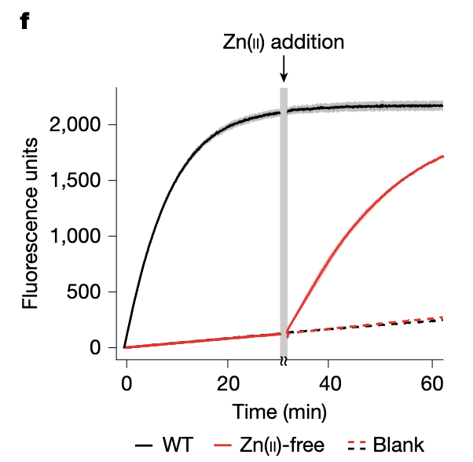

没有比这更优雅的实验了——

它直接告诉你：

> **ZETA\_1 的催化机理确实是 Zn²⁺-OH 的亲核攻击，而不是一些“假阳性反应”。**

#### **● Fig.3g：Zn 结合常数（KD）**

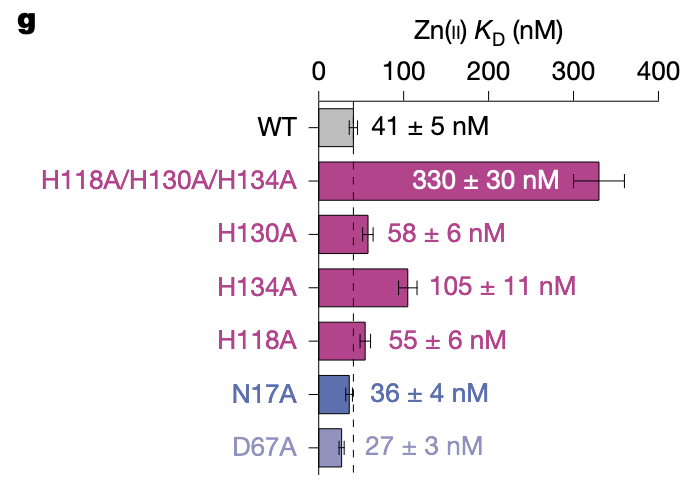

野生型 KD ≈ 41 nM——不是天然金属酶那种超强结合（<10 nM），但已经非常不错。

这里的数字透露了一条信息：

> ZETA\_1 是真正意义上的“新生金属口袋”，还不具备天然酶那种极端优化过的金属亲和力。

这反而增加了它的魅力——它还可以更强。

***

### **（5）Fig.3h–i：逐个拔掉催化残基，看它会发生什么**

突变实验是检验设计逻辑是否自洽的终极方式。

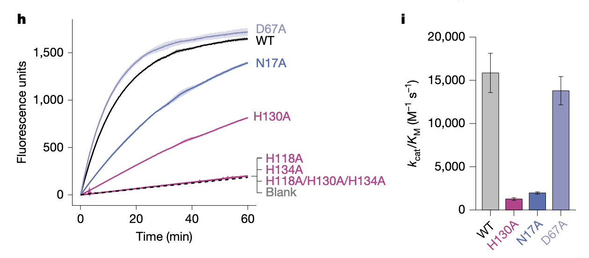

#### **● 三个 His → Ala：**

完全失活。说明模型对配位几何的安排是对的。

#### **● D67A：**

没有降低活性，甚至让 Zn²⁺ 结合更好。

这是一个非常有趣的结果——

暗示 D67 可能并不是主要 general base，

甚至可能与 H130 争抢金属。

这条线索在后面的 ZETA\_2、ZETA\_3 设计中发挥了巨大作用。

#### **● N17A：**

活性降低约八倍，说明它的氢键确实稳定了底物。

这一系列突变实验给出了一个非常有力的结论：

> **ZETA\_1 的活性不是“偶然”，而是由设计出的几何严格决定的。**
>
> **它是一条“有理由”的酶。**

***

Figure 3给出了一个完整的叙事闭环：

* 模型设计的 pocket 是真实可折叠的；

* 真实 pocket 的原子位置几乎与设计模型一致；

* 活性来自金属和几何，而不是“偶然变构”；

* 突变实验揭示了真实的反应机制；

* ZETA\_1 不是自然界的仿制品，而是一条真正“人工创造的催化实体”。

你会发现这篇论文用一种非常克制的方式传达着一件震撼的事实：

> **我们第一次看到了一条从理论几何 → AI 生成 → 实验折叠 → 精准催化全链路都自洽的 de novo 金属水解酶。**

而 Fig.3，是这条链路的“现实验证”。

***

## **六、第二轮设计：更准确的催化假设，更高的成功率（Fig.4）**

第一轮设计中，ZETA\_1 给了一个非常重要的反馈：

D67 的角色可能并不像最初假设的那样明确，它甚至可能与 H130 争夺 Zn²⁺。这个现象提示了一个关键点——**如果希望提升催化效率，应该更明确地在设计中加入“真正的 general base”。**

第二轮设计就从这里出发。

***

### **（1）更清晰的 theozymes：把 general base 显式纳入 DFT 模型（Fig.4a）**

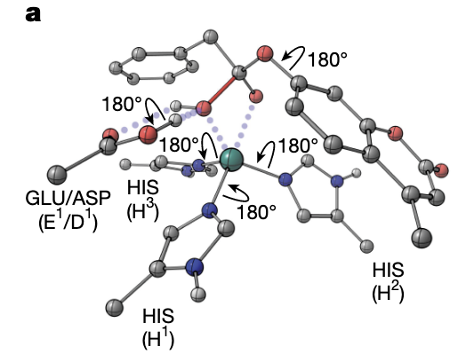

Fig.4a 显示新的 DFT 过渡态模型，这一轮最重要的升级是：

* 催化碱（Glu/Asp）不再是“推测出来的”，而是被直接固定在理论几何中；

* Zn²⁺ 配位几何更明确；

* 三个 His 的 Cβ 位置也被建模，使得生成结构时对侧链方向的要求更合理。

这一改变让输入 motif 更接近天然金属酶的布置方式，也让 RFdiffusion2 能够围绕一个“更精确的催化核心”生成结构。

***

### **（2）结果的变化非常明显：成功率显著提升（Fig.4b）**

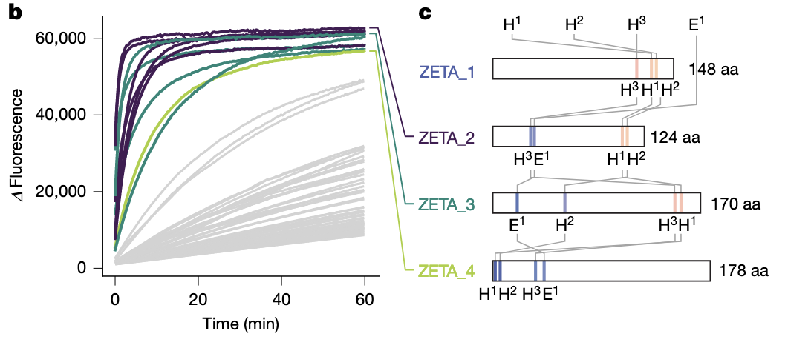

Fig.4b 展示的是第二轮 96 个设计的反应曲线。

第一轮你会看到只有五条曲线上升得明显，而本轮：

* 有 **11 条设计表现出清晰的酶活性**；

* 这些活性来自 3 种完全不同的折叠类型（scaffold families）。

这说明 RFdiffusion2 在第二次输入更清晰的催化需求后，

**能在结构空间中找到更多“可用、有效、稳定”的路径。**

简单说：

> 输入 motif 越准确，模型越容易找到可行解。

***

### **（3）ZETA\_2、ZETA\_3、ZETA\_4：三种不同折叠，三种催化方案（Fig.4c）**

Fig.4c 这张图非常值得注意。

它展示三个最高活性设计的序列长度与催化残基在骨架中的位置。

你会发现：

* ZETA\_2：124 aa，三 His 和 general base 的排列非常紧凑

* ZETA\_3：170 aa，折叠较大，催化残基明显分散

* ZETA\_4：178 aa，结构更复杂，口袋形状也不同

三个酶的骨架完全不同，但它们都能稳定地再现相同的催化几何。

这再次支持前文的核心观点：

> **RFdiffusion2 不再依赖“模板折叠”，而是围绕催化几何自由创造结构。**

***

### **（4）动力学数据（Fig.4d–e）：性能全面超过第一轮**

Fig.4d–e 给出了所有 hits 的总体表现。

其中最引人注意的是：

#### **●** **ZETA\_2：kcat/KM = 53,000 ± 5,000 M⁻¹ s⁻¹**

* 比 ZETA\_1（16,000）再提升 3 倍

* kcat 达到 **1.5 s⁻¹**，几乎是天然金属水解酶的水平

#### **●** **ZETA\_3：19,000 M⁻¹ s⁻¹**

接近第一轮的 ZETA\_1，但底物结合模式完全不同。

#### **●** **ZETA\_4：1,300 M⁻¹ s⁻¹**

虽然活性比前两者低，但仍是传统 de novo 金属酶的高水平。

更重要的是第二轮的整体活性分布——

绝大多数 hits 活性都在 **10³–10⁴** 量级，这说明：

> **设计流程已经可以稳定地产生高活性金属酶，而不是依赖偶然性。**

***

### **（5）Fig.4f–h：三个代表设计的活性口袋长什么样？**

这三张局部结构图展示了三种典型的催化策略：

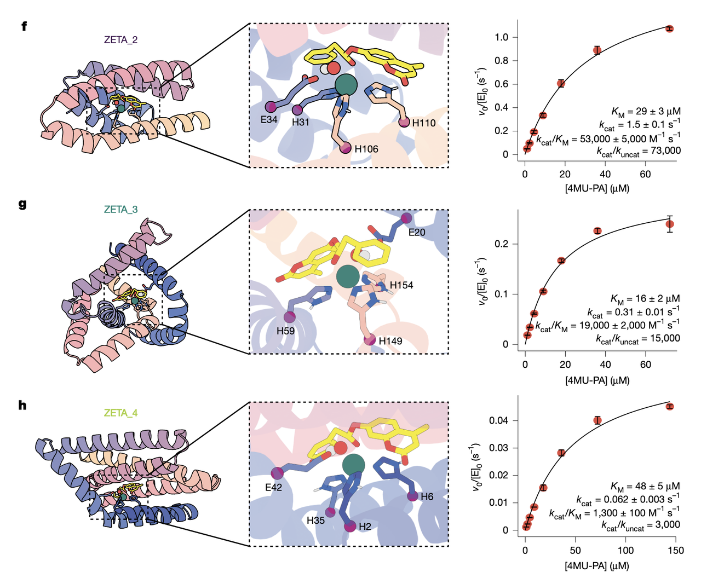

#### **● ZETA\_2**

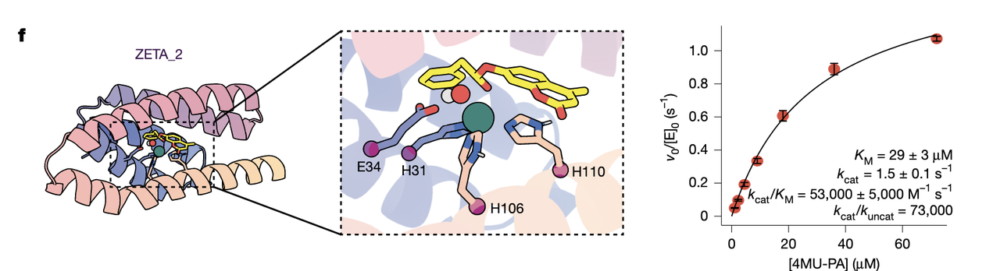

* general base（Glu）位置极佳

* Zn²⁺ 配位三 His 形成一个非常干净的三角几何

* 底物的 coumarin 环系展露在溶剂侧

ZETA\_2 的结构给人的感觉是“精准且紧凑”。

#### **● ZETA\_3**

* 与 ZETA\_2 方向相反：PA 部分暴露在外

* His 排布更松散，但 pocket 更深

* 可能通过更强的疏水约束定位底物

这也需要结合 Extended Data Fig.7（下一节会讲），才能更好理解它与 ZETA\_2 的差异。

#### **● ZETA\_4**

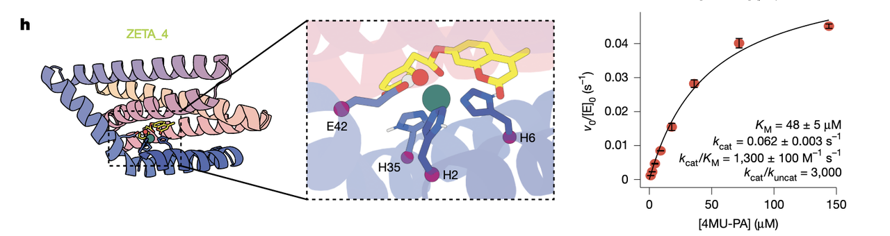

* 结构最复杂，口袋较大

* 几何上略显宽松，但仍能稳定过渡态

ZETA\_4 像是“更通用的口袋”，虽然效率不如前两者，但结构空间展示了更大的灵活度。

***

### **（6）第二轮的核心意义**

这一部分不需要太多渲染，结论本身已经很清晰：

* 更准确的催化 motif → 模型能找到更多可行结构

* RFdiffusion2 的结构生成不是孤立事件，而是可迭代、可收敛的

* 设计出的酶活性已经进入天然金属酶的区间（10⁴–10⁵ M⁻¹ s⁻¹）

* 而结构仍然完全是 de novo 的，不模仿自然界

这说明：

> **我们正在见证一种“计算驱动的催化性能提升曲线”，类似自然界的进化，但速度是迭代模型的速度。**

***

## **七、晶体结构验证：ZETA\_2 真的按 AI 的想象折叠了吗？（Fig.5）**

在酶设计文章里，动力学数据能告诉你“它动了”，突变实验能告诉你“它按设计那样动”，但只有晶体结构能回答最核心的那个问题：

> **AI 所构建的结构，在现实世界是否真的以相同的原子排列方式存在？**

Fig.5 就是在回答这个问题。而它给出的答案清晰得几乎令人意外。

***

### **（1）Fig.5a：整体折叠几乎一模一样**

图上是设计模型（彩色）与晶体结构（灰色）的 Cα 对齐。RMSD = **1.1 Å**。

这是一个极低的数字。

在结构生物学里，只要两个结构 RMSD < 2 Å，就可以认为“折叠一致”。

而 1.1 Å 代表的是：

> **不仅整体折叠一致，连局部构象都高度吻合。**

换句话说，RFdiffusion2 并不是生成一个“能折叠大概成那样”的蛋白，而是生成一个“现实中确实会折成那个样子”的蛋白。

在 de novo 场景中，这是非常罕见的。

***

### **（2）Fig.5b：活性位点的原子排布也在正确的位置**

在 Fig.5b 的局部放大中：

* 三个 His 配位 Zn²⁺ 的方向一致；

* General base（Glu）的位置恰在应在的位置；

* 周围 pocket 的形状几乎照搬了设计模型。

这说明 AI 的设计不仅是“折叠正确”，而是**催化几何也正确**。

要知道，催化位点通常是设计中最容易偏移、最容易塌陷的部分，而这里却精确到能与 DFT 过渡态完美对接。

这是一个强烈的信号：

> **RFdiffusion2 不只是设计结构，而是在设计“功能性结构”。**

***

### **（3）Fig.5c：口袋形状与过渡态模型完全互补**

这一帧非常值得强调。

它展示了设计时使用的过渡态模型（transition state analogue）叠加在晶体结构 pocket 里。

你会看到：

* 底物的定位空间几乎与设计模型重合；

* 口袋壁的形状对称、紧密，并无塌陷或意外的张力；

* 活性位点留出的空间恰到好处，不多也不少。

这张图的美学意义不亚于科学意义：

> 它展示了一种“从功能出发的形状”，
>
> AI 给了它最合理的结构支撑，
>
> 而自然界认可了这个形状。

这是第一次，一个完全不存在于自然界的金属水解酶，在现实世界以**原子级别**重现了它在计算空间的预测结构。

***

### **（4）晶体结构背后的两层重要结论**

从 Fig.5 提炼出的两层深意：

#### **第一层：AI 已能够生成“可折叠、可结晶”的 de novo 酶骨架**

天然蛋白质之所以能结晶，是因为它们的结构稳定、重复性好、构象分布窄。

ZETA\_2 能被结晶，说明：

* 折叠能量面简单；

* 活性位点稳定；

* 整体结构没有显著的柔性导致 X 射线衍射模糊。

它是一条“成熟的蛋白”，而不是一条“勉强折起来”的设计品。

***

#### **第二层：金属配位几何的准确性验证了整个 RFdiffusion2 设计逻辑**

金属酶的配位几何极为挑剔——稍偏几度几 Å 都可能让催化失效。

晶体结构的吻合度说明：

> **RFdiffusion2 内部确实在围绕催化几何展开结构生长，而不是硬塞残基。**

这与第一轮的 PLACER 分析（Fig.2e–h）以及突变数据（Fig.3h–i）形成了一个完整的闭环。

***

### **（5）为什么 Fig.5 可以看作全篇的“验证之锤”？**

因为只要这一张图成立，整篇文章的所有设计链路就成立：

* DFT 的催化要求有意义

* RFdiffusion2 能根据催化几何生成可折叠结构

* ProteinMPNN 的序列赋形有效

* AlphaFold2 预测可信

* PLACER 评估活性位点预组织是有用的

* 实验得到真实的高活性酶

* 晶体结构确认了所有计算的逻辑链条

从一个研究者的视角，Fig.5 对这篇文章的价值几乎等于一句话：

> **这是一个真正从理论 → AI → 实验 → 结构验证 全链路跑通的金属酶设计案例。**

它标志着金属酶设计从“可能做到”走向“确实可行”。

***

## **八、从 ZETA 系列到未来：金属酶设计的逻辑链终于闭合了**

当我们读完 ZETA\_1 的催化数据、ZETA\_2 的晶体结构，以及第二轮设计的全面“提速”，就会发现一个事实已经悄悄发生：

> **金属酶设计，这个被认为最难的酶设计方向之一，第一次出现了“从计算机直接拿到高活性酶”的案例。**

过去要做一条新金属酶，需要经历的步骤非常长：

先要手工定义活性位点 → 选折叠模板 → 插入残基 → 修 geometry → 调整 pocket → 表达失败 → 重来 → 勉强得到活性 → 定向进化若干轮……

这一切在 ZETA 系列中被彻底颠覆。

***

### **（1）RFdiffusion2 的本质突破：让“功能”成为蛋白质折叠的起点**

文章结尾强调了一个核心思想：

> **RFdiffusion2 不再需要你告诉它“哪个残基是 His、要放到序列第几位”，**
>
> **它只需要知道“催化必须的原子怎么放”。**

蛋白质的骨架、折叠方式、序列——这些在传统设计中是“输入”，

在 RFdiffusion2 里全部变成&#x4E86;**“自由变量”**。

**而唯一固定的，是那团被 DFT 算出来的催化几何**。

这是一种从根本概念上重新思考蛋白质设计的方式：

不再是“我想造一条蛋白质，让它顺便催化反应”，而&#x662F;**“我要达成这个催化几何，蛋白质应该如何生长？”**

当催化要求变成结构生成的“种子”，设计逻辑就反过来了。

而这种反转，是 ZETA 系列能一上来就高活性的真正原因。

***

### **（2）PLACER 和 Chai-1 的加入：让“选择正确”成为可能**

过去我们经常会问：

> 设计出来的几十条候选，哪些值得投入实验资源？

文章在第一轮和第二轮 hits 的对比中给了一个惊人的线索——

**PLACER 对“活性位点预组织化”的预测，几乎直接对应实验结果。**

也就是说：

* 活性高的 pocket，在 PLACER 中几乎“不动”；

* 活性弱的 pocket，底物在模拟中“到处乱跑”。

这让我们第一次拥有一种近似“能看懂催化几何是否稳定”的 ranking 方法。

Chai-1 也补了一刀：

它可以在 pocket 内预测 Zn²⁺ 和底物的结合方式，从中判断 Zn-binding 是否有异常构象（例如 ZETA\_1 中 H130 vs D67 的竞争）。

这些工具组合在一起，意味着：

> **我们不只是在设计结构，而是在设计能通过“分子力学筛查”的功能性结构。**

这是金属酶设计稳定化的关键节点。

***

### **（3）第二轮设计的意义：证明“改 motif → 效果立刻改善”的迭代能力**

在第一轮中，作者注意到 general base 的角色不够明确，于是他们修改了 DFT 输入，重新训练/推理，得到：

* 活性提升至 53,000 M⁻¹ s⁻¹（ZETA\_2）；

* 更多 hits；

* 不同的折叠都能实现同一个催化几何；

* 甚至能通过 ORI token 控制底物的取向。

这说明一个非常重要的事情：

> **金属酶设计进入了可控迭代期。**
>
> **你只要让 DFT 或 QM 给出更精准的几何，RFdiffusion2 就能找到更好的结构响应。**

这几乎把传统的“需要几个月才能进行一次的蛋白工程迭代”转换成“几小时就能完成一次 motif 调整和结构生成”。

金属酶的设计速度因此进入“量级提升”。

***

### **（4）晶体结构的终极意义：证明这是“工程”，不是“幸运”**

ZETA\_2 的晶体结构是全文的定点时刻。它在 1.1 Å 水平上重现了 AI 的预测——这意味着：

* 模型在处理金属配位几何时是可信的；

* 设计出的 backbone 真的是最低能量构型之一；

* 活性位点的约束足够强，使 pocket 能以近乎同一构象呈现。

这里的验证不是局部的，而是“整体结构 + 活性几何”双重一致。

因此这不是幸运事件，而是一个成体系的成功。

***

### **（5）文章最后的“预言”：金属酶的可编程时代正在来临**

作者在结尾写得非常克制，但含义深远：

* RFdiffusion2 + PLACER 的组合不仅能设计 Zn 酶；

* 它也适用于更多类型的金属催化和复杂反应；

* 甚至适用于非金属催化，例如 serine hydrolase（他们在引用里提到了自己的另一篇工作）。

真正的意思是：

> **我们正在进入“用几何定义反应，用 AI 生长结构”的时代。**
>
> **酶的反应类型，将不再受限于自然选择给我们的模板。**

这句话在金属酶领域尤其重要——

金属酶往往催化最难的反应，也是环境处理、材料降解、化学合成中最需要的酶类。

现在它们终于变得可被“设计”。

***

### **（6）总结整篇文章最核心的三条 take-home message**

如果只带走三件事，我会这样写：

### **① 催化几何是核心，蛋白质只是满足几何的结构载体。**

RFdiffusion2 把酶设计从“造蛋白”变成“造催化场景”。

### **② 预组织化决定活性。**

PLACER 的分析重复强调：稳定的 pocket 才是高活性的根本。

### **③ 金属酶设计的迭代速度，将从多年缩短到数天。**

DFT motif 越好，设计结果越好；

模型不依赖模板折叠；

成功率随着 motif 优化呈线性提升。

这是一个新的酶设计范式。

### 结语：当催化几何变成种子，蛋白质设计的边界被重新划定

当催化几何变成种子，蛋白质设计的边界被重新划定

读完整篇文章，最强烈的感受不是“AI 又做到了什么”，而是金属酶设计这个长期被认为几乎无法系统解决的问题，正在第一次呈现出一种**可被工程化、可被迭代、可被预测**的形态。

这一点在 Fig.5 的晶体结构中达到巅峰——当 ZETA\_2 的原子在现实里以 1.1 Å 的精度对齐计算模型，你会意识到：

**AI 不是在“猜一个结构”，它是在“构建一个满足催化要求的解”。**

这意味着一个新的逻辑链已经真正闭合：

1. 催化几何由量化计算给出；

2. RFdiffusion2 围着几何生长出可折叠的骨架；

3. MPNN 赋予序列；

4. AlphaFold 与 PLACER 评估可行性；

5. 实验确认折叠与活性；

6. 晶体结构给予最终验证。

过去十几年，酶设计的主旋律是“找一个折叠 → 塞进催化残基”。

而这篇 Nature 展示的是完全相反的方向：

**先点亮反应的核心原子，结构则围着功能长成。**

这不是一次方法学的升级，

而是一次设计哲学的迁移。

从“造蛋白”到“造催化场景”，

从“模板导向”到“几何导向”，

从“希望它折出来”到“它本来就会折出来”。

如果说 ZETA 系列证明了什么，那就是——

金属酶设计不再是“非自然界不可”，

它开始成为一件**人类能够系统、快速、主动完成的工程**。

而这，可能正是未来十年蛋白设计领域最值得期待的转折点。

