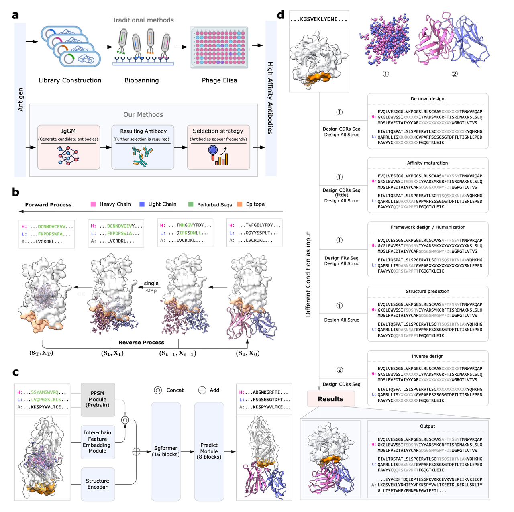
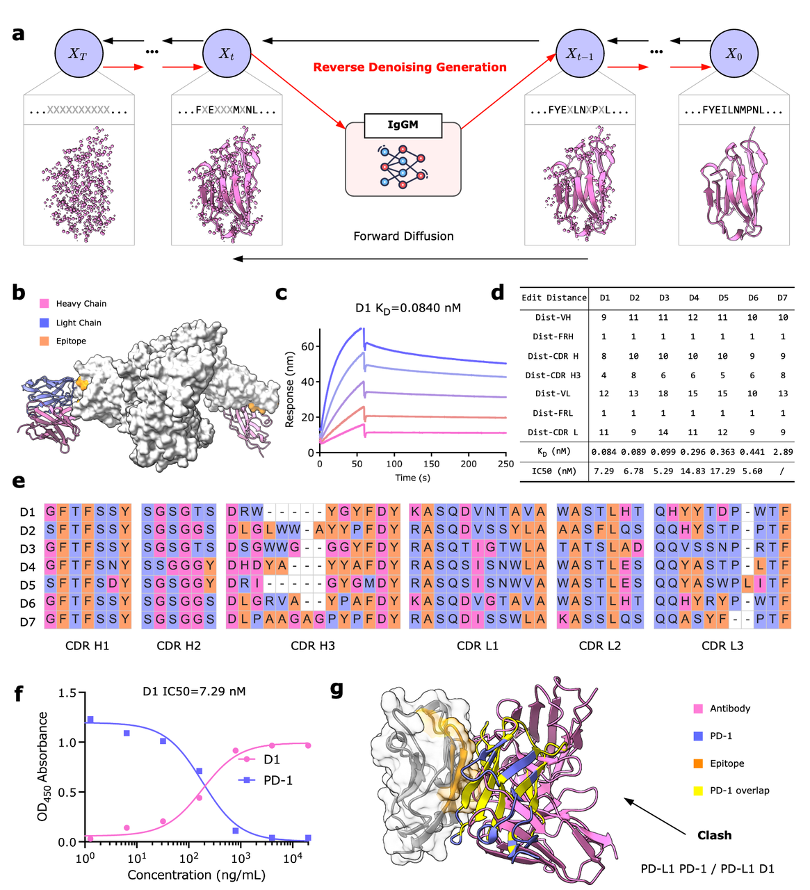

在生物医药研发的版图里，**抗体（antibody）**&#x5360;据着极为核心的地位。抗体是由 B 细胞分泌的 Y 形蛋白质，负责识别和中和外来病原体。它们之所以强大，是因为抗体的 **可变区（VH、VL）** 中有三段高度多样化的结构域，称为 **互补决定区（CDRs）**。这三段区域像“钩子”一样决定了抗体能结合什么样的抗原。与此同时，抗体的 **框架区（FRs）** 则提供了稳定的支撑结构。也就是说，**CDR 决定“能不能抓住目标”，FR 决定“抓得稳不稳”**。

正因如此，抗体不仅是免疫系统的天然武器，也已经成为药物研发的主力。无论是癌症免疫检查点抑制剂（如 PD-1/PD-L1 抗体），还是传染病防治（如新冠中和抗体），都依赖于高亲和力、高特异性的抗体分子。

然而，**从零到一设计一株抗体并不容易**。传统的抗体开发流程通常包括：

1. **免疫或噬菌体展示筛选**：在动物或体外文库中找到初始抗体；

2. **亲和力成熟**：通过定点突变和筛选优化结合力；

3. **人源化**：减少免疫原性风险，让非人源抗体在人体中也能安全使用；

4. **框架区工程**：进一步改善抗体的稳定性和生产性能。

这个过程既漫长又昂贵，往往需要 **数月到数年**，并且实验步骤繁琐。更麻烦的是，如 **Fig.1a** 所示：

* 研发周期长；

* 批次间差异大，难以保证一致性；

* 非人源抗体需要额外“人源化”处理，否则容易引发免疫排斥。

因此，虽然抗体药物市场规模庞大，但研发效率始终是一个瓶颈。

近年来，**人工智能（AI）** 为抗体设计带来了新的可能性。深度学习在结构预测和分子设计上的突破，使得抗体研发从“靠实验摸索”，逐渐转向“靠计算设计”：

* **结构预测**：如 AlphaFold3、IgFold 等工具，能快速预测抗体及其复合物结构，尤其擅长难度最大的 CDR H3 环节；

* **逆向设计**：如 IgDesign，可以根据已知结构，反推序列，从而获得具备特定功能的抗体；

* **亲和力优化**：如 GearBind，能通过计算预测不同突变对结合自由能的影响；

* **de novo 设计**：如 RFantibody，可以直接生成新的抗体骨架，探索未被发现的结合模式。

这些工作无疑推动了整个领域的发展，但问题在于——**它们往往只解决单一环节**。

如果研究者要完成一个完整的抗体优化流程，就不得不把多个工具拼接在一起。这种割裂的方式带来了效率低下，也限制了 AI 在真实药物研发中的落地。

就在这样的背景下，今天要介绍的文章应运而生：

**《A Generative Foundation Model for Antibody Design》**（Wang et al., 2025）。

这篇文章由 **腾讯 AI for Life Sciences Lab** 与 **微电子所等团队**联合完成，提出了一个新的生成式基础模型——**IgGM**。

与以往不同，IgGM 并不是为某个特定任务服务，而是试图通过一个统一框架，**同时覆盖结构预测、逆向设计、亲和力成熟、人源化、框架区优化和 de novo 设计**。正如文中的 **Fig.1b–d** 展示的那样，IgGM 让我们第一次看到了“抗体大模型”的雏形。

***

### **IgGM：一个统一的抗体设计大模型**

过去的工具往往各管一摊：有的只做结构预测，有的只做逆向设计，有的只做亲和力优化。**IgGM 的独特之处在于，它试图用一个生成式基础模型，把这些任务统统“装进一个框架”里。**

在文章的 **Fig.1b–d** 中，作者用三张示意图描绘了 IgGM 的工作原理和应用范围。

1. **多阶段架构（Fig.1b, 1c）**

IgGM 的核心由三部分组成：

1. **序列特征提取**：利用预训练的蛋白语言模型（PPSM）来提取抗体序列的进化特征，就像在自然语言中理解语法和语义一样。

2. **抗原–抗体交互建模（Sgformer）**：这是关键的一步，它能够学习抗体和抗原之间的结合规律，而不仅仅是单独的抗体结构。

3. **生成预测模块**：在前两步的基础上，直接输出抗体的序列和结构。

这种设计让 IgGM 具备了从“**部分输入**”推断完整结果的能力。例如，只给定抗原信息，它也能生成可能结合的抗体序列和结构。

* **多任务统一（Fig.1d）**

更令人兴奋的是，IgGM 可以覆盖多个抗体设计场景：

* **结构预测**：预测抗体或抗原-抗体复合物的三维结构；

* **逆向设计**：根据结构生成序列，反推出可能的抗体；

* **亲和力成熟**：在已有抗体的基础上，逐步优化特定氨基酸，提高结合力；

* **框架区优化 & 人源化**：既能让抗体更稳定、更易生产，也能把小鼠来源的抗体“改造成人用版本”；

* **de novo 设计**：真正从零开始，为特定抗原生成全新的抗体。

* **灵活性与通用性**

* IgGM 既能处理传统抗体，也能设计单链的 **纳米抗体（nanobody）**；

* 支持用户自定义 **CDR 环长**，为设计带来更大自由度；

* 设计结果可以通过**频率筛选策略**（选择模型多次独立生成中出现频率最高的候选）来优先排序，从而提高实验成功率。

**IgGM 不是“单点工具”，而是一个真正的“抗体设计大模型”**。它的出现，正如 Fig.1b–d 展示的那样，把抗体设计从零散的拼装，变成了一套系统化的解决方案。

***

### **核心功能与实验验证**

IgGM 的厉害之处，不只是“理论上能做”，而是通过了一系列 **计算机模拟和体外实验** 的验证。文章里，作者展示了四大类关键应用，每一类都配了对应的图（Fig.2–5）。

1. **结构预测与逆向设计（Fig.2）**

* **结构预测**：IgGM 能够输入抗原信息和抗体序列，直接预测抗原–抗体复合物的三维结构。

  * 在与 IgFold、tFold-Ag、AlphaFold3 等方法的对比中，IgGM 在 DockQ、RMSD 等指标上表现突出，说明它确实学到了抗原–抗体相互作用的规律。

  * 特别有意思的是，当 AlphaFold3 给出的结果不理想时，IgGM 还能“修正”结构，把 DockQ 从几乎为零提升到可用水平。

* **逆向设计**：如果已知结构，IgGM 能“反推”出可能的抗体序列。

  * 在 CDR 区域，尤其是最难的 CDR H3 上，IgGM 比 ProteinMPNN、IgDesign 等方法更接近天然序列。

  * 这说明它不仅能看懂结构，还能把“结构–序列”的双向关系建模好。

* **框架区设计与人源化（Fig.3）**

抗体的框架区往往被忽略，但它关系到 **稳定性、免疫原性和生产性能**。

* **Protein A 案例**：IgGM 通过设计框架区突变，让原本不能结合 Protein A 的抗体变得可结合，实验验证了这一点。

* **人源化案例**：IgGM 能够在保持 CDR 结构稳定的前提下，把小鼠抗体“改造成”人源版本。

  * 实验结果显示，人源化后的抗体亲和力几乎不变，但免疫原性风险显著降低。

  * 这在新冠抗体 RBD 的实验中得到了验证，5 个新的人源化抗体保持了和原始小鼠抗体相近的亲和力。

* **亲和力成熟（Fig.4）**

在自然免疫中，抗体会通过突变逐渐提高亲和力。IgGM 模拟了这个过程：

* 在 IL-33 的案例中，经过迭代优化，抗体的亲和力提升了 5 倍以上。

* 在新冠变异株的案例中，IgGM 不仅优化了针对单一毒株的亲和力，还通过多目标优化，找到了能同时结合多种变异株的 **广谱中和抗体**。

  * 例如 Q61E 和 N58D+Q61E 两个突变体，就表现出了对多个 RBD 变体的增强结合能力。

* **de novo 设计（Fig.5）**

这是 IgGM 展示实力的地方：**从零开始生成抗体**。

* 作者选择了 PD-L1（癌症免疫的重要靶点），完全不用现成抗体模板，直接让 IgGM 生成候选序列。

* 在 60 个候选中，有 **7 个抗体被实验证实具有纳摩尔甚至皮摩尔级别的高亲和力**。

* 其中一个名为 **D1** 的抗体，能有效阻断 PD-1/PD-L1 相互作用，表现出作为免疫检查点抑制剂的潜力。

* **Fig.5g** 展示了 D1 的结构：它的 CDR H3 正好“卡住”了 PD-1 结合位点，物理上阻断了结合，这与实验 ELISA 测试结果完全吻合。

***

可以看到，从结构预测、逆向设计，到框架区工程、人源化，再到亲和力优化和 de novo 抗体生成，**IgGM 都在计算和实验中交出了令人信服的成绩单**。

***

### **讨论与前景**

IgGM 的成功展示了一个重要的趋势：**抗体设计正在从单点工具走向“大模型时代”**。

1. **优势与创新**

* **统一框架**：以往需要多个模型拼接才能完成的任务（结构预测、逆向设计、亲和力成熟、人源化、框架优化、de novo 设计），现在都可以在 IgGM 中一站式完成。

* **多任务覆盖**：它不仅能处理常见的抗体，还能处理纳米抗体；不仅能生成新的 CDR，还能设计框架区。

* **频率筛选策略**：作者提出了一种巧妙的方法——通过模型在多次独立生成中出现的频率来筛选候选。频率高的序列往往更可能是“高概率解”，这个方法在实验中被证明可以显著提高设计成功率。

* **实验证据**：不同于很多只停留在计算机模拟的模型，IgGM 在 PD-L1、新冠病毒 RBD、IL-33、Protein A 等多个体系中，都做了 **体外实验验证**，证明它生成的抗体确实有效。

* **局限性**

当然，IgGM 也不是完美的。文章里作者也坦诚指出了几个限制：

* **缺乏动态建模**：目前 IgGM 使用固定的抗原–抗体输入，没能捕捉到真实结合过程中可能出现的构象变化。

* **侧链细节不足**：IgGM 主要在主链水平建模，缺少侧链的全原子描述，而侧链往往决定结合的精细特异性。

* **验证范围有限**：目前的实验主要针对单一抗原，复杂体系（比如 pMHC 类抗原）还没有验证。

* **未来展望**

* 未来可以结合 **分子动力学模拟**，加入结合时的动力学过程；

* 也可能发展出 **全原子级别的生成模型**，让侧链建模更精确；

* 最重要的是，IgGM 让人看到了 **AI 在设计“前所未有的抗体”上的潜力**，为攻克那些缺乏天然抗体靶向的“不可成药靶点”带来了希望。

***

一句话总结：

**IgGM 不只是一个新的抗体设计工具，而是一个里程碑，标志着抗体研发正式迈向“大模型驱动”的新阶段。**

**总结：**

这篇由 **腾讯 AI 实验室与复旦大学团队**联合完成的工作，提出了生成式基础模型 **IgGM**，第一次把抗体设计的多个关键任务（结构预测、逆向设计、亲和力成熟、人源化、框架区优化、de novo 设计）统一在一个框架下。它不仅在计算实验中表现优异，更重要的是在 **PD-L1、新冠 RBD、IL-33、Protein A** 等多个真实体系里，通过体外实验验证了生成抗体的有效性。

如果说过去的抗体研发是“实验室里的手工艺”，那么 IgGM 代表着“人工智能驱动的系统工程”。它让我们看到，抗体设计也可以进入“大模型时代”。

或者可以说：

**IgGM 不仅仅是一个算法，它是下一代抗体发现和优化的新范式。**

