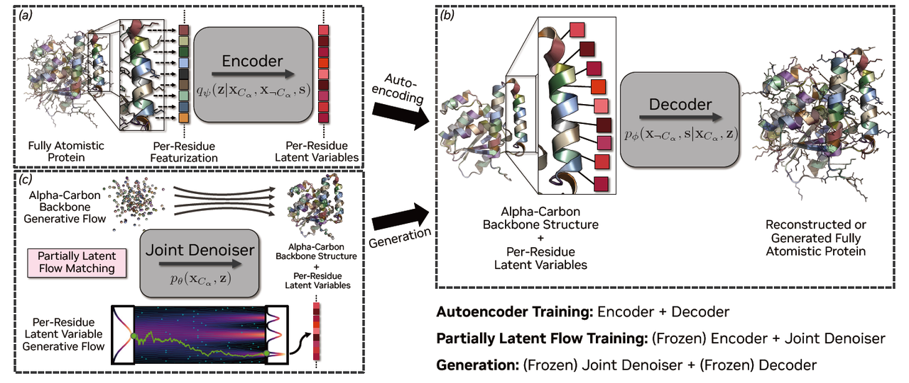
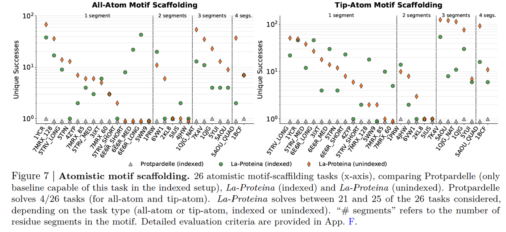
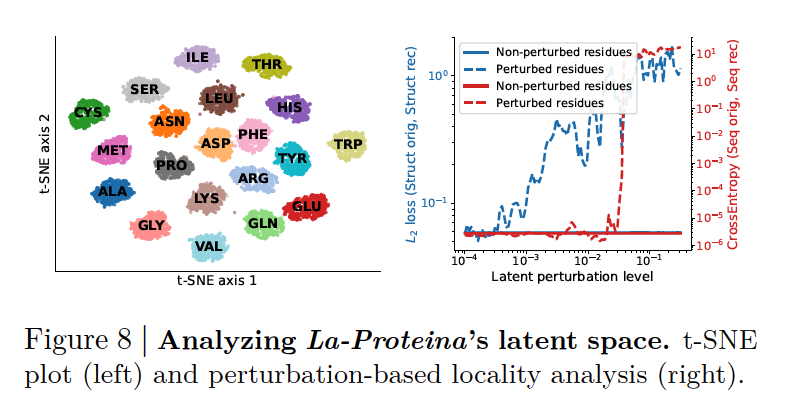

就在昨天， **La-Proteina 正式开源了**。这是 NVIDIA 团队提出的一种能够在 **全原子层面**生成蛋白质结构的模型。

相比只做 backbone 的方法，La-Proteina 最大的突破在于：它不仅能生成骨架，还能同时生成 **侧链与序列**，而且可以扩展到 **800 残基的长链蛋白**。

借着它开源的契机，我们就来一起看看这篇文章，了解它的核心方法和亮点。

原文链接：https://arxiv.org/abs/2507.09466

Github仓库链接：https://github.com/NVIDIA-Digital-Bio/la-proteina

***

## 一、背景介绍

在蛋白质设计的研究里，过去主流的方法往往是**把“序列”和“结构”分开处理**：

* 要么先生成一条氨基酸序列，再依赖预测模型折叠成结构；

* 要么先设计蛋白骨架，再寻找能匹配该骨架的序列。

这种“先后分离”的范式虽然推动了领域的发展，但它在精确控制**功能位点**（比如活性中心、结合口袋）时往往显得力不从心。原因在于，真正决定功能的往往是**侧链的三维构象**，而这需要模型能够在**全原子层面**同时理解并生成。

然而，直接做全原子生成并不容易：

> **侧链原子数量因残基不同而变化，序列是离散的，坐标是连续的，两者混合在一起会让建模异常复杂。**

很多已有方法在这个环节要么生成质量有限，要么无法扩展到大分子。

就在这种背景下，**NVIDIA 团队提出了 La-Proteina** —— 一种基于“部分潜变量 + 流匹配”的新型生成模型。它既能兼顾 backbone 的显式建模优势，又能高效处理侧链和序列细节，从而首次在 **全原子蛋白生成** 上实现了强大的可扩展性。

***

## **二、核心方法：部分潜变量的巧思**

La-Proteina 的关键创新是引入了一种 **“部分潜变量（partially latent）”的蛋白表示**。它把问题拆成两层：

1. **显式建模骨架（α-碳坐标）**

* Backbone 是所有残基共享的“主干框架”，在蛋白设计中已经有成熟的生成方法。

* 保持 backbone 在显式空间建模，可以继承现有 backbone 生成模型的优势，同时保证全局几何合理。

* **潜变量压缩侧链与序列（per-residue latent variables）**

- 每个残基的序列信息和全原子侧链坐标，被编码成一个固定维度的 latent 向量。

- 这样不论是精简的甘氨酸，还是庞大的色氨酸，最终都被映射成同样维度的潜变量。

- 这种设计避免了 **“残基侧链原子数不一致”** 带来的维度不规则问题，把原本的混合离散-连续建模问题转化为统一的连续空间问题。

* **两阶段训练流程（对应 Figure 1）**

- **Encoder**：把真实的全原子蛋白编码为 backbone + per-residue latent。

- **Decoder**：接收 backbone 和 latent，重建出完整的全原子结构与序列。

- **Flow Matching 模型**：在 backbone 与 latent 的联合空间进行流匹配训练，从而学会生成新的样本。

> **直观理解（结合 Figure 1）**：
>
> * Encoder/Decoder 负责“翻译”蛋白：原子细节被翻译成 latent，再由 latent 翻译回来。
>
> * Flow Matching 就像一个生成引擎，它在 backbone+latent 的联合空间里“画出生物合理的轨迹”，最终解码为新的全原子蛋白。

这种混合框架有几个技术亮点：

* **避免难题**：绕开了直接在侧链原子坐标空间建模的复杂性。

* **灵活可控**：骨架和原子细节可以用不同的生成节奏（不同 schedule）采样。

* **高度可扩展**：每个残基 latent 只是额外的通道，不会让模型随残基长度爆炸性增长，从而可以扩展到超长蛋白（后文 Figure 4 会展示 800 残基的生成）。

***

## **三、效果展示：从短链到长链**

La-Proteina 最直观的成果，就是它能够生成**真实可信的全原子蛋白结构**，并且在长度上突破了此前模型的极限。

1. **短链样本的质量（对应 Figure 2）**

Figure 2 展示了 La-Proteina 直接生成的多个全原子蛋白样本（不同残基数）。

* 不论是 100 个残基的小型蛋白，还是接近 800 个残基的超长蛋白，生成结果都能保证 backbone 与侧链的协调性。

* 更重要的是，这些样本不仅外观看起来合理，还通过了 **co-designability** 测试（即生成的序列能自洽地折叠回生成的结构）。

> 这说明 La-Proteina 的生成并不是“摆拍”，而是真正具备序列-结构一致性。

* **长链生成的突破（对应 Figure 4）**

以往的全原子模型在面对长链时普遍会崩溃：

* 超过 500 个残基时，大多数 baseline 要么无法生成，要么结构严重失真。

* 例如 P(all-atom) 模型生成一条 500 残基蛋白，就需要 **超过 140GB 的显存**，几乎不具备可扩展性。

而 La-Proteina 展现出了惊人的稳健性：

* 它能够稳定生成 **800 残基**的全原子结构，并保持高 co-designability 和结构多样性。

* 在 backbone 设计和全原子设计两类指标上，La-Proteina 都显著领先。

* 相比前一代 Proteina（只做 backbone），La-Proteina 在 backbone 和全原子层面都全面超越。

* **技术解读**

这种跨越式的表现，正是部分潜变量框架带来的：

* backbone 的显式建模，确保了大尺度几何的稳定；

* per-residue latent 避免了显存爆炸，让模型能承载超大规模数据。

> 因此，La-Proteina 是第一个真正把 **全原子生成** 扩展到 **长链蛋白** 的方法。

***

## **四、结构质量与物理合理性**

生成蛋白质最大的风险之一，是结构虽然“肉眼可见”合理，但在物理层面可能不稳定、不自然。La-Proteina 在这方面做了系统性的验证。

1. **MolProbity 分析：整体物理质量（对应 Figure 5）**

研究团队使用 **MolProbity**（一个常用的结构质量评估工具）对生成结果进行检查。主要指标包括：

* **Clash Score**：原子间是否存在物理上不可能的重叠。

* **Ramachandran Outliers**：主链二面角是否落在合理区域。

* **Bond Outliers**：共价键长、键角是否合理。

结果显示：

* La-Proteina 在所有这些指标上都显著优于现有全原子生成模型。

* 生成的结构整体物理质量接近 PDB/AFDB 真实蛋白的水准。

> 换句话说，La-Proteina 的样本不仅是“几何上长得像”，而且是“物理上能站得住”。

* **侧链构象合理性：Rotamer 分布（对应 Figure 6）**

蛋白质的侧链并不是随意摆放的，而是受到空间排斥限制，二面角（χ 角）会聚集在有限的构象状态——**rotamers**。

* Figure 6 以色氨酸（TRP）的 χ1 角为例，展示了 La-Proteina 生成结果的分布。

* 可以看到，La-Proteina 的 rotamer 分布几乎与 PDB/AFDB 数据重合，能够恢复主要的构象模式和相应频率。

* 相比之下，其他 baseline 模型要么漏掉了某些模式，要么生成了不合理的角度。

* **技术解读**

这说明 La-Proteina 的全原子生成结果并非“模糊平均”，而是真正捕捉到了蛋白质侧链的 **构象能量面** 与 **生物物理规律**。

* backbone 的合理性确保了整体框架的稳固；

* per-residue latent 的细致表达，使得侧链几何也能自然收敛到合理状态。

***

## **五、关键应用：原子级 motif scaffolding**

蛋白质设计的一个重要目标，是**把特定的功能基序（motif）嵌入到一个合理的整体结构中**。这些 motif 往往对应关键功能位点，比如：

* 酶的活性中心

* 抗体或配体的结合口袋

* 金属离子或小分子结合的原子团

过去的大多数生成模型，只能在 **backbone 层面**做 motif scaffolding（即只考虑 α-碳骨架的空间位置）。但这种粗粒度的方法不足以保证功能位点在原子级别的精确定位。

1. **La-Proteina 的突破（对应 Figure 3）**

La-Proteina 能够在 **全原子层面**进行 motif scaffolding：

* **All-atom scaffolding**：输入 motif 的完整 backbone+侧链原子，生成支撑该 motif 的完整蛋白。

* **Tip-atom scaffolding**：只输入 motif 中关键的功能性基团（如末端原子），让模型自动补全 backbone 和侧链。

Figure 3 展示了 La-Proteina 在不同任务上的示例：红色部分是目标 motif，模型生成的 scaffold 能够把它嵌入在一个稳定、多样的蛋白框架中。

* **性能验证（对应 Figure 7）**

研究团队在 26 个基准任务上测试了 La-Proteina，并与唯一能部分完成该任务的 baseline（Protpardelle）对比：

* **Protpardelle**：仅能在 indexed all-atom scaffolding 下完成少数任务（4/26）。

* **La-Proteina**：在 **all-atom** 和 **tip-atom**，以及 **indexed** 和 **unindexed** 四种设置下，大部分任务都能成功（21–25/26）。

尤其是 unindexed 情况下，La-Proteina 甚至优于 indexed：

* 当 motif 残基分散在多个片段时，固定索引会限制结构多样性；

* 而 unindexed 允许模型自由探索残基位置，反而更容易找到合适的 scaffold。

* **技术解读**

这一结果表明：

* La-Proteina 不仅能生成物理合理的蛋白，还能在 **功能设计** 上实现突破。

* 原子级 scaffolding 意味着研究者可以直接在生成过程中控制关键功能原子的位置，为 **催化酶设计、抗体设计、分子对接** 等应用提供强大工具。

***

## **六、模型解释性：潜变量空间分析**

除了生成能力和应用性能，La-Proteina 还具备一个常被忽视但非常重要的特性：**解释性**。研究团队通过对潜变量空间的分析，揭示了它的内部结构和可控性。

1. **潜变量的“氨基酸聚类”现象（对应 Figure 8 左图）**

* 研究者用 t-SNE 将每个残基的潜变量投影到二维空间。

* 结果显示，不同氨基酸类型在潜变量空间中形成了清晰的簇。

* 例如：

  * 化学性质相似的残基（如带负电的 **Asp/Asn**，或芳香族的 **Phe/Tyr/Trp**）会聚在一起。

  * 这说明模型确实学会了区分并编码氨基酸的物理化学特性，而不仅仅是“记住坐标”。

* **局部扰动实验：潜变量的“局部性” （对应 Figure 8 右图）**

* 在实验中，研究者对单个残基的 latent 施加扰动，观察解码后的结果。

* 发现扰动主要只影响该残基的结构和序列，而不会扩散到其他残基。

* 这表明 **每个 per-residue latent 向量主要携带本残基的信息**，而不是全局混合。

* **技术解读**

* 这种“局部化”带来两个好处：

  1. **可控性**：设计者可以有针对性地修改某个残基，而不必担心影响全局结构。

  2. **生物学合理性**：氨基酸的局部信息被独立捕捉，同时 backbone 的显式建模又保证了全局一致性。

> 换句话说，La-Proteina 不仅能生成“像真的”蛋白，还能让研究者对生成过程进行更精细的操控。这是它区别于很多黑箱式生成模型的重要特征。

***

## **七、总结与展望**

从整体上看，**La-Proteina** 的贡献可以概括为三个关键词：

> **全原子、可扩展、可控**。

1. **全原子层面**：

* 不仅生成 backbone，还能保证侧链构象合理，rotamer 分布与真实蛋白一致。

* 支持原子级 motif scaffolding，让功能位点的设计进入“亚原子精度”时代。

* **可扩展性**：

- 部分潜变量的设计，使得模型能稳定扩展到 **800 残基**级别的超长蛋白生成。

- 相比需要上百 GB 显存的 baseline，La-Proteina 在计算效率和可用性上实现巨大飞跃。

* **可控性与解释性**：

- 潜变量空间自然地分离出不同氨基酸类型，并保持局部化。

- 研究者可以针对性地操控某些残基，而不影响整体结构。

### 局限性

1. **数据依赖性强**

* 模型训练用到了超过 **4600 万条 AFDB（AlphaFold Database）结构–序列对**。

* 这意味着 La-Proteina 的效果高度依赖大规模高质量数据，普通实验室很难复现同样的规模。

* **物理真实性仍是近似**

- 虽然生成的结构在 MolProbity、rotamer 分布等指标上接近真实蛋白，但并不是严格的物理模拟。

- 仍需要后续 **分子动力学模拟** 或 **能量优化** 来确认其稳定性和可用性。

* **功能预测缺失**

- La-Proteina 可以 scaffold 功能 motif，但并没有保证生成的蛋白一定具备预期功能（比如催化活性、结合亲和力）。

- 在真正应用到药物设计或合成生物学之前，还需要结合功能预测与实验验证。

* **训练和推理成本高**

- 虽然比一些 baseline 节省显存，但主力模型仍有上亿参数（encoder/decoder \~130M，denoiser \~160M）。

- 大规模训练和长链推理对算力需求依然很高，不适合轻量化场景。

* **解释性仍有限**

- 尽管 per-residue latent 展现了良好的局部性和聚类特性，但对于更复杂的长程相互作用，模型的“黑箱性”依然存在。

> &#x20;一句话总结：**La-Proteina 把蛋白生成推进到了全原子级别，但它还停留在“结构设计”层面，在“功能设计”与“物理可行性”上仍需要配合其他工具与实验验证。**

### **蓝极点评：**

La-Proteina 的提出，标志着蛋白质生成从 backbone 阶段真正迈入了 **全原子级别**的新纪元。

* 对科研而言，它能为 **酶活性中心设计、结合位点 scaffold、复杂多肽结构探索** 提供新工具。

* 对应用而言，它为药物发现、合成生物学、材料蛋白设计等方向打开了新的可能性。

> 一句话总结：**La-Proteina 让蛋白质设计从“长得像”走向“物理真实、功能精确”，是全原子蛋白生成的重要里程碑。**

