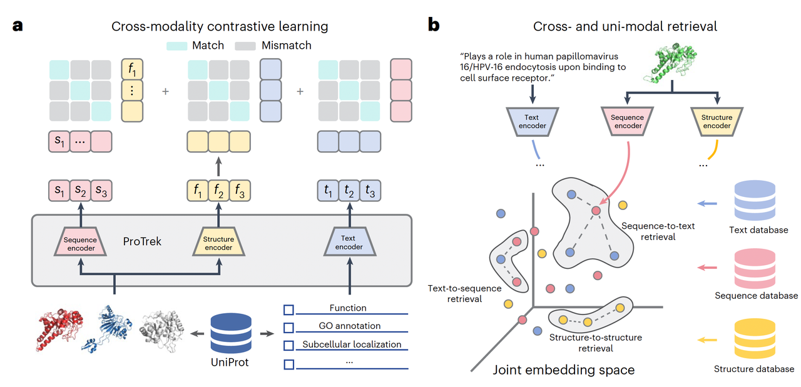
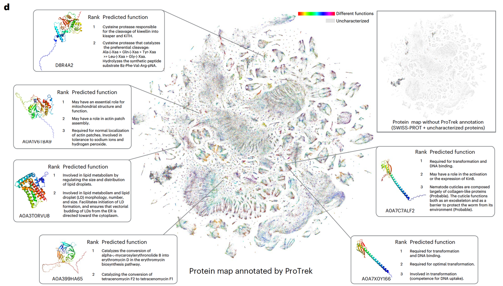
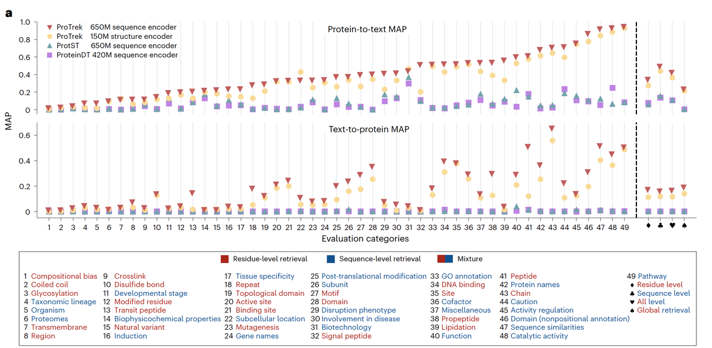
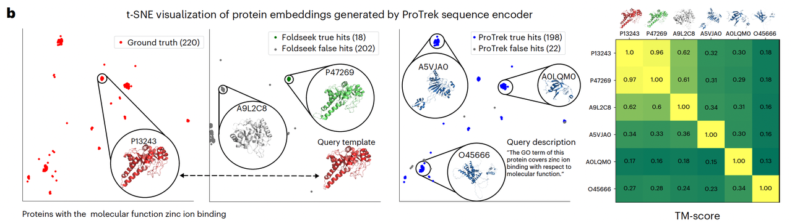
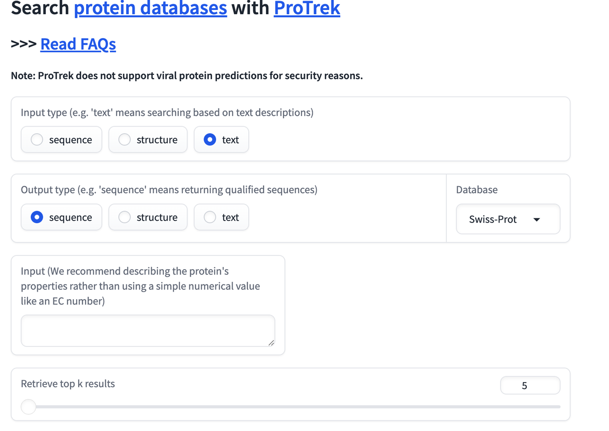

> 蓝极说：
>
> 说说话就能了解一个蛋白质功能的时代，真的要来了。

***

## **一：从“序列比对”到“理解蛋白语言”**

在蛋白质研究的历史里，“比对”几乎是所有探索的起点。无论是 BLAST、MMseqs2 还是 Foldseek，这些工具让我们能够在浩瀚的数据库中迅速找到序列或结构上相似的分子。它们推动了蛋白质组学的发展，也奠定了生物信息学的底层逻辑——**通过相似性来推测关系**。

但“比对”始终是一种浅层的理解。它回答的是“**这个序列像谁**”，却无法回答“**这个蛋白想做什么**”。在序列相似性不高、进化距离遥远的情况下，这种局限被放大。如今，UniProt 中仍有约三分之一的蛋白没有明确的功能注释——它们已经有了预测结构，却依然是“无名者”。问题不在算力，而在方法。传统工具只能在单一模态中比较：序列对序列，结构对结构。这种“模态内”的封闭视角，让我们难以看见那些跨越形式相似性的深层功能联系。

而在近几年，大语言模型改变了人们对“**理解**”的定义。它们在语言中学会了抽象与语义，能够把复杂信息映射到一个可以计算的空间。如果语言可以被学习，蛋白质是否也有自己的“语言学”？**序列、结构与功能之间的关系，是否也能被编码、被理解？**

这正是西湖大学原发杰团队提出的问题。原老师在最新发表在《Nature Biotechnology》上的文章《A trimodal protein language model enables advanced protein searches》中，并没有把蛋白质看作一串序列，而是看作一个能“说三种语言”的存在：**氨基酸的语言、折叠结构的语言，以及自然语言中的功能描述**。他们提出的模型——**ProTrek**，尝试让这三种语言在同一个语义空间里互相对齐。

如果说传统工具是在寻找“形似”的蛋白，ProTrek 想要找到的，是“**神似**”的蛋白。

***

## **二、核心机制：三模态的语言共振**

ProTrek 的核心思想，其实是一次“**翻译**”的尝试。它让蛋白的三种模态——**序列、结构与功能语言**——在同一个语义空间中建立映射关系。对研究者而言，这意味着无论输入的是氨基酸序列、一段功能描述，还是三维结构，模型都能理解它们属于同一个生物学对象，只是被不同的语言描述而已。

这种“理解”的基础在&#x4E8E;**对比学习（contrastive learning）**。模型在训练时被迫去判断哪一对数据是正确对应的，哪一对是无关的。具体而言，它会同时接收三种信息：一个蛋白的序列、它的结构，以及它在数据库中对应的功能文本。ProTrek 学会通过嵌入（embedding）把它们投射到同一个空间中，让真正属于同一个蛋白的三模态样本距离更近，而随机配对的样本被推得更远。经过大规模训练后，模型便形成了一个“通用语义地图”，能自动捕捉蛋白之间深层次的结构与功能关联。

在实现上，ProTrek 由三个独立的编码器组成：**序列由预训练的 ESM 模型处理**，**结构信息通过 Foldseek 转换成离散的三维“语句”，再交给 BERT 架构学习**，而**功能语言则由 PubMedBERT 提供语义理解**。三者通过双向对比学习进行联合优化，这种“多声部合奏”让模型真正具备了跨模态理解的能力。

从图1a可以看到，ProTrek 在训练过程中并非单向映射，而是让三种模态彼此对齐：序列对结构、结构对功能、功能对序列。这样一来，模型不仅能在三者之间进行互查（sequence↔structure↔text），还可以在单一模态内部完成高精度的搜索（sequence↔sequence 或 structure↔structure）。图1b展示了这种九种检索任务的全景——ProTrek 实际上成了一个面向蛋白宇宙的“通用搜索引擎”。

更有意思的是，图1d展示的结果让人第一次看到一个“**语言化的蛋白宇宙**”。在经过三模态对齐后，ProTrek 能够根据功能而非序列，将不同蛋白聚类到同一个语义空间中。图中那些颜色分布的点簇，并不是传统意义上的同源家族，而是被模型判定为“功能相似”的分子。换句话说，ProTrek 已经学会了用“语义”来组织蛋白世界。

这种做法解决了一个长期存在的难题：**如何跨越形式的差异去发现功能的共性**。传统的比对方法往往依赖序列局部相似，而 ProTrek 的全局嵌入能捕捉到“**神似而不形似**”的关系，比如结构不同但功能收敛的酶类。

> **模型在概念上把“比对”转变成了“理解”，这是它最根本的突破。**

***

## **三、性能表现：超越比对的边界**

ProTrek 的效果几乎在所有维度上都超过了现有方法。研究团队用它在四种标准检索任务上进行了评估：**序列对文本、结构对文本、文本对序列、以及文本对结构**。与 ProteinDT 和 ProtST 这两种当前领先的多模态模型相比，ProTrek 的平均检索精度（MAP）提升了一个数量级以上——在序列到文本的任务中，精度比 ProtST 高出三十倍，在文本到序列的任务中更是提升了六十倍。这种差距已经不只是参数规模或数据集大小带来的，而是源于三模态对齐本身带来的语义整合能力。

从另一个角度看，ProTrek 的强项不在于“识别相似”，而在于“**理解相关**”。传统的 BLAST 或 Foldseek，只能在结构或序列相似的区域内找到邻居；一旦进入“进化暮光区”（**twilight zone**），它们的判断几乎失效。而 ProTrek 的全局语义空间能跨越这种表层的差异，**找到那些结构和序列差异巨大、但功能趋同的蛋白**。

图2b中的案例几乎是对这一能力的直接证明。研究者以“zinc ion binding”这一功能描述作为检索输入。对于传统的结构比对工具 Foldseek，找到的结果里只有 18 个是真实具备锌离子结合功能的蛋白；而 ProTrek 的检索结果中，198 个是真实的命中。更令人印象深刻的是，当这些结果被投射到结构相似性空间中时，可以看到：**许多具备相同功能的蛋白在结构上几乎毫不相似**。换句话说，ProTrek 能够透过结构形式，捕捉到功能的语义。

这类结果说明了一个关键变化：模型已经不再依赖进化或物理相似性去推断功能，而是从数据中学习到了一&#x79CD;**更抽象的“生物学语言”**。图2c 的性能对比进一步支持了这一点。在不同模态的搜索任务中，无论是序列对序列还是结构对结构，ProTrek 都显著超越了 MMseqs2、DIAMOND 和 Foldseek，尤其是在那些低 TM-score 的区域，它依然能正确地识别出功能相近的蛋白。这种能力意味着它不只是“更快的搜索工具”，而是开始具备了功能层面的泛化理解。

这种泛化让 ProTrek 具备了新的研究用途。它不仅能作为功能检索引擎，还能被用作蛋白嵌入空间的基础模型。研究者可以在这个空间中进行相似性推断、功能聚类，甚至进一步的下游预测任务。

> **换句话说，它不只是改进了搜索算法，而是在重新定义“相似性”的概念**。

***

## **四、实验验证：AI 启发的功能发现**

ProTrek 的强大不只体现在数据上的指标，更在于它能启发新的实验发现。研究团队选择了一个非常具体、也非常有挑战性的目标：寻找与人源 UDG（Uracil DNA Glycosylase）功能相似的蛋白。UDG 是一种经典的碱基修复酶，能够从 DNA 中切除尿嘧啶。近几年，科研界基于它开发出一类新的碱基编辑系统——TBE（Thymine Base Editor）。然而，这些系统普遍存在编辑效率低的问题，核心瓶颈正是人源 UDG 变体的活性不足。

如果要寻找新的 UDG 替代品，传统的方法几乎行不通。UDG 在不同物种中的序列差异极大，单靠比对工具很难识别到功能等价的远缘同源体。于是团队把任务交给了 ProTrek：一方面用人源 UDG 的序列作为查询，另一方面输入一句自然语言描述——“UDGs remove uracil from DNA”。模型在 2 亿条蛋白的数据库中进行双模态搜索，返回了若干候选蛋白。这些候选在序列层面与人源 UDG 几乎没有相似性，但在语义空间中却被模型判定为“功能一致”。

接下来，研究者对这些候选进行分析，重点关注它们的活性中心。结果发现，虽然整体序列不同，但它们在关键催化残基附近都保留了类似的构象特征。团队进一步借鉴 UDG-Y147A 突变体的原理，对这些新蛋白的活性位点进行了同源替换，使其理论上具备识别并切除胸腺嘧啶（T）的能力。经过优化并与 Cas9 融合后，他们构建出一系列新的碱基编辑酶。

实验验证的结果印证了 ProTrek 的判断。几乎所有候选蛋白在细胞实验中都表现出不同程度的胸腺嘧啶编辑活性，而其中排名第一的变体——V1，编辑效率在多个位点上明显超过了现有的 TSBE3 EK 和 gTBE 系统，并且伴随更低的插入缺失（indel）比例。换句话说，ProTrek 不仅找到了功能相似的蛋白，还帮助研究者设计出一个性能更好的编辑工具。

图3的实验流程图很好地体现了这种“AI 启发 + 实验验证”的闭环。模型在语义空间中完成“假设生成”，实验室则在细胞层面完成“假设验证”。这种结合的意义在于，它把蛋白功能发现的起点从传统的比对或随机筛选，转向了基于语义理解的智能检索。

> ProTrek 的这一案例展示了一个重要方向：蛋白语言模型不仅能复述生物知识，还能提出新的科学问题。它帮助研究者从“**数据驱动”**&#x8D70;向“**语义驱动**”，把功能假设的生成变成一种系统化、可探索的过程。

***

## **五、应用与前景：让蛋白世界被“读懂”**

在完成实验验证之后，ProTrek 的意义变得更加清晰。它不仅仅是一个模型，更是一种新的科学工具，一种重新组织生物知识的方式。研究团队搭建了在线平台 [search-protrek.com](http://www.search-protrek.com)，预计算并存储了**超过五十亿个蛋白**的向量表征。这一规模大约是 UniProt 的十倍，整个平台整合了 SWISS-PROT、UniRef50、PDB、MGnify 以及全球海洋宏基因组等多个数据库，耗费了超过五年的 GPU 计算时间。这样的基础设施使得 ProTrek 成为**目前最全面的蛋白语义检索系统。**

它的用途也非常广。对于功能注释而言，研究者可以**直接用自然语言描述去检索可能具备某种活性的蛋白**；对于蛋白设计领域，**ProTrek 的嵌入空间可以作为“语义参考”**，辅助生成模型判断目标序列的功能趋向；在进化生物学中，它能揭示**不同物种中功能收敛但结构分化的酶类**，从而帮助我们重新认识趋同进化的普遍性。更长远的意义是，它让蛋白世界进入了一&#x79CD;**“可对话”的状态**——**从此我们不必总是通过对齐序列去理解分子，而是可以直接用语言去提问。**

当然，ProTrek 也有它的边界。它的训练数据几乎全部来自天然蛋白，因此在处理人工设计或突变微调的序列时仍有局限；它无法给出精确的物理预测，比如荧光波长或热稳定性等。这些问题需要基于任务的微调或与其他专用模型的结合。研究团队也意识到了这一点，他们开发了 **ColabProTrek**，一个便于用户在自定义数据上微调的交互式平台，使模型能够在特定问题上获得更高的敏感度。

在更宏观的层面上，ProTrek 代表了一种趋势：**生物学的研究正从“数据比对”走向“语义建模”**。它不是取代实验，而是重新定义实验的起点——**从语言出发，生成假设，再由实验去验证**。这样的范式意味着，我们可能正在进入一个新的阶段：在这个阶段里，理解蛋白质的关键，不再是找到它“像谁”，而是理解它“意味着什么”。

原文链接：https://www.nature.com/articles/s41587-025-02836-0

代码链接：https://github.com/westlake-repl/ProTrek

server链接：http://www.search-protrek.com/

ColabProTrek链接：https://colab.research.google.com/github/westlake-repl/SaprotHub/blob/main/colab/ColabProTrek.ipynb

Huggingface模型权重：https://huggingface.co/westlake-repl/ProTrek\_650M， https://huggingface.co/westlake-repl/ProTrek\_35M

向原老师的开源精神致敬！

